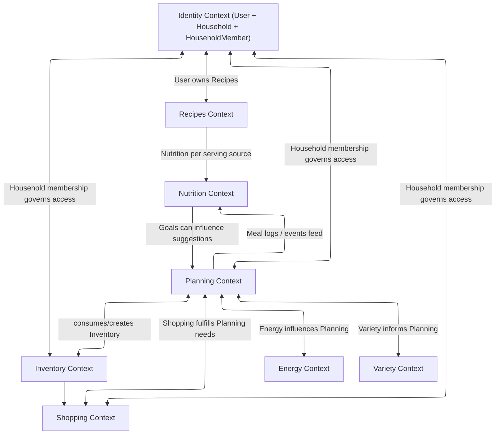
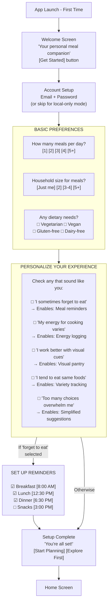
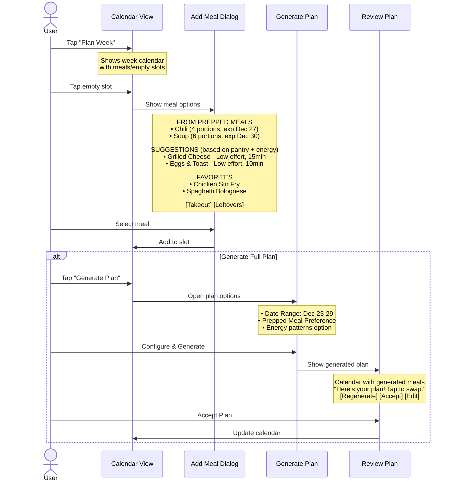
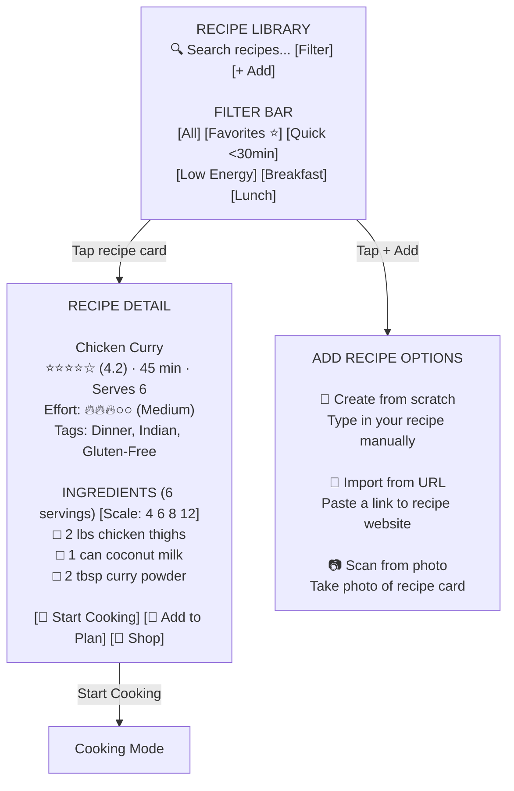
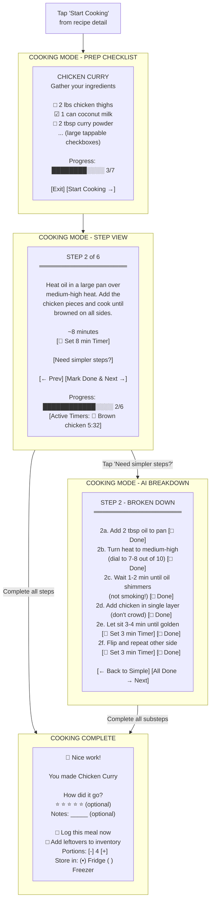
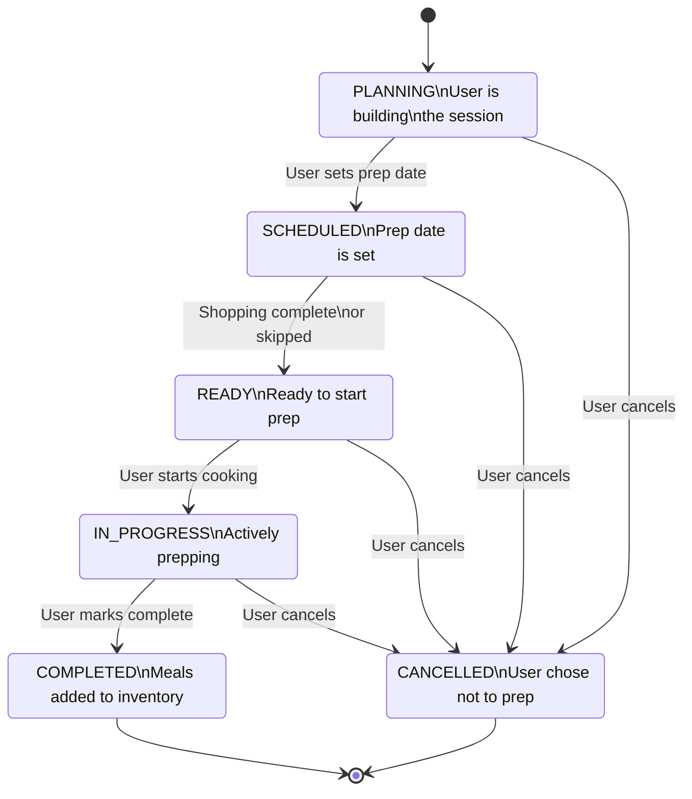
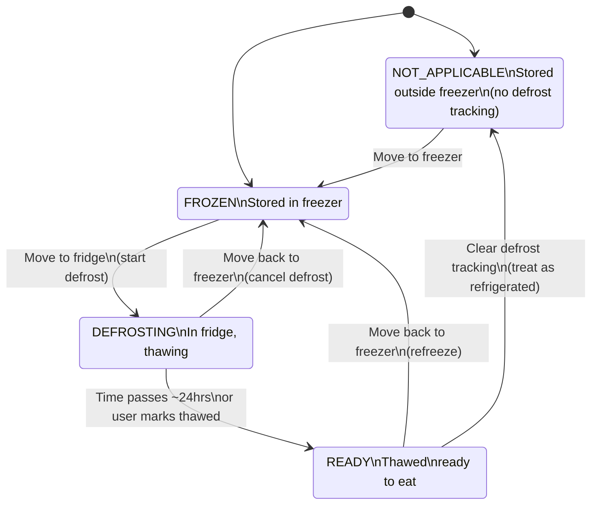
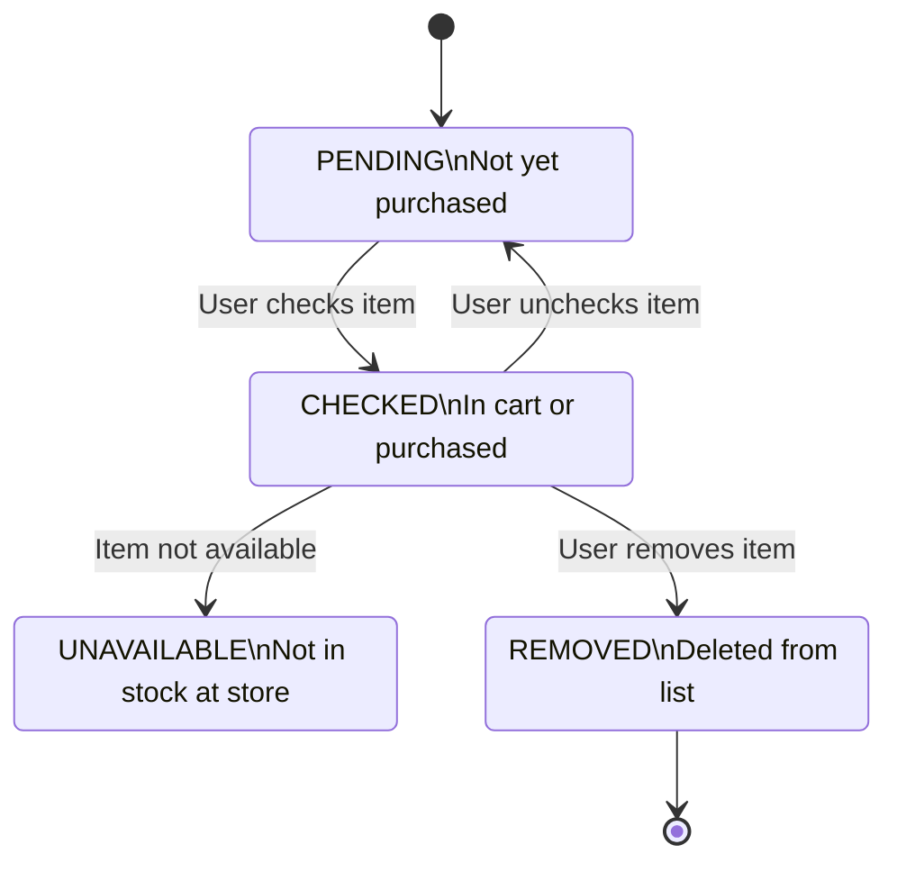
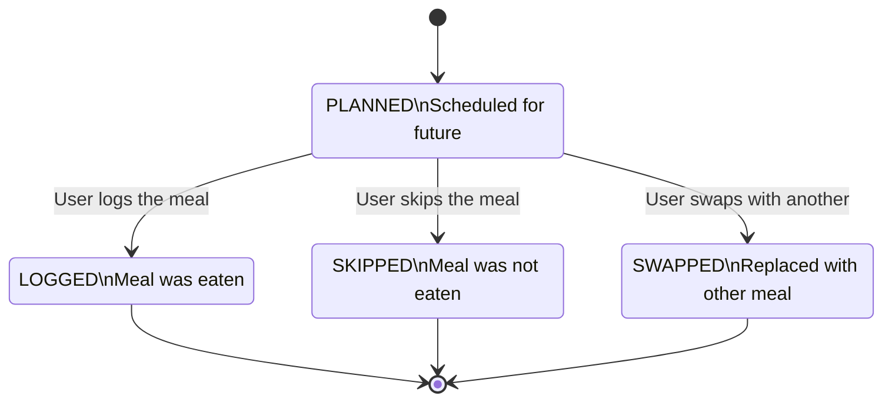

# Nexus Kitchen — Domain Specification

**Document Version:** 1.0.0  
**Date:** December 25, 2025  
**Purpose:** Spec-Driven Development reference for domain models, invariants, and UI flows

> **Document precedence:**
> [**SRS**](./) is authoritative for _requirements and user-visible guarantees_ ("what").
> [**Domain Specification**](./domain-specification.md) is authoritative for _domain terminology, entity schemas/enums
> , invariants, and event semantics_ ("the model").
> [**Logical Architecture**](./logical-architecture.md) is authoritative for _bounded context/service decomposition,
> sync/change protocol, patchability rules, and operational data flows_ ("how it's built").
> If a conflict is found, update the **non-authoritative** document; avoid duplicating competing definitions.

---

## Table of Contents

1. [Domain Model Overview](#1-domain-model-overview)
2. [Core Domain Models](#2-core-domain-models)
3. [Domain Invariants](#3-domain-invariants)
4. [UI Flows](#4-ui-flows)
5. [State Machines](#5-state-machines)
6. [Appendix A: Domain Events](#appendix-a-domain-events)

---

## 1. Domain Model Overview

### 1.1 Bounded Contexts

```text
┌───────────────────┬───────────────────┬───────────────────┬───────────────────┐
│                         MEAL PLANNING APPLICATION                             │
├───────────────────┼───────────────────┼───────────────────┼───────────────────┤
│ IDENTITY          │ RECIPES           │ INVENTORY         │ PLANNING          │
│ CONTEXT           │ CONTEXT           │ CONTEXT           │ CONTEXT           │
├───────────────────┼───────────────────┼───────────────────┼───────────────────┤
│ • User            │ • Recipe          │ • PantryItem      │ • MealPlan        │
│ • Household       │ • RecipeStep      │ • PreppedMeal     │ • PlannedMeal     │
│ • HouseholdMember │ • Ingredient      │ • StorageLocation │ • MealPrepSession │
│ • Preferences     │ • RecipeTag       │                   │ • MealReminder    │
│ • DietaryProfile  │ • NutritionInfo   │                   │ • MealLog         │
│                   │ • UserRecipeMeta  │                   │                   │
├───────────────────┼───────────────────┼───────────────────┼───────────────────┤
│ SHOPPING          │ NUTRITION         │ ENERGY            │ VARIETY           │
│ CONTEXT           │ CONTEXT           │ CONTEXT           │ CONTEXT           │
├───────────────────┼───────────────────┼───────────────────┼───────────────────┤
│ • ShoppingList    │ • NutritionGoal   │ • EnergyLog       │ • FoodHyperfixation│
│ • ShoppingListItem│ • DailyNutrition  │ • EnergyPattern   │ • FoodProfile     │
│ • StoreLayout     │   Summary         │                   │ • ChainSuggestion │
│                   │                   │                   │ • VariationIdea   │
└───────────────────┴───────────────────┴───────────────────┴───────────────────┘
```

### 1.2 Context Map



### 1.3 Integration and Projection Policy

This spec treats bounded contexts as **ownership boundaries** even when implemented in a single codebase.
Cross-context reads are allowed via references and projections; **cross-context writes are not**.

#### 1.3.1 Source of Truth and Ownership

- Every aggregate/entity has exactly one owning context (system of record).
- Only the owning context may enforce invariants and accept writes for that model.
- Other contexts may store foreign IDs (e.g., `RecipeId`) and optional denormalized _snapshot_ fields for UI,
  explicitly marked as `denormalized` or `computed`. Snapshot fields are non-authoritative and may be stale.

#### 1.3.2 Projection Types

- **Reference**: foreign ID only (preferred).
- **Reference + snapshot**: foreign ID + a few denormalized display fields (allowed; eventual consistency).
  - Example: `PreppedMeal.recipeName` mirrors `Recipe.title` for faster UI rendering.
- **Materialized projection (read model)**: a dedicated entity derived from events, optimized for reads.
  - Examples: `DailyNutritionSummary`, `EnergyPattern`.
- **Analytics/suggestion projections**: derived models used to power UX hints (never used for invariants).
  - Examples: `FoodHyperfixation` detection, chain/variation suggestion scoring.

#### 1.3.3 Ownership Matrix (Authoritative Writes)

| Context   | Owns (authoritative write models)                                                       |
| --------- | --------------------------------------------------------------------------------------- |
| Identity  | `User`, `Household`, `HouseholdMember`, `UserPreferences`, `DietaryProfile`             |
| Recipes   | `Recipe`, `RecipeStep`, `RecipeIngredient`, `Ingredient`, `RecipeTag`, `UserRecipeMeta` |
| Inventory | `PantryItem`, `PreppedMeal`, `PortionEvent`, `StorageLocation`                          |
| Planning  | `MealPlan`, `PlannedMeal`, `MealPrepSession`, `MealReminder`, `MealLog`                 |
| Shopping  | `ShoppingList`, `ShoppingListItem`, `StoreLayout`, `StoreSection`                       |
| Nutrition | `NutritionGoal` (write model), `DailyNutritionSummary` (projection owned by Nutrition)  |
| Energy    | `EnergyLog` (write model), `EnergyPattern` (projection owned by Energy)                 |
| Variety   | `FoodProfile`, `FoodHyperfixation`, `ChainSuggestion`, `VariationIdea`                  |

#### 1.3.4 Projection Contracts (Event-Driven)

Projections are updated asynchronously by subscribing to domain events (Appendix A).
They must be **idempotent** (safe to apply twice) and **rebuildable** (can be regenerated from source-of-truth).

Key projections and their upstream sources:

- **Nutrition → `DailyNutritionSummary`**
  - Derived from **Planning** `MealLogCreated` / `MealLogDeleted` events.
  - Key: `(userId, localDate(mealLog.loggedAt, resolvedTimeZone))`.
  - Uses `MealLog.nutritionInfo` when present; otherwise may look up `Recipe.nutritionPerServing` (Recipes) or treat as
    unknown.
  - Must respect opt-in: only maintained when `UserPreferences.nutritionTracking = true`.

- **Energy → `EnergyPattern`**
  - Derived from **Energy** `EnergyLevelLogged` events (which correspond to persisted `EnergyLog`).
  - Aggregates by `(userId, timeOfDay, dayOfWeek)`.
  - Must respect opt-in: only maintained when `UserPreferences.energyPatternLearning = true`.

- **Inventory portion ledger from meal logging**
  - **Inventory** is the source of truth for prepped-meal portion removal. When a user logs a meal that consumes a `PreppedMeal`,
    **Planning** issues a `ConsumePortion` command to **Inventory** (idempotent via an idempotency key / changeId).
  - **Inventory** validates business rules (e.g., remaining portions cannot go negative), appends a
    `PortionEvent(kind=CONSUMED, deltaPortions=-qty)`, updates `PreppedMeal.portionsRemaining`, and emits `PreppedMealPortionConsumed`.
  - **Planning** then creates the `MealLog` and emits `MealLogCreated`, linking it to the same causation
    (`preppedMealId`, optional `plannedMealId`, and the idempotency key) so downstream projections can correlate.
  - Discards and expirations follow the same ledger model (`DiscardPortion`, `PreppedMealPortionDiscarded`,
    `PreppedMealExpired`) but do **not** create meal logs.

- **Denormalized name snapshots**
  - When **Recipes** emits `RecipeUpdated` with a title change, update any stored snapshots (e.g., `PreppedMeal.recipeName`).
  - Snapshot refresh is a UX optimization; stale values must not affect correctness.

- **Variety analytics (optional)**
  - `FoodHyperfixation` and chaining signals may be derived from **Planning** meal logging events and/or `RecipeCooked`
    events.
  - These are advisory; they must not block core flows.

#### 1.3.5 Consistency, Reliability, and Failure Handling

- **Within a context:** strong consistency (transactions) for its own aggregates and invariants.
- **Across contexts:** eventual consistency via events or explicit application-layer orchestration (process managers).
- Event delivery is assumed to be **at-least-once**; handlers must be idempotent and tolerate reordering.
- Every projection must have a defined **rebuild strategy** (replay events or re-scan source-of-truth).
- Authorization is always checked against **Identity** (membership/roles); projections must not be used as auth sources.

#### 1.3.6 Event Envelope (Implementation Note)

Event payloads in Appendix A show the logical fields.
Implementations should wrap them in a standard envelope to support idempotency and debugging:
`{ eventId, eventType, occurredAt, producerContext, payload }`.

#### 1.3.7 Offline-First and Sync Semantics (Project Contract)

Nexus Kitchen’s **primary native clients are offline-first** and sync to a self-hosted server with eventual consistency
(see SRS architecture + offline sections).
This domain spec remains the **logical contract** for models, invariants, and events, with these operational rules:

- **Canonical state:** the server database is canonical for shared household data; clients maintain local replicas as a
  working set.
- **Invariant enforcement:** invariants in §3 are enforced at the authoritative write boundary (owning context on the server).
  Clients should enforce them locally where practical, but may temporarily hold **pending** or **conflicted** states
  while offline.
- **Conflict handling:** when concurrent offline edits occur, resolution follows the SRS conflict policy:
  - Shopping lists merge at the **item** level (status toggles resolve by most recent toggle; other fields resolve
    deterministically).
  - Pantry quantity changes should prefer **additive adjustments** over absolute quantity overwrites (to merge
    concurrent edits).
  - Meal plan slot conflicts deterministically pick a winner and preserve the losing assignment as an “unscheduled”
    entry for recovery.
- **Domain events vs sync:** Appendix A events are **logical** domain events.
  Implementations may emit them explicitly, or derive them from the sync/change-log layer, but projections must remain
  idempotent and rebuildable (§1.3.4–1.3.5).

#### 1.3.8 Search and AI Projections (Client-Local)

Nexus Kitchen supports both **keyword search** and (optionally) **semantic search**. Search and AI artifacts are
treated as **projections**:

- derived from authoritative domain entities (primarily `Recipe`, `Ingredient`, tags, and user notes),
- **not** used to enforce invariants or authorization,
- safe to delete and **rebuildable** from source-of-truth data.

These projections are typically stored **locally on each native client** and are not required to sync across devices.

##### Semantic recipe search projection (local-first)

`SemanticRecipeIndexState` is a per-device, per-user **status object** describing
the readiness/health of the local embedding/vector index used by semantic search.

```typescript
SemanticRecipeIndexState {
    userId: UserId [immutable]

    // Which model built the current index (null when disabled)
    modelId: EmbeddingModelId? [nullable]

    status: SemanticIndexStatus

    // Progress + freshness
    indexedRecipeCount: NonNegativeInteger
    totalRecipeCount: NonNegativeInteger
    lastBuiltAt: Timestamp?
    lastUpdatedAt: Timestamp?
    lastError: String? [0..2000 chars]
}

SemanticIndexStatus {
    DISABLED     // feature off
    NOT_BUILT    // enabled, but no index yet
    BUILDING     // background build or rebuild in progress
    READY        // usable
    STALE        // usable but behind; will self-heal
    ERROR        // unusable; show fallback + user action
}

// Implementation note: keep this stable and user-facing (e.g., "local:e5-small", "cloud:provider/model@v1")
type EmbeddingModelId = String
```

##### Index update contract

- The semantic index is derived from `Recipe` fields (title, ingredients, steps, tags, notes).
- Subscribe to `RecipeCreated`, `RecipeUpdated`, and `RecipeDeleted` events (Appendix A) to incrementally update
  embeddings/index entries.
- If updates are missed, the model changes, or corruption is detected, rebuild the index and surface clear status:
  `BUILDING → READY` or `BUILDING → ERROR` (with a keyword-search fallback in all cases).
- Semantic ranking is advisory; **keyword search remains the baseline**.

##### AI caches (non-authoritative)

AI-assisted outputs may be cached locally as projections to improve responsiveness and enable “offline with cache”
behavior. Examples include:

- step-breakdown expansions for `RecipeStep` (keyed by `recipeId`, `stepId`, and requested granularity),
- pantry item photo recognition hints (keyed by `pantryItemId` and image hash),
- suggestion explanations (keyed by suggestion id and generation inputs).

Caches must be safe to delete and must not gate core flows.

---

## 2. Core Domain Models

### 2.0 Entity Index (Canonical)

The entities below are defined in full in this document and should be treated as the **source of truth** for structure
and constraints.

| Context                    | Primary entities                                                                                                      |
| -------------------------- | --------------------------------------------------------------------------------------------------------------------- |
| Identity                   | `User`, `UserPreferences`, `SupportProfile`, `DietaryProfile`, `DislikedIngredient`, `Household`, `HouseholdMember`   |
| Recipes                    | `Recipe`, `UserRecipeMeta`, `RecipeIngredient`, `RecipeStep`, `RecipeTag`, `Ingredient`, `NutritionInfo`              |
| Inventory                  | `PantryItem`, `PreppedMeal`, `StorageLocation`                                                                        |
| Planning                   | `MealPlan`, `PlannedMeal`, `MealScheduleRule`, `MealSuggestionFeedback`, `MealPrepSession`, `MealReminder`, `MealLog` |
| Shopping                   | `ShoppingList`, `ShoppingListItem`, `StoreLayout`, `StoreSection`                                                     |
| Energy                     | `EnergyLog`, `EnergyPattern`                                                                                          |
| Nutrition                  | `NutritionGoal`, `DailyNutritionSummary`                                                                              |
| Variety                    | `FoodProfile`, `FoodHyperfixation`, `ChainSuggestion`, `VariationIdea`                                                |
| Projections (client-local) | `SemanticRecipeIndexState` (semantic search readiness) and other optional AI/search caches (§1.3.8)                   |

### 2.1 Identity Context

#### User

```typescript
User {
    id: UserId [unique, immutable]
    email: Email [unique]
    displayName: String [1..100 chars]
    passwordHash: HashedPassword [internal]
    currentHouseholdId: HouseholdId? [nullable]
    preferences: UserPreferences
    createdAt: Timestamp [immutable]
    updatedAt: Timestamp
    lastActiveAt: Timestamp
}

UserPreferences {
    // Basic settings
    mealsPerDay: PositiveInteger [default: 3, range: 1..10]
    defaultServings: PositiveDecimal [default: 2, range: 1..20]
    measurementSystem: MeasurementSystem [METRIC | IMPERIAL]
    theme: Theme [LIGHT | DARK | SYSTEM]
    notificationsEnabled: Boolean [default: true]
    timeZone: TimeZoneId [default: device timezone]

    // Passive features (default ON, individually toggleable)
    // These enhance suggestions without requiring user input
    energyAwareFiltering: Boolean [default: true]      // Filter suggestions by user energy vs recipe effort
    expirationAwareSuggestions: Boolean [default: true] // Prioritize expiring items
    preppedMealSuggestions: Boolean [default: true]    // Suggest prepped meals when available
    smartMealDefaults: Boolean [default: true]         // Remember last choices, smart defaults

    // Active tracking features (default OFF, opt-in)
    // These require ongoing user input or track patterns
    energyLogging: Boolean [default: false]            // Log energy levels with meals
    energyPatternLearning: Boolean [default: false]    // Learn/predict energy patterns
    energyPatternMinSamples: PositiveInteger [default: 20, range: 5..200] // Minimum logged entries before predictions
    nutritionTracking: Boolean [default: false]        // Track nutrition goals/progress
    varietyTracking: Boolean [default: false]          // Track food frequency patterns
    hyperfixationAwareness: Boolean [default: false]   // Identify hyperfixation periods
    foodChainingSuggestions: Boolean [default: false]  // Suggest similar new foods

    // Onboarding profile (informs defaults, not shown as labels)
    supportProfile: SupportProfile?

    // Dietary profile (optional)
    // Used for filtering suggestions and showing allergen warnings.
    // Not a medical guarantee; always allow overrides and show uncertainty.
    dietaryProfile: DietaryProfile?
}

SupportProfile {
    // Captured during onboarding to set sensible defaults
    // Never labeled as "ADHD" in UI - framed as personal preferences

    wantsRemindersToEat: Boolean          // "I sometimes forget to eat"
    prefersSimpleOptions: Boolean          // "I often feel too tired to cook"
    likesVisualOrganization: Boolean       // "I work better with visual cues"
    wantsGentleVarietySuggestions: Boolean // "I tend to eat the same things"
    prefersMinimalDecisions: Boolean       // "I get overwhelmed by too many choices"

    // Used to set initial defaults, user can override any individual setting later
}


DietaryProfile {
    // Used to personalize recipe suggestions and warnings.
    // NOTE: This is preference data, not medical advice.
    // Always allow user override and show "best-effort" confidence where applicable.

    requiredDietaryTags: Set<DietaryTag> [default: empty]
    excludedDietaryTags: Set<DietaryTag> [default: empty]

    allergensToAvoid: Set<Allergen> [default: empty]

    dislikedIngredients: Set<DislikedIngredient> [default: empty]
    notes: String? [0..1000 chars]
}

DislikedIngredient {
    ingredientId: IngredientId? [nullable; allows free-text entries]
    name: String [1..200 chars]
    level: DislikeLevel [MILD | STRONG | CANNOT_EAT]
}

DislikeLevel {
    MILD        // Prefer to avoid, but tolerate if needed
    STRONG      // Hide from suggestions by default
    CANNOT_EAT  // Treat as exclusion (still not a medical allergy)
}

/*
 * FEATURE CATEGORIZATION DESIGN NOTE
 * ──────────────────────────────────────────────────────────────────────
 *
 * Features are categorized into three tiers based on user impact:
 *
 * 1. DESIGN PHILOSOPHY (Always On, Not Configurable)
 *    - Shame-free language throughout the app
 *    - Minimal taps for common actions
 *    - Visual feedback and progress indicators
 *    - Smart defaults that remember preferences
 *    - Graceful "exit ramps" (easy to dismiss/skip)
 *
 *    These are just good UX - everyone benefits, no toggle needed.
 *
 * 2. PASSIVE FEATURES (Default ON, Individually Toggleable)
 *    - Energy-aware recipe filtering
 *    - Expiration-aware meal suggestions
 *    - Prepped meal prioritization
 *    - Visual pantry and shopping lists
 *
 *    These enhance the experience without requiring user input.
 *    Low overhead, high benefit. Users can disable if not useful.
 *
 * 3. ACTIVE TRACKING (Default OFF, Opt-In)
 *    - Energy level logging
 *    - Energy pattern learning/prediction
 *    - Nutrition goal tracking
 *    - Hyperfixation detection
 *    - Food chaining suggestions
 *    - Variety scoring
 *
 *    These require ongoing user engagement and track behavioral patterns.
 *    Must be explicitly enabled. Some users find tracking stressful.
 *
 * ONBOARDING APPROACH:
 * - Present as personal preferences, not medical accommodations
 * - Use relatable "I sometimes..." statements
 * - Set defaults based on selections
 * - Never label anything as "ADHD features" in UI
 * - All settings individually adjustable post-onboarding
 *
 * ──────────────────────────────────────────────────────────────────────
 */
```

#### Household

```typescript
Household {
    id: HouseholdId [unique, immutable]
    name: String [1..100 chars]
    timeZone: TimeZoneId [default: createdBy.preferences.timeZone]
    createdBy: UserId [immutable]
    members: Set<HouseholdMember> [min: 1]
    createdAt: Timestamp [immutable]
    updatedAt: Timestamp
}

HouseholdMember {
    id: HouseholdMemberId [unique, immutable]
    householdId: HouseholdId [immutable]
    userId: UserId [immutable]
    role: HouseholdRole [ADMIN | MEMBER | VIEWER]
    joinedAt: Timestamp [immutable]
}

HouseholdRole {
    ADMIN   // Can manage household, invite/remove members, full edit
    MEMBER  // Can edit shared resources
    VIEWER  // Read-only access to shared resources
}
```

### 2.2 Recipe Context

#### Recipe

```typescript
Recipe {
    id: RecipeId [unique, immutable]
    ownerId: UserId [immutable]
    householdId: HouseholdId? [nullable, for shared recipes]

    // Core Info
    title: String [1..500 chars]
    description: String? [0..2000 chars]
    servings: PositiveDecimal [range: 1..100]

    // Time
    prepTimeMinutes: NonNegativeInteger?
    cookTimeMinutes: NonNegativeInteger?
    activeTimeMinutes: NonNegativeInteger? [hands-on time]
    totalTimeMinutes: computed [prep + cook]

    // Classification
    effortLevel: EffortLevel [1..5]
    tags: Set<RecipeTag>
    cuisineType: String?
    mealTypes: Set<MealType> [BREAKFAST | LUNCH | DINNER | SNACK]

    // Content
    ingredients: List<RecipeIngredient> [ordered, min: 1]
    steps: List<RecipeStep> [ordered, min: 1]
    notes: String? [0..5000 chars]

    // Media
    imageUrls: List<Url> [max: 10]
    sourceUrl: Url? [for imported recipes]

    // Nutrition (computed or overridden)
    nutritionPerServing: NutritionInfo?
    nutritionSource: NutritionSource [COMPUTED | MANUAL | EXTERNAL]

    // Metadata
    createdAt: Timestamp [immutable]
    updatedAt: Timestamp
}

// User-specific recipe metadata (favorites, rating, cook history) is modeled separately.
// This keeps the Recipe aggregate stable while allowing per-user customization.
UserRecipeMeta {
    id: UserRecipeMetaId [unique, immutable]
    userId: UserId [immutable]
    recipeId: RecipeId [immutable]

    isFavorite: Boolean [default: false]
    rating: Rating? [1..5]
    timesCooked: NonNegativeInteger [default: 0]
    lastCookedAt: Timestamp?

    createdAt: Timestamp [immutable]
    updatedAt: Timestamp
}

RecipeIngredient {
    id: RecipeIngredientId [unique]
    ingredientId: IngredientId?  [link to master ingredient, nullable for custom]
    name: String [1..200 chars]  [display name, may differ from master]
    quantity: PositiveDecimal
    unit: MeasurementUnit
    preparation: String? [e.g., "diced", "minced"]
    isOptional: Boolean [default: false]
    substituteFor: RecipeIngredientId? [for substitution suggestions]
    sortOrder: NonNegativeInteger
}

RecipeStep {
    id: RecipeStepId [unique]
    instruction: String [1..2000 chars]
    durationMinutes: NonNegativeInteger? [estimated time for step]
    timerMinutes: NonNegativeInteger? [if step requires a timer]
    timerLabel: String? [e.g., "Simmer sauce"]
    imageUrl: Url?
    sortOrder: NonNegativeInteger
}

RecipeTag {
    id: RecipeTagId [unique]
    name: String [1..50 chars, lowercase]
    category: TagCategory [DIETARY | CUISINE | MEAL_TYPE | COOKING_METHOD | CUSTOM]
}
```

#### Ingredient (Master Data)

```typescript
Ingredient {
    id: IngredientId [unique, immutable]
    name: String [1..200 chars]
    alternateNames: Set<String> [for search]
    category: IngredientCategory
    defaultUnit: MeasurementUnit
    nutritionPer100g: NutritionInfo?
    barcode: String? [for scanning]
    isCommon: Boolean [for suggestion prioritization]

    // Food profile for variety features
    foodProfile: FoodProfile?
}

IngredientCategory {
    PRODUCE
    MEAT_SEAFOOD
    DAIRY
    GRAINS_BREAD
    CANNED_JARRED
    FROZEN
    CONDIMENTS_SAUCES
    SPICES_SEASONINGS
    SNACKS
    BEVERAGES
    BAKING
    OTHER
}
```

#### Nutrition

```typescript
NutritionInfo {
    calories: NonNegativeDecimal [kcal]
    proteinGrams: NonNegativeDecimal
    carbsGrams: NonNegativeDecimal
    fatGrams: NonNegativeDecimal
    fiberGrams: NonNegativeDecimal?
    sugarGrams: NonNegativeDecimal?
    sodiumMg: NonNegativeDecimal?
    saturatedFatGrams: NonNegativeDecimal?
    cholesterolMg: NonNegativeDecimal?

    // Micronutrients (all optional)
    vitaminA_IU: NonNegativeDecimal?
    vitaminC_mg: NonNegativeDecimal?
    vitaminD_IU: NonNegativeDecimal?
    calcium_mg: NonNegativeDecimal?
    iron_mg: NonNegativeDecimal?
    potassium_mg: NonNegativeDecimal?
}
```

### 2.3 Inventory Context

#### PantryItem

```typescript
PantryItem {
    id: PantryItemId [unique, immutable]
    ownerId: UserId [immutable]
    householdId: HouseholdId? [nullable, for shared pantry]

    // Item identification
    ingredientId: IngredientId? [link to master ingredient]
    name: String [1..200 chars]
    barcode: String?
    notes: String? [freeform user note]

    // Quantity
    quantity: NonNegativeDecimal
    unit: MeasurementUnit
    minimumQuantity: NonNegativeDecimal? [for "running low" alerts]

    // Storage
    storageLocation: StorageLocation [PANTRY | FRIDGE | FREEZER | OTHER]
    customLocation: String? [e.g., "garage freezer"]

    // Freshness
    purchaseDate: Date?
    expirationDate: Date?
    openedDate: Date? [some items expire faster once opened]

    // Visual
    photoUrl: Url?
    thumbnailUrl: Url?

    // State
    // Date-based computations use the resource's resolved timezone (see Common Types).
    isRunningLow: computed [quantity <= minimumQuantity]
    isExpiringSoon: computed [expirationDate within 7 days]
    isExpired: computed [expirationDate < today]

    createdAt: Timestamp [immutable]
    updatedAt: Timestamp
}

StorageLocation {
    PANTRY   [default shelf life: 365 days]
    FRIDGE   [default shelf life: 7 days]
    FREEZER  [default shelf life: 90 days]
    OTHER    [default shelf life: 30 days]
}
```

#### PreppedMeal

```typescript
PreppedMeal {
    id: PreppedMealId [unique, immutable]
    ownerId: UserId [immutable]
    householdId: HouseholdId? [nullable]

    // Source
    recipeId: RecipeId [immutable]
    recipeName: String [denormalized for display]
    displayName: String? [optional override label]
    notes: String? [freeform user note]
    mealPrepSessionId: MealPrepSessionId? [which prep session created this]

    // Portion tracking
    originalPortions: PositiveDecimal [immutable]
    portionsRemaining: NonNegativeDecimal [derived; updated via PortionEvent ledger]

    // Storage state
    storageLocation: StorageLocation
    containerLabel: String? [e.g., "Blue lid container"]

    // Dates
    preparedDate: Date [immutable]
    expirationDate: Date

    // Defrost tracking
    defrostState: DefrostState
    defrostStartedAt: Timestamp?
    estimatedReadyAt: Timestamp? [computed from defrost start]

    // Visual
    photoUrl: Url?

    // Computed state
    // Date-based computations use the resource's resolved timezone (see Common Types).
    isExpiringSoon: computed [expirationDate within 2 days]
    isExpired: computed [expirationDate < today]
    isReadyToEat: computed [defrostState in {NOT_APPLICABLE, READY}]

    createdAt: Timestamp [immutable]
    updatedAt: Timestamp
}

DefrostState {
    NOT_APPLICABLE  [not frozen; no defrost tracking (stored outside freezer)]
    FROZEN          [stored in freezer]
    DEFROSTING      [moved to fridge; thaw in progress]
    READY           [previously frozen; now thawed and ready to eat]
    // NOTE: storageLocation=FREEZER ↔ defrostState=FROZEN (see invariants)
}
```

#### PortionEvent (PreppedMeal portion ledger)

`PortionEvent` is an **append-only ledger** of portion changes for a `PreppedMeal`. It enables:

- merge-safe portion updates across offline clients (prefer additive deltas),
- a clear audit trail (what changed, when, and why),
- idempotent retries using an `idempotencyKey`.

```typescript
PortionEvent {
    id: PortionEventId [unique, immutable]
    preppedMealId: PreppedMealId [immutable]

    ownerId: UserId [immutable]
    householdId: HouseholdId? [nullable]

    kind: PortionEventKind [CONSUMED | DISCARDED | EXPIRED | ADJUSTED]
    deltaPortions: Integer [≠ 0; negative removes portions; positive allowed only for ADJUSTED]
    occurredAt: Timestamp [client-observed time]
    recordedAt: Timestamp [server-recorded time; immutable]
    sequence: PositiveInteger [monotonic per preppedMeal; server-assigned]

    // Optional linkage for correlation/idempotency
    mealLogId: MealLogId?          [if created from meal logging]
    plannedMealId: PlannedMealId?  [if tied to a plan slot]
    idempotencyKey: String?        [dedupe across retries/offline sync]
    reason: String?                [e.g., "spilled", "miscounted portions"]

    createdAt: Timestamp [immutable]
}

PortionEventKind {
    CONSUMED
    DISCARDED
    EXPIRED
    ADJUSTED
}
```

### 2.4 Planning Context

#### MealPlan

```typescript
MealPlan {
    id: MealPlanId [unique, immutable]
    ownerId: UserId [immutable]
    householdId: HouseholdId? [nullable]

    name: String? [optional label, e.g., "Week of Dec 25"]
    startDate: Date
    endDate: Date

    plannedMeals: List<PlannedMeal>

    // Generation preferences (captured when plan was created)
    generationPreferences: PlanGenerationPreferences?

    createdAt: Timestamp [immutable]
    updatedAt: Timestamp
}

PlannedMeal {
    id: PlannedMealId [unique]
    mealPlanId: MealPlanId [immutable]

    date: Date
    mealSlot: MealSlot [BREAKFAST | LUNCH | DINNER | SNACK_1 | SNACK_2 | SNACK_3 | OTHER]

    // What's planned (exactly one must be set)
    source: PlannedMealSource
    recipeId: RecipeId?          [if source == RECIPE]
    preppedMealId: PreppedMealId? [if source == PREPPED]
    quickMealName: String?        [if source == QUICK, e.g., "Leftovers", "Takeout"]

    // Serving info
    servings: PositiveDecimal [default: from recipe or 1]

    // Nutrition (computed or from source)
    nutritionInfo: NutritionInfo?

    // State
    status: PlannedMealStatus [PLANNED | LOGGED | SKIPPED | SWAPPED]
    loggedAt: Timestamp?

    sortOrder: NonNegativeInteger [for ordering within same slot]
}

PlannedMealSource {
    RECIPE    // Cook from recipe
    PREPPED   // Eat from prepped meal inventory
    QUICK     // Quick/simple option (takeout, leftovers, etc.)
}

PlannedMealStatus {
    PLANNED   // Scheduled but not yet eaten
    LOGGED    // Marked as eaten
    SKIPPED   // User skipped this meal
    SWAPPED   // Replaced with something else
}

MealSlot {
    BREAKFAST [typical time: 07:00-09:00]
    LUNCH     [typical time: 12:00-14:00]
    DINNER    [typical time: 18:00-20:00]
    SNACK_1   [typical time: 10:00-11:00]
    SNACK_2   [typical time: 15:00-16:00]
    SNACK_3   [typical time: 21:00-22:00]
    OTHER     [no typical time; unscheduled/overflow bucket]
}

PlanGenerationPreferences {
    preppedMealPriority: PrepPriority [PREFER_PREPPED | PREFER_FRESH | NO_PREFERENCE]
    useEnergyPatterns: Boolean
    excludeRecipeIds: Set<RecipeId>
    requiredTags: Set<RecipeTagId>
    excludedTags: Set<RecipeTagId>
}

PrepPriority {
    PREFER_PREPPED   // Use prepped meals first
    PREFER_FRESH     // Prefer fresh cooking
    NO_PREFERENCE    // Mix as appropriate
}
```

#### MealPrepSession

```typescript
MealPrepSession {
    id: MealPrepSessionId [unique, immutable]
    ownerId: UserId [immutable]
    householdId: HouseholdId? [nullable]

    name: String? [optional label]
    scheduledDate: Date

    // Recipes to prep
    recipes: List<MealPrepRecipe> [min: 1]

    // Totals (computed)
    totalServings: computed [sum of recipe servings]
    totalPrepTime: computed [sum of recipe prep times]
    totalCookTime: computed [max of recipe cook times, assuming parallel]

    // Generated plan
    generatedMealPlanId: MealPlanId? [the plan created from this session]
    planningHorizonDays: PositiveInteger

    // State
    status: MealPrepSessionStatus
    completedAt: Timestamp?

    createdAt: Timestamp [immutable]
    updatedAt: Timestamp
}

MealPrepRecipe {
    id: MealPrepRecipeId [unique]
    sessionId: MealPrepSessionId [immutable]
    recipeId: RecipeId
    recipeName: String [denormalized]

    servingsToPrep: PositiveDecimal
    storageLocation: StorageLocation [where it will be stored]

    // Computed
    ingredientsNeeded: List<IngredientRequirement> [computed from recipe * servings]
}

MealPrepSessionStatus {
    PLANNING     // User is selecting recipes
    SCHEDULED    // Prep day is set, shopping may be needed
    READY        // Shopping complete, ready to prep
    IN_PROGRESS  // Currently prepping
    COMPLETED    // Prep finished, meals in inventory
    CANCELLED    // User cancelled the session
}

IngredientRequirement {
    ingredientId: IngredientId?
    name: String
    quantityNeeded: PositiveDecimal
    quantityInPantry: NonNegativeDecimal
    quantityToShop: NonNegativeDecimal [computed: needed - inPantry, min 0]
    unit: MeasurementUnit
    forRecipeIds: Set<RecipeId> [which recipes need this]
}
```

#### MealReminder

```typescript
MealReminder {
    id: MealReminderId [unique, immutable]
    userId: UserId [immutable]

    name: String [1..100 chars, e.g., "Lunch time"]
    mealSlot: MealSlot

    // Timing
    reminderTime: LocalTime [e.g., 12:00, in user.preferences.timeZone]
    preAlertMinutes: NonNegativeInteger? [e.g., 30 for prep reminder]

    // Schedule
    isEnabled: Boolean [default: true]
    daysOfWeek: Set<DayOfWeek> [min: 1 if enabled]

    // Notification preferences
    notificationType: NotificationType [PUSH | SILENT | NONE]

    createdAt: Timestamp [immutable]
    updatedAt: Timestamp
}

DayOfWeek {
    MONDAY | TUESDAY | WEDNESDAY | THURSDAY | FRIDAY | SATURDAY | SUNDAY
}
```

#### MealScheduleRule

Recurring planning rules let users set “default meals” (e.g., _oatmeal every weekday breakfast_) without forcing a
rigid plan. Rules are templates — they are applied to generate `PlannedMeal` entries within a chosen date range.

```typescript
MealScheduleRule {
    id: MealScheduleRuleId [unique, immutable]
    ownerId: UserId [immutable]
    householdId: HouseholdId? [nullable]

    name: String? [optional label, e.g., "Weekday breakfasts"]

    mealSlot: MealSlot
    daysOfWeek: Set<DayOfWeek> [min: 1 if enabled]

    // Optional active window
    effectiveFrom: Date? [null = immediately]
    effectiveTo: Date?   [null = no end]

    // What to schedule (same "exactly one" source rule as PlannedMeal)
    source: PlannedMealSource
    recipeId: RecipeId?            [if source == RECIPE]
    preppedMealId: PreppedMealId?  [if source == PREPPED]
    quickMealName: String?         [if source == QUICK]

    servings: PositiveDecimal [default: 1]

    isEnabled: Boolean [default: true]

    createdAt: Timestamp [immutable]
    updatedAt: Timestamp
}
```

#### MealSuggestionFeedback

Meal suggestions are advisory. Feedback is stored as a signal for future personalization and never blocks core flows.

```typescript
MealSuggestionFeedback {
    id: MealSuggestionFeedbackId [unique, immutable]
    userId: UserId [immutable]

    // What suggestion was this about?
    source: PlannedMealSource
    recipeId: RecipeId?
    preppedMealId: PreppedMealId?
    quickMealName: String?

    feedback: SuggestionFeedbackType
    note: String? [0..500 chars]

    createdAt: Timestamp [immutable]
}

SuggestionFeedbackType {
    LIKE              // "More like this"
    DISLIKE           // "Less like this"
    TOO_MUCH_EFFORT   // "Not right for my energy today"
    NOT_APPETIZING    // "Not appealing"
    ALLERGEN_OR_AVOID // "Contains something I avoid"
    OTHER
}
```

#### MealLog

```typescript
MealLog {
    id: MealLogId [unique, immutable]
    userId: UserId [immutable]

    // What was eaten
    logType: MealLogType
    plannedMealId: PlannedMealId?  [if from plan]
    recipeId: RecipeId?            [if specific recipe]
    preppedMealId: PreppedMealId?  [if from prepped inventory]
    description: String?           [for quick logs]

    // When
    loggedAt: Timestamp
    mealSlot: MealSlot?

    // Quantity
    servings: PositiveDecimal [default: 1]

    // Energy state at time of eating
    energyLevel: EnergyLevel? [1..5]

    // Nutrition (computed or estimated)
    nutritionInfo: NutritionInfo?

    // Notes
    notes: String? [0..1000 chars]

    createdAt: Timestamp [immutable]
}

MealLogType {
    FROM_PLAN       // Logged from meal plan
    FROM_RECIPE     // Cooked a recipe (not planned)
    FROM_PREPPED    // Ate prepped meal (not planned)
    QUICK_LOG       // Simple acknowledgment ("I ate something")
    CUSTOM          // Custom description
}
```

### 2.5 Shopping Context

#### ShoppingList

```typescript
ShoppingList {
    id: ShoppingListId [unique, immutable]
    ownerId: UserId [immutable]
    householdId: HouseholdId? [nullable, for shared lists]

    name: String [1..100 chars]

    // Source
    sourceType: ShoppingListSource
    mealPlanId: MealPlanId?      [if generated from plan]
    mealPrepSessionId: MealPrepSessionId? [if generated from prep session]

    // Store organization
    storeLayoutId: StoreLayoutId?

    items: List<ShoppingListItem>

    // State
    status: ShoppingListStatus
    completedAt: Timestamp?

    createdAt: Timestamp [immutable]
    updatedAt: Timestamp
}

ShoppingListItem {
    id: ShoppingListItemId [unique]
    shoppingListId: ShoppingListId [immutable]

    // Item identification
    ingredientId: IngredientId?
    barcode: String? [optional; helpful for scan-to-list]
    name: String [1..200 chars]
    notes: String? [freeform user note]

    // Quantity
    quantity: PositiveDecimal
    unit: MeasurementUnit

    // Organization
    storeSectionId: StoreSectionId?
    sortOrder: NonNegativeInteger

    // Source tracking
    neededForRecipeIds: Set<RecipeId> [which recipes need this]

    // Visual
    photoUrl: Url?

    // Collaboration
    assignedToUserId: UserId?

    // State
    status: ShoppingItemStatus
    checkedAt: Timestamp?
    checkedByUserId: UserId?

    // Online ordering
    onlineProductId: String?
    onlineProductUrl: Url?
    onlineProvider: String?

    createdAt: Timestamp [immutable]
    updatedAt: Timestamp
}

ShoppingListSource {
    MANUAL        // Created manually by user
    FROM_PLAN     // Generated from meal plan
    FROM_PREP     // Generated from meal prep session
}

ShoppingListStatus {
    ACTIVE        // Currently in use
    SHOPPING      // User is actively shopping
    COMPLETED     // All items checked
    ARCHIVED      // Historical record
}

ShoppingItemStatus {
    PENDING       // Not yet purchased
    CHECKED       // Purchased/in cart
    UNAVAILABLE   // Marked as unavailable at store
    REMOVED       // Removed from list
}
```

#### StoreLayout

```typescript
StoreLayout {
    id: StoreLayoutId [unique, immutable]
    userId: UserId [immutable]

    storeName: String [1..100 chars]
    isDefault: Boolean [default: false]

    sections: List<StoreSection> [ordered, min: 1]

    createdAt: Timestamp [immutable]
    updatedAt: Timestamp
}

StoreSection {
    id: StoreSectionId [unique]
    storeLayoutId: StoreLayoutId [immutable]

    name: String [1..50 chars]
    color: HexColor? [for visual distinction]
    iconName: String? [icon identifier]

    // Default ingredient categories for this section
    defaultCategories: Set<IngredientCategory>
    matchKeywords: Set<String>? [optional keyword hints for auto-assignment]

    sortOrder: NonNegativeInteger
}
```

### 2.6 Energy Context

#### EnergyLog

```typescript
EnergyLog {
    id: EnergyLogId [unique, immutable]
    userId: UserId [immutable]

    energyLevel: EnergyLevel [1..5]
    recordedAt: Timestamp

    // Context
    context: EnergyLogContext [MEAL_LOG | MANUAL | PLANNING | COOKING]
    relatedMealLogId: MealLogId?

    // Derived (for pattern learning)
    timeOfDay: TimeOfDay [MORNING | MIDDAY | AFTERNOON | EVENING | NIGHT]
    dayOfWeek: DayOfWeek

    createdAt: Timestamp [immutable]
}


TimeOfDay {
    MORNING    [05:00 - 09:00]
    MIDDAY     [09:00 - 12:00]
    AFTERNOON  [12:00 - 17:00]
    EVENING    [17:00 - 21:00]
    NIGHT      [21:00 - 05:00]
}
```

#### EnergyPattern

```typescript
EnergyPattern {
    id: EnergyPatternId [unique]
    userId: UserId [immutable]

    timeOfDay: TimeOfDay
    dayOfWeek: DayOfWeek

    // Aggregated stats
    averageEnergy: Decimal [1.0 - 5.0]
    sampleCount: PositiveInteger
    standardDeviation: NonNegativeDecimal

    // Prediction
    predictedEnergy: EnergyLevel [rounded average]
    confidence: Decimal [0.0 - 1.0, based on sample count and std dev]

    lastUpdatedAt: Timestamp
}
```

### 2.7 Nutrition Context

#### NutritionGoal

```typescript
NutritionGoal {
    id: NutritionGoalId [unique]
    userId: UserId [immutable]

    // Daily targets (all optional - user sets what they care about)
    dailyCalories: PositiveInteger?
    dailyProteinGrams: PositiveInteger?
    dailyCarbsGrams: PositiveInteger?
    dailyFatGrams: PositiveInteger?
    dailyFiberGrams: PositiveInteger?
    dailySodiumMg: PositiveInteger?

    // Active period
    effectiveFrom: Date
    effectiveTo: Date? [null = ongoing]

    createdAt: Timestamp [immutable]
    updatedAt: Timestamp
}
```

#### DailyNutritionSummary

```typescript
DailyNutritionSummary {
    id: DailyNutritionSummaryId [unique]
    userId: UserId [immutable]
    date: Date [immutable]

    // Totals from meal logs
    totalCalories: NonNegativeDecimal
    totalProteinGrams: NonNegativeDecimal
    totalCarbsGrams: NonNegativeDecimal
    totalFatGrams: NonNegativeDecimal
    totalFiberGrams: NonNegativeDecimal
    totalSodiumMg: NonNegativeDecimal

    // Goal comparison (if goals set)
    caloriesPercent: Decimal? [actual / goal * 100]
    proteinPercent: Decimal?
    carbsPercent: Decimal?
    fatPercent: Decimal?

    // Meal count
    mealsLogged: NonNegativeInteger

    lastUpdatedAt: Timestamp
}
```

### 2.8 Variety Context

#### FoodProfile

```typescript
FoodProfile {
    id: FoodProfileId [unique]
    ingredientId: IngredientId? [link to master ingredient]
    name: String [1..200 chars]

    // Sensory characteristics
    texture: Texture? [CRUNCHY | SOFT | CHEWY | SMOOTH | CRISPY | CREAMY]
    temperature: Temperature? [HOT | WARM | ROOM_TEMP | COLD | FROZEN]
    flavorProfile: Set<Flavor> [SWEET | SALTY | SAVORY | UMAMI | SPICY | SOUR | BITTER]

    // Complexity
    complexity: ComplexityLevel [1..5, 1=simple single ingredient, 5=complex dish]

    // Dietary info
    dietaryTags: Set<DietaryTag>
    commonAllergens: Set<Allergen>

    // For chaining
    similarFoods: Set<FoodProfileId> [manually curated or AI-generated]
}

Texture { CRUNCHY | SOFT | CHEWY | SMOOTH | CRISPY | CREAMY | LIQUID }
Temperature { HOT | WARM | ROOM_TEMP | COLD | FROZEN }
Flavor { SWEET | SALTY | SAVORY | UMAMI | SPICY | SOUR | BITTER | BLAND }
```

#### FoodHyperfixation

```typescript
FoodHyperfixation {
    id: FoodHyperfixationId [unique, immutable]
    userId: UserId [immutable]

    // What food
    foodName: String [1..200 chars]
    ingredientId: IngredientId?
    recipeId: RecipeId?

    // Pattern tracking
    startedAt: Date
    endedAt: Date? [null = still active]

    // Frequency
    occurrenceCount: PositiveInteger
    peakFrequencyPerDay: Decimal [max times eaten per day during fixation]

    // Status
    isActive: Boolean

    // Notes (user can add context if they want)
    notes: String?

    createdAt: Timestamp [immutable]
    updatedAt: Timestamp
}
```

#### ChainSuggestion

```typescript
ChainSuggestion {
    id: ChainSuggestionId [unique]
    userId: UserId [immutable]

    // Current food
    currentFoodName: String
    currentFoodProfileId: FoodProfileId?

    // Suggested food
    suggestedFoodName: String
    suggestedFoodProfileId: FoodProfileId?
    suggestedRecipeId: RecipeId?

    // Why suggested
    similarityReason: String [e.g., "Similar texture and temperature"]
    sharedCharacteristics: Set<String>

    // Feedback
    status: SuggestionStatus [PENDING | ACCEPTED | REJECTED | TRIED]
    userFeedback: String?
    wasLiked: Boolean?

    createdAt: Timestamp [immutable]
    respondedAt: Timestamp?
}

// Variation ideas are "gentle nudges" to add novelty without requiring a big change.
// They are intentionally low-friction and user-controlled.
VariationIdea {
    id: VariationIdeaId [unique]
    userId: UserId [immutable]

    // What we're varying from (at least one should be set)
    baseFoodName: String?
    baseFoodProfileId: FoodProfileId?
    baseRecipeId: RecipeId?
    baseIngredientId: IngredientId?

    // The suggested variation
    ideaType: VariationIdeaType
    suggestionName: String [1..200 chars]
    suggestedFoodProfileId: FoodProfileId?
    suggestedRecipeId: RecipeId?
    suggestedIngredientId: IngredientId?

    rationale: String? [0..500 chars]

    // Feedback (reuse SuggestionStatus for consistency)
    status: SuggestionStatus [PENDING | ACCEPTED | REJECTED | TRIED]
    userFeedback: String?
    wasLiked: Boolean?

    createdAt: Timestamp [immutable]
    respondedAt: Timestamp?
}

VariationIdeaType {
    SWAP_INGREDIENT   // Replace one ingredient with a similar one
    ADD_TOPPING       // Add something small (sauce, crunch, garnish)
    CHANGE_SEASONING  // Same base, different flavor profile
    CHANGE_TEXTURE    // Adjust crunch/creaminess/temperature
    CHANGE_METHOD     // Bake vs pan-fry, slow-cooker vs stovetop, etc.
    ADD_SIDE          // Add a familiar side to make a new main feel safer
}

SuggestionStatus {
    PENDING   // Not yet responded to
    ACCEPTED  // User will try it
    REJECTED  // User not interested
    TRIED     // User tried it (feedback recorded)
}
```

### 2.9 Common Types

```typescript
// Identifiers (all are UUID or similar unique identifiers)
type UserId = UniqueId
type HouseholdId = UniqueId
type RecipeId = UniqueId
// ... etc

// Measurements
MeasurementUnit {
    // Volume
    ML | L | TSP | TBSP | CUP | FL_OZ | PINT | QUART | GALLON

    // Weight
    G | KG | OZ | LB

    // Count
    PIECE | SLICE | CLOVE | PINCH | DASH | BUNCH | CAN | PACKAGE

    // Other
    TO_TASTE
}

// Conversion note:
// - Weight <-> volume conversions require ingredient density (often approximate).
// - Units like TO_TASTE are intentionally non-convertible.

MeasurementSystem {
    METRIC    // mL, L, g, kg
    IMPERIAL  // cups, oz, lb
}

// Enumerations (shared)
// These are domain-level classifications used for filtering, personalization, and UI hints.
// They are intentionally "best effort" — they are not strict medical or legal definitions.
MealType {
    BREAKFAST  // Breakfast-style meals (often morning, but not enforced)
    LUNCH      // Midday-style meals (sandwiches, salads, leftovers, etc.)
    DINNER     // Main meal / evening-style meals (often larger / cooked)
    SNACK      // Small meal / snack-sized item
    // Note: Recipe.mealTypes is a Set, so a recipe can fit multiple meal types.
}

NotificationType {
    PUSH    // Standard notification (system-level; delivery behavior depends on OS settings)
    SILENT  // Notification without sound/vibration (quiet delivery / badge only)
    NONE    // No notification; reminder exists only for scheduling/UI purposes
}

EnergyLogContext {
    MEAL_LOG  // Captured while logging a meal (relatedMealLogId should be set)
    MANUAL    // Standalone check-in (no associated meal)
    PLANNING  // Captured while planning meals (helps interpret suggestion filtering)
    COOKING   // Captured during cooking/prep (captures effort/capacity in-the-moment)
}

DietaryTag {
    VEGETARIAN   // No meat/fish; may include eggs/dairy
    VEGAN        // No animal products
    GLUTEN_FREE  // Intended gluten-free (avoid wheat/barley/rye); best-effort classification
    DAIRY_FREE   // No milk/dairy ingredients; best-effort classification
    // Note: Tags are ingredient/recipe-level metadata, not a guarantee against cross-contamination.
}

Allergen {
    MILK        // Milk/dairy proteins (e.g., casein, whey)
    EGGS        // Egg ingredients
    FISH        // Finfish (e.g., salmon, tuna)
    SHELLFISH   // Shellfish (e.g., shrimp, crab, lobster; mollusks optional per policy)
    PEANUTS     // Peanuts
    TREE_NUTS   // Tree nuts (e.g., almonds, walnuts, cashews)
    WHEAT       // Wheat (distinct from GLUTEN_FREE tag)
    SOY         // Soy/soy lecithin/soybean derivatives (policy-defined)
    SESAME      // Sesame (seeds/oil/tahini)
    // Note: This list is for warnings/preferences, not medical advice.
}

// Primitives with constraints
type PositiveInteger = Integer where value > 0
type NonNegativeInteger = Integer where value >= 0
type PositiveDecimal = Decimal where value > 0
type NonNegativeDecimal = Decimal where value >= 0
type Decimal = Number with arbitrary precision
type Timestamp = UTC datetime with timezone
type Date = Calendar date without time
type LocalTime = Time without date or timezone
type TimeZoneId = String matching IANA timezone pattern (e.g., "America/Los_Angeles")
// Date/Time semantic note:
// - Timestamp is an absolute instant (store/transport in UTC).
// - Date is a calendar date; comparisons like "today" require a timezone.
// - Canonical timezone resolution (implementation contract):
//     if resource.householdId != null -> Household.timeZone
//     else -> User.preferences.timeZone
type Email = String matching email pattern
type Url = String matching URL pattern
type HexColor = String matching #RRGGBB pattern
type Rating = Integer where 1 <= value <= 5
// Rating semantic scale (user-entered):
// 1 = Disliked, 3 = Neutral/OK, 5 = Loved

type ComplexityLevel = Integer where 1 <= value <= 5
// ComplexityLevel semantic scale (subjective cognitive load / effort):
// 1 = Minimal (no-cook / single-step)
// 2 = Simple (few steps, little prep)
// 3 = Moderate (multi-step, normal cook)
// 4 = Complex (timing coordination / multiple components)
// 5 = Very complex (many steps / high attention)

type EnergyLevel = Integer where 1 <= value <= 5
// EnergyLevel semantic scale (user-entered "current capacity"):
// 1 = Very low   (minimal capacity)
// 2 = Low        (simple tasks only)
// 3 = Medium     (normal capacity)
// 4 = High       (can handle more effort)
// 5 = Very high  (peak capacity)
//
// Used for:
// - MealLog.energyLevel (when energy logging is enabled)
// - EnergyLog.energyLevel / EnergyPattern.predictedEnergy

type EffortLevel = Integer where 1 <= value <= 5
// EffortLevel semantic scale (recipe preparation effort / cognitive load):
// 1 = Minimal (no-cook / extremely simple)
// 2 = Simple  (few steps, little prep)
// 3 = Moderate (multi-step, normal cooking)
// 4 = Complex (timing/coordination / multiple components)
// 5 = Very complex (many steps / high attention)
//
// Common energy-aware filtering interpretation (best-effort):
//     show recipes where recipe.effortLevel <= currentUserEnergyLevel

```

---

## 3. Domain Invariants

### 3.1 Identity Invariants

```text
INV-ID-001: User email must be unique across all users
    ∀ u1, u2 ∈ Users: u1.id ≠ u2.id → u1.email ≠ u2.email

INV-ID-002: A user can be a member of at most one household
    ∀ u ∈ Users: |{m ∈ HouseholdMembers : m.userId = u.id}| ≤ 1

INV-ID-003: Every household must have at least one ADMIN member
    ∀ h ∈ Households: |{m ∈ h.members : m.role = ADMIN}| ≥ 1

INV-ID-004: The household creator must be an ADMIN member
    ∀ h ∈ Households: ∃ m ∈ h.members : m.userId = h.createdBy ∧ m.role = ADMIN

INV-ID-005: User's currentHouseholdId must reference a household they belong to
    ∀ u ∈ Users where u.currentHouseholdId ≠ null:
        ∃ m ∈ HouseholdMembers : m.userId = u.id ∧ m.householdId = u.currentHouseholdId
```

### 3.2 Recipe Invariants

```text
INV-RC-001: Recipe must have at least one ingredient
    ∀ r ∈ Recipes: |r.ingredients| ≥ 1

INV-RC-002: Recipe must have at least one step
    ∀ r ∈ Recipes: |r.steps| ≥ 1

INV-RC-003: Recipe servings must be positive
    ∀ r ∈ Recipes: r.servings > 0.0

INV-RC-004: Recipe effort level must be 1-5
    ∀ r ∈ Recipes: 1 ≤ r.effortLevel ≤ 5

INV-RC-005: Ingredient quantities must be positive
    ∀ r ∈ Recipes, i ∈ r.ingredients: i.quantity > 0

INV-RC-006: Step sort orders must be unique within recipe
    ∀ r ∈ Recipes: ∀ s1, s2 ∈ r.steps: s1.id ≠ s2.id → s1.sortOrder ≠ s2.sortOrder

INV-RC-007: Ingredient sort orders must be unique within recipe
    ∀ r ∈ Recipes: ∀ i1, i2 ∈ r.ingredients: i1.id ≠ i2.id → i1.sortOrder ≠ i2.sortOrder

INV-RC-008: Active time cannot exceed total time
    ∀ r ∈ Recipes where r.activeTimeMinutes ≠ null ∧ r.totalTimeMinutes ≠ null:
        r.activeTimeMinutes ≤ r.totalTimeMinutes

INV-RC-009: User recipe rating must be 1-5 if set
    ∀ m ∈ UserRecipeMetas where m.rating ≠ null: 1 ≤ m.rating ≤ 5

INV-RC-010: Shared recipe must have householdId set
    ∀ r ∈ Recipes where r.householdId ≠ null:
        ∃ h ∈ Households : h.id = r.householdId

INV-RC-011: Substitute ingredient must exist in same recipe
    ∀ r ∈ Recipes, i ∈ r.ingredients where i.substituteFor ≠ null:
        ∃ i2 ∈ r.ingredients : i2.id = i.substituteFor

INV-RC-012: Only one user meta record per user+recipe
    ∀ m1, m2 ∈ UserRecipeMetas:
        (m1.userId = m2.userId ∧ m1.recipeId = m2.recipeId) → m1.id = m2.id

```

### 3.3 Inventory Invariants

```text
INV-INV-001: Pantry item quantity must be non-negative
    ∀ p ∈ PantryItems: p.quantity ≥ 0

INV-INV-002: Minimum quantity must be non-negative if set
    ∀ p ∈ PantryItems where p.minimumQuantity ≠ null: p.minimumQuantity ≥ 0

INV-INV-003: Expiration date must not be in distant past when created
    ∀ p ∈ PantryItems where p.expirationDate ≠ null:
        p.expirationDate ≥ p.createdAt - 30 days
        (allows backdating for items already in pantry)

INV-INV-004: Portion ledger must not produce negative remaining portions
    ∀ pm ∈ PreppedMeals:
        pm.originalPortions + Σ e.deltaPortions (for e where e.preppedMealId = pm.id) ≥ 0

INV-INV-005: Prepped meal portions must be non-negative
    ∀ pm ∈ PreppedMeals: pm.portionsRemaining ≥ 0.0

INV-INV-010: Portion event delta must be non-zero
    ∀ e ∈ PortionEvents: e.deltaPortions ∈ ℤ ∧ e.deltaPortions ≠ 0

INV-INV-011: Only ADJUSTED portion events may add portions
    ∀ e ∈ PortionEvents: (e.deltaPortions > 0) → (e.kind = ADJUSTED)

INV-INV-006: Prepped meal must reference valid recipe
    ∀ pm ∈ PreppedMeals: ∃ r ∈ Recipes : r.id = pm.recipeId

INV-INV-007: Freezer items must be marked FROZEN (and only freezer items can be FROZEN)
    ∀ pm ∈ PreppedMeals:
        (pm.storageLocation = FREEZER ↔ pm.defrostState = FROZEN)

INV-INV-008: DEFROSTING items must be in FRIDGE and have a defrost start timestamp
    ∀ pm ∈ PreppedMeals where pm.defrostState = DEFROSTING:
        pm.storageLocation = FRIDGE ∧ pm.defrostStartedAt ≠ null

INV-INV-009: Prepped meal expiration must be after preparation date
    ∀ pm ∈ PreppedMeals: pm.expirationDate > pm.preparedDate
```

### 3.4 Planning Invariants

```text
INV-PL-001: Meal plan end date must be on or after start date
    ∀ mp ∈ MealPlans: mp.endDate ≥ mp.startDate

INV-PL-002: Planned meal date must be within meal plan range
    ∀ mp ∈ MealPlans, pm ∈ mp.plannedMeals:
        mp.startDate ≤ pm.date ≤ mp.endDate

INV-PL-003: Planned meal must have exactly one source
    ∀ pm ∈ PlannedMeals:
        (pm.source = RECIPE ∧ pm.recipeId ≠ null ∧ pm.preppedMealId = null ∧ pm.quickMealName = null) ∨
        (pm.source = PREPPED ∧ pm.preppedMealId ≠ null ∧ pm.recipeId = null ∧ pm.quickMealName = null) ∨
        (pm.source = QUICK ∧ pm.quickMealName ≠ null ∧ pm.recipeId = null ∧ pm.preppedMealId = null)

INV-PL-004: Planned meal servings must be positive
    ∀ pm ∈ PlannedMeals: pm.servings > 0.0

INV-PL-005: Logged meals must have logged timestamp
    ∀ pm ∈ PlannedMeals where pm.status = LOGGED: pm.loggedAt ≠ null

INV-PL-006: Meal prep session must have at least one recipe
    ∀ mps ∈ MealPrepSessions: |mps.recipes| ≥ 1

INV-PL-007: Meal prep recipe servings must be positive
    ∀ mps ∈ MealPrepSessions, r ∈ mps.recipes: r.servingsToPrep > 0.0

INV-PL-008: Completed meal prep session must have completion timestamp
    ∀ mps ∈ MealPrepSessions where mps.status = COMPLETED: mps.completedAt ≠ null

INV-PL-009: Planning horizon must be positive
    ∀ mps ∈ MealPrepSessions: mps.planningHorizonDays > 0

INV-PL-010: Meal reminder time must be valid
    ∀ mr ∈ MealReminders: 00:00 ≤ mr.reminderTime ≤ 23:59

INV-PL-011: Enabled reminder must have at least one day selected
    ∀ mr ∈ MealReminders where mr.isEnabled = true: |mr.daysOfWeek| ≥ 1

INV-PL-012: Enabled meal schedule rule must have at least one day selected
    ∀ msr ∈ MealScheduleRules where msr.isEnabled = true: |msr.daysOfWeek| ≥ 1

INV-PL-013: Meal schedule rule must have exactly one source
    ∀ msr ∈ MealScheduleRules:
        (msr.source = RECIPE ∧ msr.recipeId ≠ null ∧ msr.preppedMealId = null ∧ msr.quickMealName = null) ∨
        (msr.source = PREPPED ∧ msr.preppedMealId ≠ null ∧ msr.recipeId = null ∧ msr.quickMealName = null) ∨
        (msr.source = QUICK ∧ msr.quickMealName ≠ null ∧ msr.recipeId = null ∧ msr.preppedMealId = null)

INV-PL-014: Meal suggestion feedback must reference exactly one target
    ∀ f ∈ MealSuggestionFeedbacks:
        (f.source = RECIPE ∧ f.recipeId ≠ null ∧ f.preppedMealId = null ∧ f.quickMealName = null) ∨
        (f.source = PREPPED ∧ f.preppedMealId ≠ null ∧ f.recipeId = null ∧ f.quickMealName = null) ∨
        (f.source = QUICK ∧ f.quickMealName ≠ null ∧ f.recipeId = null ∧ f.preppedMealId = null)
```

### 3.5 Shopping Invariants

```text
INV-SH-001: Shopping list must have at least one item when active
    ∀ sl ∈ ShoppingLists where sl.status = ACTIVE: |sl.items| ≥ 1

INV-SH-002: Item quantity must be positive
    ∀ sl ∈ ShoppingLists, i ∈ sl.items: i.quantity > 0

INV-SH-003: Checked items must have checked timestamp
    ∀ i ∈ ShoppingListItems where i.status = CHECKED: i.checkedAt ≠ null

INV-SH-004: Completed list must have completion timestamp
    ∀ sl ∈ ShoppingLists where sl.status = COMPLETED: sl.completedAt ≠ null

INV-SH-005: Store section sort orders must be unique within layout
    ∀ sl ∈ StoreLayouts: ∀ s1, s2 ∈ sl.sections: s1.id ≠ s2.id → s1.sortOrder ≠ s2.sortOrder

INV-SH-006: Only one default store layout per user
    ∀ u ∈ Users: |{sl ∈ StoreLayouts : sl.userId = u.id ∧ sl.isDefault = true}| ≤ 1

INV-SH-007: Assigned user must be household member if list is shared
    ∀ sl ∈ ShoppingLists, i ∈ sl.items
        where sl.householdId ≠ null ∧ i.assignedToUserId ≠ null:
        ∃ m ∈ HouseholdMembers : m.householdId = sl.householdId ∧ m.userId = i.assignedToUserId
```

### 3.6 Energy Invariants

```text
INV-EN-001: Energy level must be 1-5
    ∀ el ∈ EnergyLogs: 1 ≤ el.energyLevel ≤ 5

INV-EN-002: Energy pattern average must be within range
    ∀ ep ∈ EnergyPatterns: 1.0 ≤ ep.averageEnergy ≤ 5.0

INV-EN-003: Energy pattern confidence must be 0-1
    ∀ ep ∈ EnergyPatterns: 0.0 ≤ ep.confidence ≤ 1.0

INV-EN-004: Energy pattern sample count must be positive
    ∀ ep ∈ EnergyPatterns: ep.sampleCount > 0

INV-EN-005: One pattern per user per time slot per day
    ∀ ep1, ep2 ∈ EnergyPatterns where ep1.userId = ep2.userId:
        ep1.id ≠ ep2.id → (ep1.timeOfDay ≠ ep2.timeOfDay ∨ ep1.dayOfWeek ≠ ep2.dayOfWeek)
```

### 3.7 Nutrition Invariants

```text
INV-NT-001: Nutrition values must be non-negative
    ∀ n ∈ NutritionInfo:
        n.calories ≥ 0 ∧ n.proteinGrams ≥ 0 ∧ n.carbsGrams ≥ 0 ∧ n.fatGrams ≥ 0

INV-NT-002: Nutrition goals must be positive if set
    ∀ ng ∈ NutritionGoals:
        (ng.dailyCalories = null ∨ ng.dailyCalories > 0) ∧
        (ng.dailyProteinGrams = null ∨ ng.dailyProteinGrams > 0) ∧
        (ng.dailyCarbsGrams = null ∨ ng.dailyCarbsGrams > 0) ∧
        (ng.dailyFatGrams = null ∨ ng.dailyFatGrams > 0)

INV-NT-003: Goal effective period must be valid
    ∀ ng ∈ NutritionGoals where ng.effectiveTo ≠ null:
        ng.effectiveTo ≥ ng.effectiveFrom

INV-NT-004: Only one active goal per user at a time
    ∀ u ∈ Users, d ∈ Dates:
        |{ng ∈ NutritionGoals : ng.userId = u.id ∧ ng.effectiveFrom ≤ d ∧
            (ng.effectiveTo = null ∨ ng.effectiveTo ≥ d)}| ≤ 1
```

### 3.8 Variety Invariants

```text
INV-VR-001: Food hyperfixation end date must be after start date if set
    ∀ fh ∈ FoodHyperfixations where fh.endedAt ≠ null:
        fh.endedAt > fh.startedAt

INV-VR-002: Active hyperfixation must not have end date
    ∀ fh ∈ FoodHyperfixations where fh.isActive = true: fh.endedAt = null

INV-VR-003: Ended hyperfixation must not be active
    ∀ fh ∈ FoodHyperfixations where fh.endedAt ≠ null: fh.isActive = false

INV-VR-004: Hyperfixation occurrence count must be positive
    ∀ fh ∈ FoodHyperfixations: fh.occurrenceCount > 0

INV-VR-005: Chain suggestion must not suggest same food
    ∀ cs ∈ ChainSuggestions: cs.currentFoodName ≠ cs.suggestedFoodName

INV-VR-006: Tried suggestions must have liked feedback
    ∀ cs ∈ ChainSuggestions where cs.status = TRIED: cs.wasLiked ≠ null
```

### 3.9 Cross-Domain Invariants

```text
INV-XD-001: Meal log from plan must reference valid planned meal
    ∀ ml ∈ MealLogs where ml.logType = FROM_PLAN:
        ml.plannedMealId ≠ null ∧ ∃ pm ∈ PlannedMeals : pm.id = ml.plannedMealId

INV-XD-002: Meal log from prepped must reference valid prepped meal
    ∀ ml ∈ MealLogs where ml.logType = FROM_PREPPED:
        ml.preppedMealId ≠ null ∧ ∃ pm ∈ PreppedMeals : pm.id = ml.preppedMealId

INV-XD-003: Consuming prepped meal decrements portions
    When meal logged from prepped meal:
        preppedMeal.portionsRemaining = preppedMeal.portionsRemaining - mealLog.servings
        (enforced via domain event, not structural invariant)

INV-XD-004: Shopping list from prep references valid session
    ∀ sl ∈ ShoppingLists where sl.sourceType = FROM_PREP:
        sl.mealPrepSessionId ≠ null ∧ ∃ mps ∈ MealPrepSessions : mps.id = sl.mealPrepSessionId

INV-XD-005: Planned meal from prepped must reference valid prepped meal with portions
    ∀ pm ∈ PlannedMeals where pm.source = PREPPED:
        ∃ prm ∈ PreppedMeals : prm.id = pm.preppedMealId ∧ prm.portionsRemaining > 0.0

INV-XD-006: Household resources accessible only to members
    ∀ resource ∈ {Recipes, PantryItems, PreppedMeals, MealPlans, ShoppingLists}
        where resource.householdId ≠ null:
        Only users in household can access resource
        (enforced via authorization, not structural invariant)
```

---

## 4. UI Flows

### 4.1 Onboarding Flow



### 4.2 Home Screen Flow

```text
┌─────────────────────────────────────────────────────────────┐
│                       HOME SCREEN                           │
└─────────────────────────────────────────────────────────────┘

┌─────────────────────────────────────────────────────────────┐
│  ┌──────────────────────────────────────────────────────┐   │
│  │            TODAY'S OVERVIEW                          │   │
│  │  ──────────────────────────────────────────────────  │   │
│  │  [Morning greeting based on time]                    │   │
│  │  "Good morning! Here's your day."                    │   │
│  │                                                      │   │
│  │  ┌─────────┐ ┌─────────┐ ┌─────────┐                │   │
│  │  │Breakfast│ │  Lunch  │ │ Dinner  │  ← Today's     │   │
│  │  │ ✓ Eaten │ │ Planned │ │ Planned │    meals       │   │
│  │  │ Oatmeal │ │ Chili   │ │ Tacos   │                │   │
│  │  └─────────┘ └─────────┘ └─────────┘                │   │
│  │                                                      │   │
│  │  [Quick Log Button] "Log a meal"                     │   │
│  └──────────────────────────────────────────────────────┘   │
│                                                             │
│  ┌──────────────────────────────────────────────────────┐   │
│  │            QUICK ACTIONS                             │   │
│  │  ──────────────────────────────────────────────────  │   │
│  │  ┌──────────────┐  ┌──────────────┐                 │   │
│  │  │ 📅 Plan Week │  │ 🛒 Shopping  │                 │   │
│  │  └──────────────┘  └──────────────┘                 │   │
│  │  ┌──────────────┐  ┌──────────────┐                 │   │
│  │  │ 🍳 Meal Prep │  │ 📖 Recipes   │                 │   │
│  │  └──────────────┘  └──────────────┘                 │   │
│  └──────────────────────────────────────────────────────┘   │
│                                                             │
│  ┌──────────────────────────────────────────────────────┐   │
│  │            ATTENTION NEEDED (if any)                 │   │
│  │  ──────────────────────────────────────────────────  │   │
│  │  ⚠️ 3 prepped meals expiring soon                    │   │
│  │  ⚠️ Milk running low                                 │   │
│  │  [View All]                                          │   │
│  └──────────────────────────────────────────────────────┘   │
│                                                             │
│  ┌──────────────────────────────────────────────────────┐   │
│  │  [─────] [Home] [Plan] [Recipes] [Pantry] [─────]   │   │
│  │          Bottom Navigation                           │   │
│  └──────────────────────────────────────────────────────┘   │
└─────────────────────────────────────────────────────────────┘
```

### 4.3 Meal Planning Flow



### 4.4 Meal Prep Session Flow

```mermaid
graph TB
    Start["Tap 'Meal Prep'"]

    subgraph Home["MEAL PREP HOME"]
        Current["CURRENT PREPPED INVENTORY<br/>• Chili - 4 portions (fridge, exp Dec 27)<br/>• Soup - 6 portions (freezer, exp Jan 15)<br/>Total: 13 portions (~3 days)"]
        NewSession["[+ Start New Prep Session]"]
        Past["PAST SESSIONS<br/>• Dec 21 - Made Chili, Soup<br/>• Dec 14 - Made Pasta Sauce"]
    end

    subgraph Step1["STEP 1: SELECT RECIPES"]
        Select["What do you want to prep?<br/><br/>GOOD FOR MEAL PREP<br/>□ Chicken Curry (~45 min, serves 6)<br/>□ Greek Salad Jars (~30 min, serves 5)<br/>☑ Marinara Sauce (~40 min, serves 10)<br/><br/>FAVORITES<br/>☑ Black Bean Soup (~45 min, serves 6)"]
    end

    subgraph Step2["STEP 2: SET QUANTITIES"]
        Qty["Marinara Sauce<br/>Servings: [-] 8 [+]<br/>Store in: (•) Freezer ( ) Fridge<br/><br/>Black Bean Soup<br/>Servings: [-] 12 [+] (2x recipe)<br/>Store in: ( ) Freezer (•) Fridge<br/><br/>SUMMARY<br/>Total new: 20 portions<br/>+ Existing: 13 portions<br/>= Total: 33 portions<br/>~8 days of meals"]
    end

    subgraph Step3["STEP 3: SCHEDULE & PLAN"]
        Schedule["Prep Day: [Sunday, Dec 28]<br/><br/>Create meal plan using preps?<br/>Planning horizon: [8 days]<br/>(•) Yes, create meal plan<br/>( ) No, just track meals"]
    end

    subgraph Step4["STEP 4: SHOPPING LIST"]
        Shop["NEED TO BUY<br/>□ Crushed tomatoes (2 cans)<br/>□ Black beans (3 cans)<br/>□ Onions (4)<br/>□ Garlic (1 head)<br/><br/>ALREADY HAVE<br/>✓ Olive oil<br/>✓ Vegetable broth<br/>✓ Cumin"]
    end

    subgraph Step5["STEP 5: REVIEW & CONFIRM"]
        Review["PREP SESSION SUMMARY<br/>📅 Prep Day: Sunday, Dec 28<br/>📝 Recipes: Marinara, Soup<br/>⏱️ Est. Time: ~1.5 hours<br/>🛒 Shopping List: 4 items<br/>📅 Meal Plan: 8 days created"]
    end

    subgraph Complete["COMPLETE PREP SESSION"]
        Done["How did prep go?<br/><br/>Marinara Sauce<br/>Planned: 8 Actually: [-] 8 [+]<br/><br/>Black Bean Soup<br/>Planned: 12 Actually: [-] 10 [+]<br/>(adjusted - made less)<br/><br/>[Complete & Add to Inventory]"]
    end

    Start --> Home
    Home --> NewSession
    NewSession --> Step1
    Step1 --> Step2
    Step2 --> Step3
    Step3 --> Step4
    Step4 --> Step5
    Step5 -->|After prep day| Complete
```



### 4.5 Recipe Management Flow



### 4.6 Cooking Mode Flow



### 4.7 Shopping Flow

```text
┌─────────────────────────────────────────────────────────────┐
│                      SHOPPING FLOW                          │
└─────────────────────────────────────────────────────────────┘

[Navigate to Shopping or tap from home]
        │
        ▼
┌─────────────────────────────────────────────────────────────┐
│                    SHOPPING LISTS                           │
│  ─────────────────────────────────────────────────────────  │
│                                                             │
│  ┌──────────────────────────────────────────────────────┐   │
│  │  ACTIVE LIST                                         │   │
│  │  Weekly Shopping · 12 items                          │   │
│  │  ████████████░░░░░░░░ 7/12 checked                   │   │
│  │  [Continue Shopping]                                 │   │
│  └──────────────────────────────────────────────────────┘   │
│                                                             │
│  [+ Create New List]                                        │
│  [📅 Generate from Meal Plan]                               │
│                                                             │
│  ┌──────────────────────────────────────────────────────┐   │
│  │  RECENT LISTS                                        │   │
│  │  ──────────────────────────                          │   │
│  │  Dec 18 - Completed · 15 items                       │   │
│  │  Dec 11 - Completed · 8 items                        │   │
│  └──────────────────────────────────────────────────────┘   │
└─────────────────────────────────────────────────────────────┘
        │
        │ [Tap "Continue Shopping" or open list]
        ▼
┌─────────────────────────────────────────────────────────────┐
│                    SHOPPING LIST VIEW                       │
│  ─────────────────────────────────────────────────────────  │
│                                                             │
│  [← Back]   Weekly Shopping   [Store: Kroger ▼] [+ Add]    │
│                                                             │
│  ┌──────────────────────────────────────────────────────┐   │
│  │  🥬 PRODUCE                                          │   │
│  │  ──────────────────────────                          │   │
│  │  ┌──────────────────────────────────────────────┐    │   │
│  │  │ □ Onions (4)              [photo]            │    │   │
│  │  │   For: Marinara, Soup                        │    │   │
│  │  └──────────────────────────────────────────────┘    │   │
│  │  ┌──────────────────────────────────────────────┐    │   │
│  │  │ ☑ Garlic (1 head)         [photo]            │    │   │
│  │  └──────────────────────────────────────────────┘    │   │
│  │  ┌──────────────────────────────────────────────┐    │   │
│  │  │ □ Carrots (1 lb)          [photo]            │    │   │
│  │  └──────────────────────────────────────────────┘    │   │
│  └──────────────────────────────────────────────────────┘   │
│                                                             │
│  ┌──────────────────────────────────────────────────────┐   │
│  │  🥫 CANNED GOODS                                     │   │
│  │  ──────────────────────────                          │   │
│  │  ┌──────────────────────────────────────────────┐    │   │
│  │  │ □ Crushed tomatoes (2)    [photo]            │    │   │
│  │  │   For: Marinara, Soup                        │    │   │
│  │  └──────────────────────────────────────────────┘    │   │
│  │  ┌──────────────────────────────────────────────┐    │   │
│  │  │ □ Black beans (3)         [photo]            │    │   │
│  │  │   For: Soup                                  │    │   │
│  │  └──────────────────────────────────────────────┘    │   │
│  └──────────────────────────────────────────────────────┘   │
│                                                             │
│  ┌──────────────────────────────────────────────────────┐   │
│  │  ✓ CHECKED (5 items)                     [collapse]  │   │
│  └──────────────────────────────────────────────────────┘   │
│                                                             │
│  [Complete Shopping - Add to Pantry]                        │
└─────────────────────────────────────────────────────────────┘
```

### 4.8 Meal Logging Flow

```text
┌─────────────────────────────────────────────────────────────┐
│                    MEAL LOGGING FLOW                        │
└─────────────────────────────────────────────────────────────┘

[From reminder notification, home screen, or quick action]
        │
        ▼
┌─────────────────────────────────────────────────────────────┐
│                    QUICK LOG OPTIONS                        │
│  ─────────────────────────────────────────────────────────  │
│                                                             │
│  "Log your meal"                                            │
│                                                             │
│  ┌──────────────────────────────────────────────────────┐   │
│  │  TODAY'S PLAN (if planned)                           │   │
│  │  ──────────────────────────                          │   │
│  │  ┌────────────────────────────────────────────────┐  │   │
│  │  │ 🍲 Chicken Curry (from plan)     [Log This]    │  │   │
│  │  └────────────────────────────────────────────────┘  │   │
│  └──────────────────────────────────────────────────────┘   │
│                                                             │
│  ┌──────────────────────────────────────────────────────┐   │
│  │  PREPPED MEALS READY                                 │   │
│  │  ──────────────────────────                          │   │
│  │  ┌────────────────────────────────────────────────┐  │   │
│  │  │ 🥣 Chili (4 left, exp Dec 27)    [Log This]    │  │   │
│  │  └────────────────────────────────────────────────┘  │   │
│  │  ┌────────────────────────────────────────────────┐  │   │
│  │  │ 🍲 Soup (6 left, exp Dec 30)     [Log This]    │  │   │
│  │  └────────────────────────────────────────────────┘  │   │
│  └──────────────────────────────────────────────────────┘   │
│                                                             │
│  ┌──────────────────────────────────────────────────────┐   │
│  │  RECENT / FAVORITES                                  │   │
│  │  ──────────────────────────                          │   │
│  │  ⭐ Oatmeal                          [Log This]      │   │
│  │  🔄 Eggs & Toast (yesterday)         [Log This]      │   │
│  └──────────────────────────────────────────────────────┘   │
│                                                             │
│  ┌──────────────────────────────────────────────────────┐   │
│  │  QUICK OPTIONS                                       │   │
│  │  ──────────────────────────                          │   │
│  │  [🍕 Takeout]  [🍱 Leftovers]  [✓ Something else]    │   │
│  └──────────────────────────────────────────────────────┘   │
│                                                             │
│  [Browse Recipes]                              [Cancel]     │
└─────────────────────────────────────────────────────────────┘
        │
        │ [Tap any "Log This" option]
        ▼
┌─────────────────────────────────────────────────────────────┐
│                    LOG DETAILS (Optional)                   │
│  ─────────────────────────────────────────────────────────  │
│                                                             │
│  Logging: Chicken Curry                                     │
│                                                             │
│  ┌──────────────────────────────────────────────────────┐   │
│  │  Servings: [-] 1.0 [+]                               │   │
│  └──────────────────────────────────────────────────────┘   │
│                                                             │
│  ┌──────────────────────────────────────────────────────┐   │
│  │  How's your energy right now? (optional)             │   │
│  │                                                      │   │
│  │  [😫 1] [😕 2] [😐 3] [🙂 4] [😊 5]                  │   │
│  │   Very                              Very             │   │
│  │   Low                               High             │   │
│  └──────────────────────────────────────────────────────┘   │
│                                                             │
│  ┌──────────────────────────────────────────────────────┐   │
│  │  Notes (optional): _______________________           │   │
│  └──────────────────────────────────────────────────────┘   │
│                                                             │
│  [Skip Details]                              [Log Meal]     │
└─────────────────────────────────────────────────────────────┘
        │
        ▼
┌─────────────────────────────────────────────────────────────┐
│                    LOGGED CONFIRMATION                      │
│  ─────────────────────────────────────────────────────────  │
│                                                             │
│          ✓ Meal logged!                                     │
│                                                             │
│     (Brief toast notification, returns to previous screen)  │
│                                                             │
└─────────────────────────────────────────────────────────────┘
```

### 4.9 Pantry Management Flow

```text
┌─────────────────────────────────────────────────────────────┐
│                   PANTRY MANAGEMENT FLOW                    │
└─────────────────────────────────────────────────────────────┘

[Navigate to Pantry tab]
        │
        ▼
┌─────────────────────────────────────────────────────────────┐
│                    PANTRY OVERVIEW                          │
│  ─────────────────────────────────────────────────────────  │
│                                                             │
│  🔍 Search pantry...                          [+ Add]       │
│                                                             │
│  [Tab: All] [Tab: Fridge] [Tab: Freezer] [Tab: Pantry]      │
│                                                             │
│  ┌──────────────────────────────────────────────────────┐   │
│  │  ⚠️ EXPIRING SOON                                    │   │
│  │  ──────────────────────────                          │   │
│  │  ┌──────────┐  ┌──────────┐  ┌──────────┐           │   │
│  │  │ [photo]  │  │ [photo]  │  │ [photo]  │           │   │
│  │  │ Milk     │  │ Yogurt   │  │ Spinach  │           │   │
│  │  │ exp 12/26│  │ exp 12/27│  │ exp 12/26│           │   │
│  │  └──────────┘  └──────────┘  └──────────┘           │   │
│  └──────────────────────────────────────────────────────┘   │
│                                                             │
│  ┌──────────────────────────────────────────────────────┐   │
│  │  🚨 RUNNING LOW                                      │   │
│  │  ──────────────────────────                          │   │
│  │  Eggs (2 left), Bread (3 slices), Butter             │   │
│  │  [Add to Shopping List]                              │   │
│  └──────────────────────────────────────────────────────┘   │
│                                                             │
│  ┌──────────────────────────────────────────────────────┐   │
│  │  📷 VISUAL INVENTORY                                 │   │
│  │  ──────────────────────────                          │   │
│  │  (Grid of pantry item photos, tappable)              │   │
│  │  ┌─────┐ ┌─────┐ ┌─────┐ ┌─────┐ ┌─────┐            │   │
│  │  │     │ │     │ │     │ │     │ │     │            │   │
│  │  └─────┘ └─────┘ └─────┘ └─────┘ └─────┘            │   │
│  │  ┌─────┐ ┌─────┐ ┌─────┐ ┌─────┐ ┌─────┐            │   │
│  │  │     │ │     │ │     │ │     │ │ +   │            │   │
│  │  └─────┘ └─────┘ └─────┘ └─────┘ └─────┘            │   │
│  └──────────────────────────────────────────────────────┘   │
└─────────────────────────────────────────────────────────────┘
        │
        │ [Tap "+ Add"]
        ▼
┌─────────────────────────────────────────────────────────────┐
│                    ADD PANTRY ITEM                          │
│  ─────────────────────────────────────────────────────────  │
│                                                             │
│  "Add to your pantry"                                       │
│                                                             │
│  ┌──────────────────────────────────────────────────────┐   │
│  │  [📷 Take Photo]  [🔍 Scan Barcode]  [✏️ Manual]     │   │
│  └──────────────────────────────────────────────────────┘   │
│                                                             │
│  ─────────────────────────────────────────────────────────  │
│                                                             │
│  Item name: [Chicken Breast____________]                    │
│                                                             │
│  Quantity: [-] 2 [+]   Unit: [lbs ▼]                        │
│                                                             │
│  Location: (•) Fridge  ( ) Freezer  ( ) Pantry              │
│                                                             │
│  Expiration: [Dec 28, 2025]  (suggested based on item)      │
│                                                             │
│  Minimum quantity alert: [_____] (optional)                 │
│                                                             │
│  [Cancel]                                      [Add Item]   │
└─────────────────────────────────────────────────────────────┘
```

### 4.10 Settings Flow

```text
┌─────────────────────────────────────────────────────────────┐
│                      SETTINGS FLOW                          │
└─────────────────────────────────────────────────────────────┘

[Tap profile/settings icon]
        │
        ▼
┌─────────────────────────────────────────────────────────────┐
│                       SETTINGS                              │
│  ─────────────────────────────────────────────────────────  │
│                                                             │
│  ┌──────────────────────────────────────────────────────┐   │
│  │  ACCOUNT                                             │   │
│  │  ──────────────────────────                          │   │
│  │  Profile                                    [→]      │   │
│  │  Household                                  [→]      │   │
│  │  Sync & Backup                              [→]      │   │
│  └──────────────────────────────────────────────────────┘   │
│                                                             │
│  ┌──────────────────────────────────────────────────────┐   │
│  │  PREFERENCES                                         │   │
│  │  ──────────────────────────                          │   │
│  │  Meals per day                              [3]      │   │
│  │  Default servings                           [2]      │   │
│  │  Measurement system                    [Metric]      │   │
│  │  Theme                                  [System]     │   │
│  └──────────────────────────────────────────────────────┘   │
│                                                             │
│  ┌──────────────────────────────────────────────────────┐   │
│  │  SMART SUGGESTIONS (always-on enhancements)          │   │
│  │  ──────────────────────────                          │   │
│  │  Energy-aware filtering                    [ON]      │   │
│  │  Expiration-aware suggestions              [ON]      │   │
│  │  Prepped meal suggestions                  [ON]      │   │
│  │  Remember my preferences                   [ON]      │   │
│  └──────────────────────────────────────────────────────┘   │
│                                                             │
│  ┌──────────────────────────────────────────────────────┐   │
│  │  TRACKING FEATURES (opt-in)                          │   │
│  │  ──────────────────────────                          │   │
│  │  Meal reminders                             [→]      │   │
│  │  Log energy with meals                    [OFF]      │   │
│  │  Learn my energy patterns                 [OFF]      │   │
│  │  Nutrition tracking                       [OFF]      │   │
│  │  Food variety awareness                   [OFF]      │   │
│  │  Suggest similar new foods                [OFF]      │   │
│  └──────────────────────────────────────────────────────┘   │
│                                                             │
│  ┌──────────────────────────────────────────────────────┐   │
│  │  DIETARY                                             │   │
│  │  ──────────────────────────                          │   │
│  │  Dietary preferences                        [→]      │   │
│  │  Allergies & restrictions                   [→]      │   │
│  │  Disliked ingredients                       [→]      │   │
│  └──────────────────────────────────────────────────────┘   │
│                                                             │
│  ┌──────────────────────────────────────────────────────┐   │
│  │  SHOPPING                                            │   │
│  │  ──────────────────────────                          │   │
│  │  Store layouts                              [→]      │   │
│  │  Default store                         [Kroger]      │   │
│  └──────────────────────────────────────────────────────┘   │
│                                                             │
│  ┌──────────────────────────────────────────────────────┐   │
│  │  DATA                                                │   │
│  │  ──────────────────────────                          │   │
│  │  Export data                                [→]      │   │
│  │  Import data                                [→]      │   │
│  │  Clear all data                             [→]      │   │
│  └──────────────────────────────────────────────────────┘   │
│                                                             │
│  ┌──────────────────────────────────────────────────────┐   │
│  │  ABOUT                                               │   │
│  │  ──────────────────────────────                      │   │
│  │  Version                                  [1.0.0]    │   │
│  │  Licenses                                   [→]      │   │
│  │  Privacy Policy                             [→]      │   │
│  └──────────────────────────────────────────────────────┘   │
│                                                             │
│  [Log Out]                                                  │
└─────────────────────────────────────────────────────────────┘
```

---

## 5. State Machines

### 5.1 Meal Prep Session State Machine



### 5.2 Prepped Meal Defrost State Machine



### 5.3 Shopping List Item State Machine



### 5.4 Planned Meal State Machine



---

## Appendix A: Domain Events

```typescript
// Identity Events
UserRegistered { userId, email, timestamp }
UserPreferencesUpdated { userId, preferences, timestamp }
HouseholdCreated { householdId, createdBy, name, timestamp }
HouseholdMemberAdded { householdId, userId, role, timestamp }
HouseholdMemberRemoved { householdId, userId, timestamp }

// Recipe Events
RecipeCreated { recipeId, ownerId, title, timestamp }
RecipeUpdated { recipeId, changes, timestamp }
RecipeDeleted { recipeId, timestamp }
RecipeFavorited { recipeId, userId, timestamp }
RecipeUnfavorited { recipeId, userId, timestamp }
RecipeCooked { recipeId, userId, servings, timestamp }

// Inventory Events
PantryItemAdded { itemId, ownerId, name, quantity, timestamp }
PantryItemUpdated { itemId, changes, timestamp }
PantryItemConsumed { itemId, quantityUsed, timestamp }
PantryItemDeleted { itemId, timestamp }
PreppedMealCreated { mealId, recipeId, portions, timestamp }
PreppedMealPortionConsumed { mealId, portions, timestamp }
PreppedMealPortionDiscarded { mealId, portions, reason?, timestamp }
PreppedMealPortionAdjusted { mealId, deltaPortions, reason?, timestamp }
PreppedMealDefrostStarted { mealId, timestamp }
PreppedMealDefrostCompleted { mealId, timestamp }
PreppedMealExpired { mealId, timestamp }

// Planning Events
MealPlanCreated { planId, ownerId, dateRange, timestamp }
MealPlanUpdated { planId, changes, timestamp }
PlannedMealAdded { planId, mealId, date, slot, source, timestamp }
PlannedMealLogged { mealId, userId, timestamp }
PlannedMealSkipped { mealId, userId, timestamp }
PlannedMealSwapped { mealId, newSource, timestamp }
MealLogCreated { mealLogId, userId, loggedAt, logType, plannedMealId?, recipeId?, preppedMealId?, servings, energyLevel?, nutritionInfo?, timestamp }
MealLogDeleted { mealLogId, userId, loggedAt, logType, plannedMealId?, recipeId?, preppedMealId?, servings, energyLevel?, nutritionInfo?, timestamp }
MealPrepSessionCreated { sessionId, recipes, scheduledDate, timestamp }
MealPrepSessionCompleted { sessionId, actualPortions, timestamp }
MealPrepSessionCancelled { sessionId, timestamp }
MealReminderTriggered { reminderId, userId, timestamp }
MealScheduleRuleCreated { ruleId, ownerId, mealSlot, daysOfWeek, source, recipeId?, preppedMealId?, quickMealName?, timestamp }
MealScheduleRuleUpdated { ruleId, changes, timestamp }
MealScheduleRuleDeleted { ruleId, timestamp }
MealSuggestionFeedbackRecorded { feedbackId, userId, source, recipeId?, preppedMealId?, quickMealName?, feedback, timestamp }

// Shopping Events
ShoppingListCreated { listId, ownerId, sourceType, timestamp }
ShoppingItemAdded { listId, itemId, name, quantity, timestamp }
ShoppingItemChecked { itemId, userId, timestamp }
ShoppingItemUnchecked { itemId, timestamp }
ShoppingListCompleted { listId, timestamp }

// Energy Events
EnergyLevelLogged { userId, level, context, timestamp }
EnergyPatternUpdated { userId, timeOfDay, dayOfWeek, newAverage, timestamp }

// Nutrition Events
NutritionGoalSet { userId, goals, timestamp }
DailyNutritionSummaryUpdated { userId, date, totals, timestamp }

// Variety Events
FoodHyperfixationDetected { userId, foodName, startDate, timestamp }
FoodHyperfixationEnded { hyperfixationId, endDate, timestamp }
ChainSuggestionGenerated { userId, currentFood, suggestedFood, timestamp }
ChainSuggestionResponded { suggestionId, response, timestamp }
```

---

| Version | Date       | Author          | Description                                                                                                          |
| ------- | ---------- | --------------- | -------------------------------------------------------------------------------------------------------------------- |
| v1.0.0  | 2026-12-25 | Robert Hamilton | Initial Document. Checklist: schema/event field changes reflected in Domain Spec + Architecture appendices/examples. |

---

_End of Domain Specification_
