# Nexus Kitchen — Logical Architecture

**Document Version:** 1.0.0  
**Date:** December 25, 2025  
**Purpose:** Technology-agnostic system design derived from the Nexus Kitchen **Domain Specification** and **SRS** requirements.

> **Document precedence:**
> [**SRS**](./) is authoritative for _requirements and user-visible guarantees_ ("what").
> [**Domain Specification**](./domain-specification.md) is authoritative for _domain terminology, entity schemas/enums
> , invariants, and event semantics_ ("the model").
> [**Logical Architecture**](./logical-architecture.md) is authoritative for _bounded context/service decomposition,
> sync/change protocol, patchability rules, and operational data flows_ ("how it's built").
> If a conflict is found, update the **non-authoritative** document; avoid duplicating competing definitions.

---

## Table of Contents

1. [System Context](#1-system-context)
2. [Logical Component Architecture](#2-logical-component-architecture)
3. [Bounded Context to Service Mapping](#3-bounded-context-to-service-mapping)
4. [Core Data Flows](#4-core-data-flows)
5. [Integration Architecture](#5-integration-architecture)
6. [Offline-First & Sync Model](#6-offline-first--sync-model)
7. [Security Architecture](#7-security-architecture)
8. [Cross-Cutting Concerns](#8-cross-cutting-concerns)
9. [Open Questions for Technology Selection](#9-open-questions-for-technology-selection)
10. [Appendix A: Domain Event Flow Summary](#appendix-a-domain-event-flow-summary)
11. [Appendix B: MVP Scope Considerations](#appendix-b-mvp-scope-considerations)
12. [Appendix C: Conventions, Glossary, and Diagram Legend](#appendix-c-conventions-glossary-and-diagram-legend)
13. [Appendix D: Canonical Data Contracts](#appendix-d-canonical-data-contracts)
14. [Appendix E: Patchability Contract](#appendix-e-patchability-contract)
15. [Appendix F: Command Catalog](#appendix-f-command-catalog)
16. [Appendix G: Data Retention, Backup, and Restore](#appendix-g-data-retention-backup-and-restore)

---

## 1. System Context

### 1.0 Relationship to other project documents

- The **SRS** is the requirements contract for Nexus Kitchen (**what** the system must do).
- The **Domain Specification** is the source of truth for entity schemas, invariants, and domain terminology.
- This **Logical Architecture** describes a technology-agnostic decomposition into bounded contexts, logical
  services/modules, and key data flows (**how** the system can be structured).

If anything here conflicts with the SRS, treat the SRS as authoritative and update this document.

**Platform strategy (from SRS):**

- **Primary clients:** Android (offline-first, **Kotlin Multiplatform** + **Compose Multiplatform**)
  and Web (offline-first, **SvelteKit** + **PowerSync Web SDK**)
- **Stretch native client:** iOS (KMP + Compose, community-tested due to lack of test hardware)

### 1.1 System Context Diagram

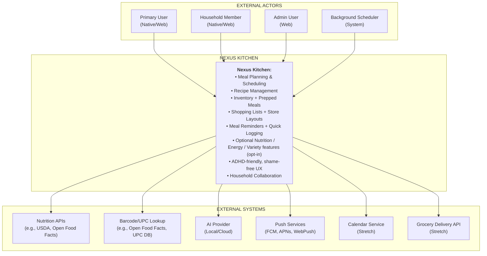

> **Note on diagram hierarchy:** This is a **system context diagram** showing Nexus Kitchen as a black box with external actors and systems. For the internal structure, see:
> - **SRS §1.5.1** — Container diagram showing deployable components (clients, sync service, API server, worker, databases)
> - **Technical Architecture §3.1** — Component topology showing data flow between technical components

### 1.2 Actor Descriptions

| Actor                    | Description                                                         | Key Interactions                                                |
| ------------------------ | ------------------------------------------------------------------- | --------------------------------------------------------------- |
| **Primary User**         | Individual managing their meals, typically with ADHD accommodations | Planning, recipes, inventory, shopping, logging                 |
| **Household Member**     | User in a shared household with varying permission levels           | Shared pantry, shopping lists, meal plans                       |
| **Admin User**           | User with household admin privileges or system administrator        | User management, household settings, data export                |
| **Background Scheduler** | System process for automated tasks                                  | Reminders, expiration checks, sync operations, pattern analysis |

### 1.3 External System Dependencies

| System                          | Purpose                                     | Criticality | Offline Behavior                          |
| ------------------------------- | ------------------------------------------- | ----------- | ----------------------------------------- |
| **Nutrition APIs**              | Ingredient/product nutrition lookup         | Medium      | Cache locally; manual entry fallback      |
| **Barcode/UPC Lookup**          | Product identification from scans           | Low         | Manual entry fallback                     |
| **AI Provider (Local/Cloud)**   | Recipe parsing, suggestions, step breakdown | Low         | Feature unavailable; graceful degradation |
| **Push Services**               | Reminders, alerts, household notifications  | Medium      | Local notifications only                  |
| **Calendar Service** (stretch)  | External calendar sync                      | Low         | Export-only fallback                      |
| **Grocery Delivery API** (stretch) | Shopping list export                     | Low         | Manual list sharing                       |

---

## 2. Logical Component Architecture

### 2.1 High-Level Component Diagram

> **Note on deployment:** this document describes **logical services** (bounded contexts + platform services). For an
> MVP, these may be implemented as a **modular monolith** sharing a **Primary Data Store**, while still preserving
> bounded context boundaries in code. The same logical boundaries can later be deployed as independent services.

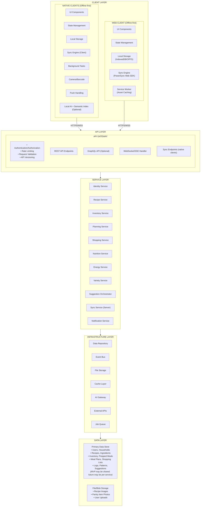

### 2.2 Component Responsibilities

#### Client Layer

> **Client note:** Both native and web clients are **offline-first** with local storage and sync capabilities. Native clients use SQLite + PowerSync Kotlin SDK; web clients use IndexedDB/OPFS + PowerSync Web SDK. Background tasks (reminders, expiration checks) are native-only due to platform limitations.

| Component                                        | Responsibility                                                                          |
| ------------------------------------------------ | --------------------------------------------------------------------------------------- |
| **UI Components**                                | Screen rendering, accessibility, kitchen display mode                                   |
| **State Management**                             | Local state, optimistic updates, UI reactivity                                          |
| **Local Storage (Native)**                       | Offline persistence, cached resources, pending sync queue                               |
| **Sync Engine (Client, Native)**                 | Change tracking, conflict detection, background sync orchestration                      |
| **Background Tasks (Native)**                    | Reminder scheduling, expiration checks, local notifications                             |
| **Camera/Barcode (Native)**                      | Image capture, barcode scanning (optional OCR preprocessing)                            |
| **Push Handling**                                | Receive and display push notifications (native push; web push where supported)          |
| **Local AI + Semantic Index (Optional, Native)** | Local embeddings, semantic search indexing, privacy-first AI execution where configured |

#### API Layer

| Component                 | Responsibility                                                             |
| ------------------------- | -------------------------------------------------------------------------- |
| **API Gateway**           | Single entry point: auth verification, rate limiting, request routing      |
| **REST Endpoints**        | Standard CRUD operations for all resources                                 |
| **GraphQL (Optional)**    | Flexible querying for complex reads (plan → meals → recipes → ingredients) |
| **WebSocket/SSE Handler** | Real-time updates for household collaboration                              |
| **Sync Endpoints**        | Delta sync protocol, conflict resolution, bulk operations                  |

#### Service Layer

| Component                   | Responsibility                                                        |
| --------------------------- | --------------------------------------------------------------------- |
| **Identity Service**        | Auth, households, membership/roles, preferences, feature flags        |
| **Recipe Service**          | Recipe CRUD, import/parsing, scaling, search, tags                    |
| **Inventory Service**       | Pantry items, prepped meals, expiration/defrost, portion ledger       |
| **Planning Service**        | Meal plans, planned meals, prep sessions, reminders, **meal logging** |
| **Shopping Service**        | Shopping lists, store layouts, list generation                        |
| **Nutrition Service**       | Nutrition lookup + caching, daily summaries, goal tracking            |
| **Energy Service**          | Energy logs, pattern analysis, prediction                             |
| **Variety Service**         | Variety metrics, hyperfixation detection, chaining suggestions        |
| **Suggestion Orchestrator** | Cross-service orchestration for suggestions                           |
| **Sync Service (Server)**   | Cursor/change-feed management, conflict resolution, propagation       |
| **Notification Service**    | Push dispatch, reminder scheduling                                    |

#### Infrastructure Layer

| Component           | Responsibility                                                |
| ------------------- | ------------------------------------------------------------- |
| **Data Repository** | DB abstraction, query building, transactions                  |
| **Event Bus**       | Internal pub/sub for domain events                            |
| **File Storage**    | Image upload/storage/optimization (optional CDN)              |
| **Cache Layer**     | Hot data caching + invalidation                               |
| **AI Gateway**      | AI provider abstraction, prompt management, output validation |
| **External APIs**   | Nutrition, barcode/UPC, other third-party clients             |
| **Job Queue**       | Background job scheduling/execution                           |

---

## 3. Bounded Context to Service Mapping

### 3.1 Context-Service Alignment

The domain specification defines **8 bounded contexts**. These map to 8 **domain services/modules**.

In addition, the platform includes supporting **platform services** (Sync Service, Notification Service, Suggestion
Orchestrator). These provide cross-cutting capabilities and are **not** bounded contexts.

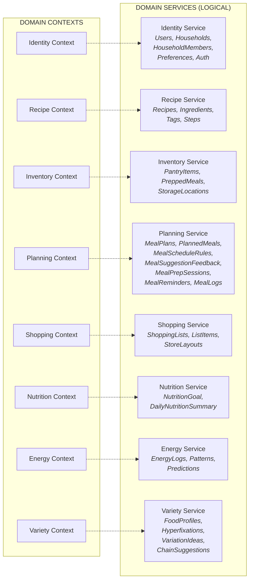

### 3.2 Cross-Context Dependencies

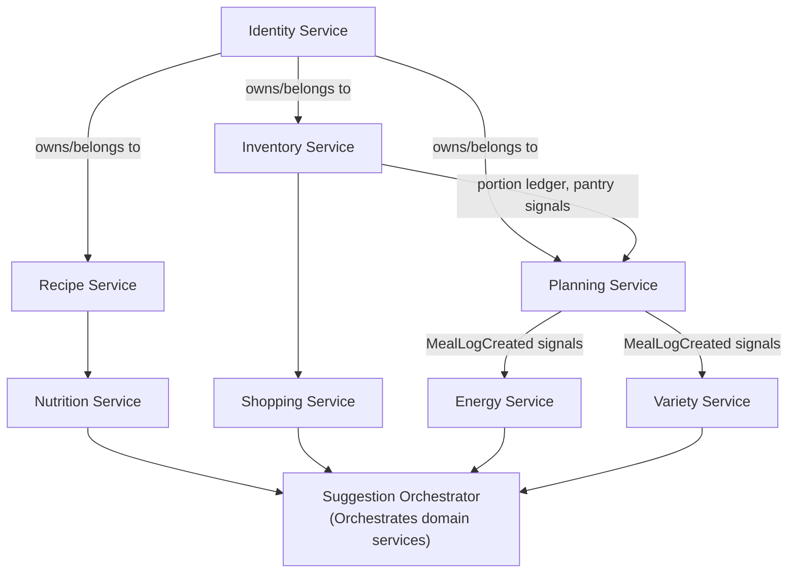

### 3.3 Service Communication Patterns

| Pattern                | Use Case                              | Example                                                                                                    |
| ---------------------- | ------------------------------------- | ---------------------------------------------------------------------------------------------------------- |
| **Direct Query**       | Reads within same deployment          | Planning queries Recipe for meal details                                                                   |
| **Domain Events**      | State changes other services react to | `ConsumePortion` accepted → Inventory emits `PreppedMealPortionConsumed` → Planning emits `MealLogCreated` |
| **Request/Response**   | Operations requiring confirmation     | Planning requests `ConsumePortion(preppedMealId)` from Inventory and awaits accept/reject                  |
| **Saga/Orchestration** | Multi-step workflows                  | Meal prep completion: create prepped meals, update pantry, adjust plan                                     |

> **Design choice:** Inventory is the source of truth for **portion removal** (consumed/discarded/expired). This supports
> cases where portions are removed without implying the user ate the meal.

---

## 4. Core Data Flows

### Legend

- **PS** = Planning Service
- **InvS** = Inventory Service
- **RS** = Recipe Service
- **ES** = Energy Service
- **NS** = Nutrition Service
- **VS** = Variety Service
- **SO** = Suggestion Orchestrator

### 4.1 Meal Planning Flow

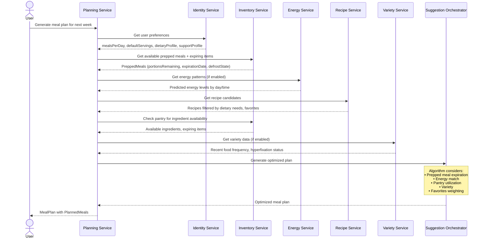

### 4.2 Meal Prep Session Flow

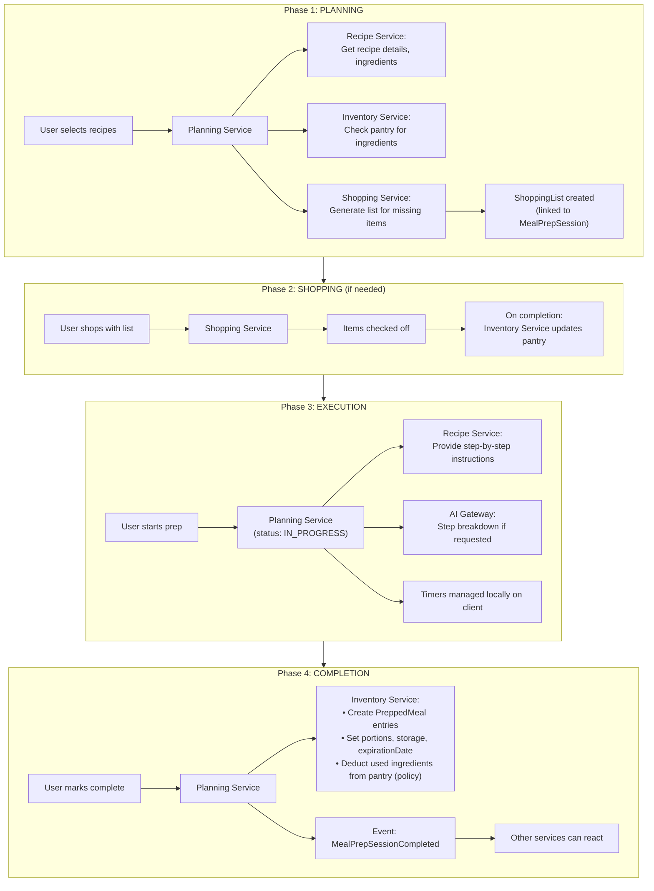

### 4.3 Meal Logging Flow (Inventory is source of truth for portion removal)

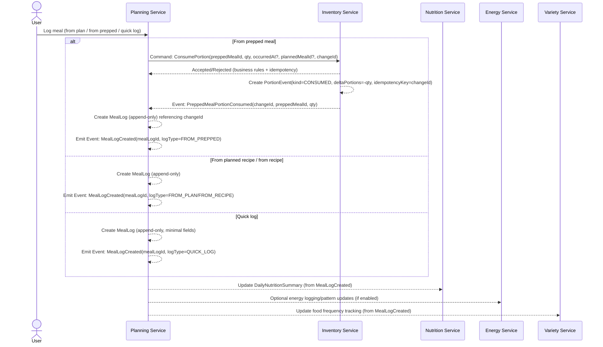

### 4.4 Shopping List Generation Flow

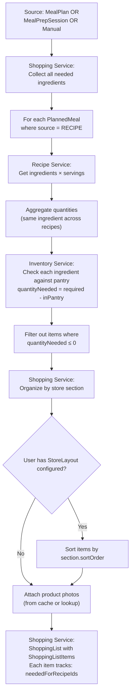

### 4.5 Prepped Meal Discard / Missed Meal (no meal log)

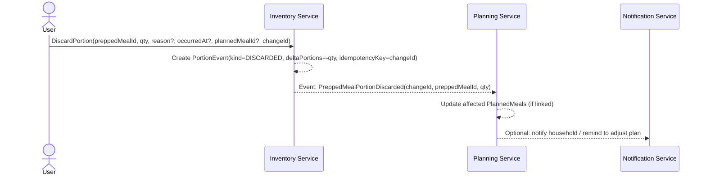

### 4.6 Prepped Meal Expiration (automatic)

Expiration is treated as **inventory removal**, not as consumption, and is recorded via the **portion ledger**.

**Canonical behavior:**

- A background job in **Inventory Service** finds `PreppedMeal` records where `expirationDate < today` and the meal is
  not already expired.
- Inventory appends a **server-created** `PortionEvent(kind=EXPIRED, deltaPortions=-portionsRemaining)` (bringing
  remaining to zero).
- Inventory updates derived freshness/availability projections for UI clarity.
- Inventory emits `PreppedMealExpired` for other services to react (plan adjustments, notifications).

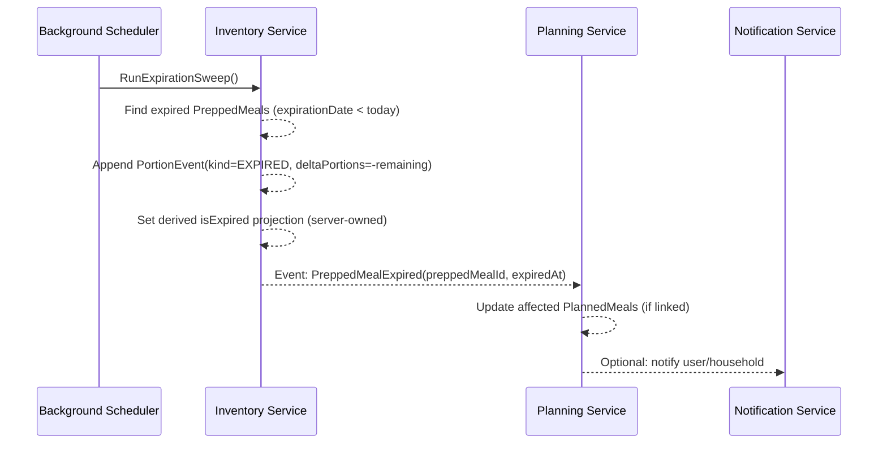

---

## 5. Integration Architecture

### 5.1 Integration Points

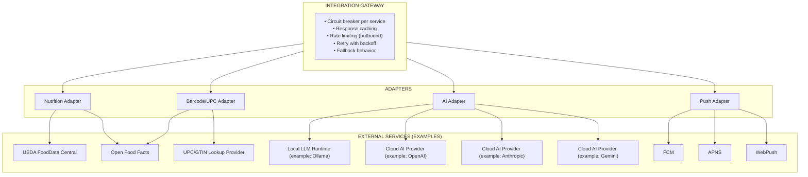

### 5.2 AI Integration Detail

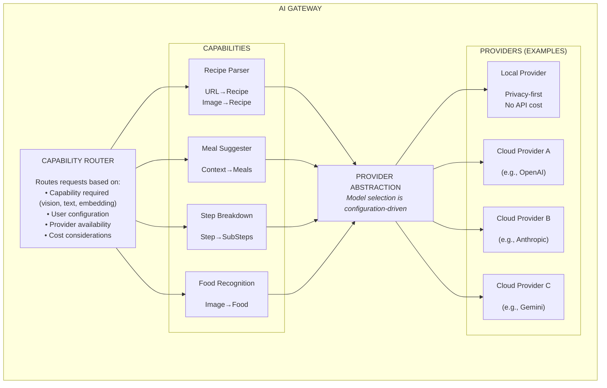

#### 5.2.1 AI Security, Privacy, and Abuse Resistance

- **Data minimization:** enforce allow-lists for what may be sent to providers.
- **Redaction:** scrub likely-PII fields (names, freeform notes) before outbound calls.
- **Prompt-injection resilience:** treat external content (recipe URLs, uploads) as untrusted.
- **Output validation:** validate JSON shape, numeric ranges, units, identifiers before persisting.
- **Auditability:** store request metadata (provider, request type, correlationId); avoid logging raw prompts by default.
- **Graceful degradation:** deterministic fallbacks + manual entry when AI is unavailable.

### 5.3 Graceful Degradation Matrix

| Feature             | AI Available                | AI Unavailable                            |
| ------------------- | --------------------------- | ----------------------------------------- |
| Recipe URL Import   | AI extracts structured data | JSON-LD/schema.org parsing + manual entry |
| Recipe Photo Import | AI parses image             | Manual entry only                         |
| Meal Suggestions    | AI-enhanced personalization | Rule-based suggestions                    |
| Step Breakdown      | AI generates sub-steps      | Show original steps only                  |
| Food Recognition    | AI identifies items         | Manual entry only                         |

---

## 6. Offline-First & Sync Model

### 6.1 Offline Architecture

> This section describes the **offline-first architecture** for both native and web clients. Native clients use SQLite + PowerSync Kotlin SDK; web clients use IndexedDB/OPFS + PowerSync Web SDK. Both maintain local sync queues and support offline operation.

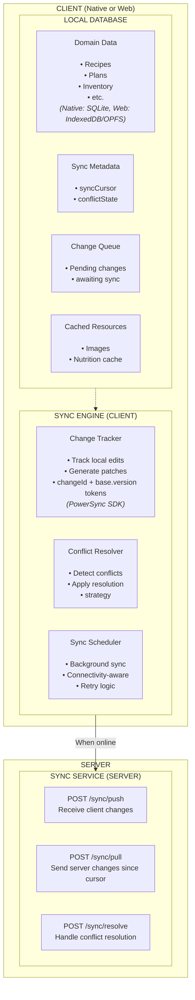

### 6.2 Sync Protocol (Conceptual)

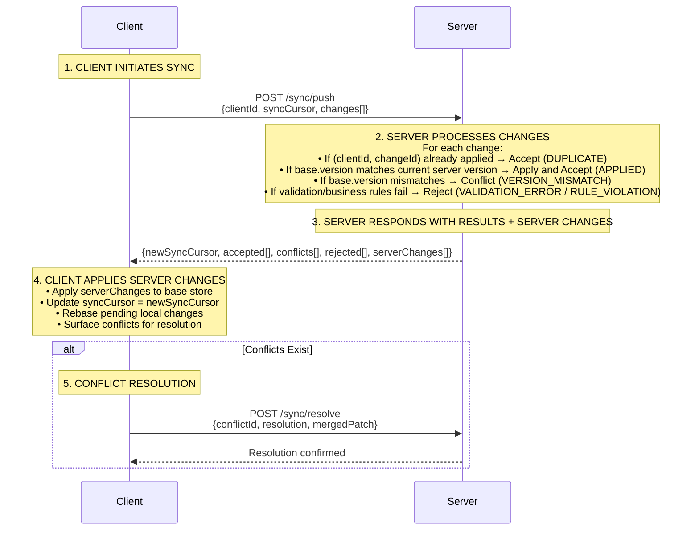

### 6.3 Conflict Resolution Strategy by Entity

| Entity                         | Strategy                                  | Rationale                                                         |
| ------------------------------ | ----------------------------------------- | ----------------------------------------------------------------- |
| **User/Preferences**           | Last-write-wins                           | Personal, single-user most of the time                            |
| **Recipe**                     | LWW (personal) / Merge (household)        | Conflicts are rare                                                |
| **PantryItem**                 | Merge quantities; LWW for other fields    | Multiple users may adjust pantry                                  |
| **PreppedMeal (metadata)**     | LWW                                       | Notes/location/label updates are tolerable LWW                    |
| **PreppedMeal portion events** | **Append-only PortionEvent ledger**       | Prevent double-counting; support consumed vs discarded vs expired |
| **MealPlan**                   | Merge by `(date, mealSlot)` (slotKey)     | Different users schedule different slots                          |
| **PlannedMeal**                | LWW for a slot; special rules for `OTHER` | One meal per standard slot; `OTHER` can be multi                  |
| **ShoppingList**               | Merge items                               | Collaborative                                                     |
| **ShoppingListItem**           | LWW / status-driven                       | Frequent check-offs                                               |
| **MealLog**                    | Append-only                               | Logs shouldn’t conflict                                           |
| **EnergyLog**                  | Append-only                               | Logs shouldn’t conflict                                           |

### 6.4–6.6

These sections are implemented unchanged from the reconciled document (Change model, conflict objects, realtime stream
reuse).  
See **Appendix D** for canonical wire contracts and **Appendix E** for patch surface rules.

---

## 7. Security Architecture

(Adopted unchanged from the reconciled document: auth flow, resource scoping, data protection, API security.)

---

## 8. Cross-Cutting Concerns

### 8.1 Logging & Observability

(Adopted unchanged from the reconciled document, with health endpoints supporting `/health`, `/health/live`, `/health/ready`.)

### 8.2 Error Handling Strategy

(Adopted unchanged from the reconciled document.)

### 8.3 Internationalization (i18n)

(Adopted unchanged from the reconciled document.)

### 8.4 Eventing Reliability (Transactional Outbox)

(Adopted unchanged from the reconciled document.)

### 8.5 Data Lifecycle, Retention, Backup, and Restore

(Adopted unchanged from the reconciled document; see Appendix G for the runbook.)

---

## 9. Open Questions for Technology Selection

### 9.1 Critical Decisions

| Question                       | Options                                 | Impacts                                          |
| ------------------------------ | --------------------------------------- | ------------------------------------------------ |
| **Monolith vs. Services?**     | Modular monolith (MVP) vs microservices | Complexity, deployment, scaling                  |
| **API Style?**                 | REST vs GraphQL vs both                 | Client complexity, caching, bandwidth            |
| **Real-time approach?**        | WebSocket vs SSE vs polling             | Battery, complexity, collaboration feel          |
| **Local DB (native clients)?** | SQLite baseline vs alternatives         | Offline capability, query power, sync complexity |
| **Background sync?**           | OS background tasks vs app-active only  | Reliability vs platform complexity               |
| **AI default?**                | Local-first vs cloud-first              | Privacy vs capability vs cost                    |

### 9.2 Questions by Stack Choice

**Mobile client stack (Kotlin Multiplatform + Compose Multiplatform):**

- Which local database + DAL (SQLite baseline; library choice is an implementation detail)?
- Background sync per OS (Android WorkManager; iOS background tasks)?
- Notification split: local notifications vs push (collaboration)?
- Camera/barcode scanning implementation across targets?
- Client-local semantic index storage/update strategy?

**Web client stack (SvelteKit + PowerSync Web SDK):**

- How to ensure feature parity with mobile while leveraging web-specific capabilities?
- IndexedDB/OPFS storage limits and migration strategy?
- Service Worker caching strategy for offline assets?
- Browser-specific limitations (background sync, notifications)?

**Backend framework & DB:**

- Concurrency + realtime support (WebSocket/SSE)?
- Background jobs (expiration sweeps, reminders, outbox publishing)?
- Self-hosting simplicity and migrations?
- Sync-friendly primitives (change feeds, per-row versioning, conflict detection)?

**AI providers/models (optional):**

- Which providers are supported (local runtime, cloud)?
- How models are selected per capability (text vs vision vs embedding)?
- Default privacy/cost posture (local-first; explicit opt-in for cloud)?
- How structured output is validated and versioned?

### 9.3 Constraints Recap

Sticky constraints (from SRS / core intent):

- **Self-hosting first:** container-friendly deployment; low ops burden; hobby-scale costs.
- **Offline-first all primary clients:** Android + Web primary; iOS stretch.
- **Two UI codebases:** Mobile (KMP/Compose) and Web (SvelteKit) with shared sync infrastructure.
- **Sync approach:** a dedicated Sync Service exists; the system must satisfy offline/sync requirements regardless of
  the specific library.
- **MVP deployment shape:** modular monolith is acceptable; bounded-context boundaries remain explicit in code.
- **Privacy posture:** local-first where feasible; cloud AI/integrations are opt-in and degrade gracefully.

---

## Appendix A: Domain Event Flow Summary

(Adopted unchanged from the reconciled document.)

---

## Appendix B: MVP Scope Considerations

(Adopted unchanged from the reconciled document.)

---

## Appendix C: Conventions, Glossary, and Diagram Legend

### C.4 Canonical `slotKey` Format (Meal Planning)

To make **slot-based planning** predictable across devices (including offline edits within a household),
we standardize on a canonical **derived** `slotKey` string.

> In Nexus Kitchen, the **primary identifier** for a planned meal is `PlannedMeal.id`.  
> `slotKey` is a **deterministic grouping key** derived from `PlannedMeal.date` + `PlannedMeal.mealSlot`.

**Resolved time zone**

- Interpret “planning dates” in:
  - `Household.timeZone` when collaborating, else
  - `UserPreferences.timeZone` (or device time zone in single-user mode).

**Format**

```text
YYYY-MM-DD:<MEAL_SLOT>
```

Where `<MEAL_SLOT>` is one of the domain `MealSlot` codes (examples):

- `BREAKFAST`, `LUNCH`, `DINNER`, `SNACK_1`, `SNACK_2`, `SNACK_3`, `OTHER`

**Rules**

- `slotKey` MUST be deterministic for a given `(date, mealSlot)`.
- Planning SHOULD enforce:
  - at most one active (`status=PLANNED`) `PlannedMeal` per `(mealPlanId, date, mealSlot)` for all slots except `OTHER`,
  - `OTHER` may contain multiple items per day, ordered by `PlannedMeal.sortOrder`.

---

## Appendix D-G

Appendices **D (Canonical Data Contracts)** through **G (Retention/Backup/Restore)** are included from the reconciled
draft and then lightly edited where needed to keep naming and examples consistent with the Domain Specification and
SRS (e.g., `sourceType`, `StoreLayout.userId`, and unit codes).

---

## Appendix D: Canonical Data Contracts

This appendix defines the canonical “wire dialect” used by the **Sync Service** and the eventing/outbox layer.
The goal is to prevent accidental drift where different parts of the system start speaking slightly different languages.

> These schemas are **conceptual**. They can be implemented over REST/JSON, gRPC/protobuf, or any other transport.

### D.1 Common Conventions

- **IDs** are opaque strings (UUID/ULID/etc.). Never encode meaning into IDs.
- **Timestamps** use RFC3339 UTC strings (e.g., `2025-12-25T12:34:56Z`).
- **Dates** use ISO 8601 date-only strings (e.g., `2025-12-25`) and are interpreted in the user/household resolved time
  zone.
- **Delivery is at-least-once**: duplicates are possible. Consumers must be idempotent.
- **Versioning:** every envelope has `schemaVersion` (integer). Backward-compatible additions are optional fields;
  breaking changes increment `schemaVersion`.
- **Tracing:**
  - `correlationId` ties together a whole user action across services.
  - `causationId` points to the immediate trigger (a `changeId`, prior `eventId`, or request id).

---

### D.2 `ChangeV1` (Sync Mutation Unit)

A `Change` is the unit of replication between client and server: “this is what I did (or tried to do), even if I was offline.”

#### Shape (TypeScript-style)

```ts
type ChangeOp = "CREATE" | "PATCH" | "DELETE" | "COMMAND";
type PatchFormat = "JSON_PATCH"; // Recommended: RFC 6902 semantics

interface JsonPatchOperation {
  op: "add" | "remove" | "replace" | "move" | "copy" | "test";
  path: string; // JSON Pointer, e.g. "/notes"
  from?: string; // required for move/copy
  value?: unknown; // required for add/replace/test
}

interface ChangeV1 {
  schemaVersion: 1;

  // Idempotency / dedupe
  changeId: string; // unique per client; stable across retries
  clientId: string; // stable installation/client identity
  deviceId?: string; // optional (debugging/analytics)

  // Auth/tenancy context (server validates against session)
  actorUserId: string;
  householdId?: string;

  // Target entity/aggregate
  target: {
    type: string; // e.g., "PantryItem", "MealPlan", "PreppedMeal"
    id: string;
  };

  op: ChangeOp;

  // Concurrency control (optimistic locking)
  base?: {
    version: string; // opaque server version token the client last saw
  };

  // Operation-specific body (see below)
  body?: unknown;

  // Client time (informational)
  clientObservedAt: string;

  // Tracing
  correlationId?: string;
  causationId?: string;
}
```

#### Operation bodies

```ts
// CREATE: full initial representation (patches don’t help you if the entity doesn’t exist yet)
interface CreateBodyV1 {
  initial: Record<string, unknown>;
}

// PATCH: patch document applied to the server’s current entity state,
// but only if base.version matches
interface PatchBodyV1 {
  patchFormat: "JSON_PATCH";
  patch: JsonPatchOperation[];
}

// DELETE: delete intent + optional audit hint
interface DeleteBodyV1 {
  reason?: string;
}

// COMMAND: imperative action (server maps to one or more writes + domain events)
interface CommandBodyV1 {
  name: string;                 // e.g., "ConsumePortion"
  args: Record<string, unknown>;
}

> Command names and required arguments are standardized in **Appendix F: Command Catalog**.
```

#### `ChangeV1` invariants

1. **Idempotency:** `(clientId, changeId)` uniquely identifies a change. Retrying must not duplicate effects.
2. **Concurrency correctness:**
   - `base.version` is **required** for `PATCH` and `DELETE`.
   - If `base.version` mismatches the server’s current version, the server returns a **Conflict** (below) and does not
     partially apply.
3. **Patch safety:**
   - Server must validate patches (paths allowed, types valid, no illegal mutations of derived fields). See **Appendix E**
     for the canonical patch surface area.
   - Prefer small patches to reduce conflict surface area and make merges easier.
4. **Command safety:**
   - Commands are validated like any other input (schema + business rules).
   - Commands may produce **server-created** derived records (e.g., `PortionEvent`) and publish domain events.

---

### D.3 Sync API Envelopes (Conceptual)

These are the minimal payloads needed to make sync predictable and debuggable.

```ts
interface SyncPushRequestV1 {
  schemaVersion: 1;
  clientId: string;
  syncCursor?: string; // opaque; omit if first sync
  changes: ChangeV1[];
}

type AcceptedStatus = "APPLIED" | "DUPLICATE";

interface AcceptedChangeV1 {
  changeId: string;
  status: AcceptedStatus;
}

interface RejectedChangeV1 {
  changeId: string;
  error: {
    code: string; // e.g., "VALIDATION_ERROR", "RULE_VIOLATION"
    message: string;
  };
}

interface SyncPushResponseV1 {
  schemaVersion: 1;
  newSyncCursor: string;
  accepted: AcceptedChangeV1[];
  conflicts: ConflictV1[];
  rejected?: RejectedChangeV1[];
  serverChanges: ChangeV1[]; // deltas since prior cursor (or a small “catch-up” set)
}

interface SyncPullRequestV1 {
  schemaVersion: 1;
  clientId: string;
  syncCursor?: string;
}

interface SyncPullResponseV1 {
  schemaVersion: 1;
  newSyncCursor: string;
  serverChanges: ChangeV1[];
}
```

**`serverChanges[]` semantics**

- `serverChanges` is the authoritative change feed since the provided `syncCursor`.
- It MAY include both:
  - changes produced by _other clients_ (collaboration), and
  - **side effects** caused by accepted changes in the same `/sync/push` request.
- Clients MUST apply `serverChanges` idempotently and should not assume a global ordering across entity types.
  - Use per-entity `version` tokens for mutable entities.
  - Use `sequence` ordering for append-only ledgers like `PortionEventV1`.

---

### D.4 `ConflictV1` (Conflict Object Schema)

A `Conflict` represents “the client tried to apply a `Change`, but the server has moved on.”

```ts
type ConflictReason = "VERSION_MISMATCH" | "MISSING_ENTITY" | "RULE_VIOLATION"; // sometimes treated as rejection; included here for completeness

type ConflictResolutionOption =
  | "KEEP_SERVER"
  | "APPLY_CLIENT_PATCH_ON_LATEST"
  | "MANUAL_MERGE";

interface ConflictV1 {
  schemaVersion: 1;

  conflictId: string;

  // Reference to the client attempt
  clientId: string;
  changeId: string;

  target: {
    type: string;
    id: string;
  };

  op: ChangeOp;
  reason: ConflictReason;

  // What the client thought it was editing
  base?: {
    version?: string;
  };

  // The server’s current truth
  server: {
    version: string;
    updatedAt?: string;

    // Optional: include a current snapshot to enable UI merge flows.
    // For large entities, you may omit this and require the client to fetch it.
    snapshot?: Record<string, unknown>;
  };

  // Echo the client attempt (usually a patch or command args) for UI resolution.
  clientBody?: unknown;

  // What the server will accept as a next step
  resolutionOptions: ConflictResolutionOption[];

  // Optional: server-proposed merge hint (still must be validated client-side)
  suggestedPatch?: PatchBodyV1;
}
```

#### Conflict resolution request (conceptual)

```ts
interface SyncResolveRequestV1 {
  schemaVersion: 1;
  conflictId: string;

  resolution: "KEEP_SERVER" | "APPLY_CLIENT_PATCH_ON_LATEST" | "MANUAL_MERGE";

  // For manual merge flows: supply a patch that transforms the current server snapshot
  // into the desired merged state.
  mergedPatch?: PatchBodyV1;
}

interface SyncResolveResponseV1 {
  schemaVersion: 1;
  resolved: boolean;
  serverChanges?: ChangeV1[]; // optional: server can return the applied merged result
}
```

---

### D.5 `DomainEventV1` (Event Bus / Outbox Unit)

A `DomainEvent` is an immutable fact: “this happened in the domain.”

```ts
interface DomainEventV1 {
  schemaVersion: 1;

  eventId: string; // globally unique; dedupe key for subscribers
  eventType: string; // past tense preferred, e.g., "MealLogCreated"
  occurredAt: string; // domain time (when it happened)
  recordedAt: string; // system time (when persisted/published)

  producer: {
    service: string; // e.g., "inventory"
    instanceId?: string;
  };

  actor: {
    userId?: string; // optional for system events
    householdId?: string;
  };

  correlationId?: string;
  causationId?: string; // often a changeId or prior eventId
  requestId?: string;

  aggregate: {
    type: string; // e.g., "PreppedMeal"
    id: string;
    version?: number | string;
  };

  payload: Record<string, unknown>;

  // Non-domain metadata (avoid PII)
  meta?: Record<string, unknown>;
}
```

**Event invariants**

- Events are **immutable**. Corrections happen via new events.
- Consumers must dedupe by `eventId`.
- If `aggregate.version` exists, it must be monotonic **per aggregate**.

---

### D.6 `PortionEventV1` (Inventory Portion Ledger Record)

A `PortionEvent` is the append-only ledger explaining how a `PreppedMeal`’s remaining portions changed over time.
This supports “consumed” vs “discarded/missed” vs “expired” without guessing.

> **Option 2 (chosen):** clients submit **commands**; the server creates canonical `PortionEvent` records after validation.

```ts
type PortionEventKind = "CONSUMED" | "DISCARDED" | "EXPIRED" | "ADJUSTED";

interface PortionEventV1 {
  schemaVersion: 1;

  portionEventId: string; // server-generated; unique
  preppedMealId: string;

  kind: PortionEventKind;

  // Signed delta: negative removes portions, positive adds portions (only ADJUSTED should add)
  deltaPortions: number; // non-zero integer, e.g. -1, -2, +1

  occurredAt: string; // user-observed time (client-provided)
  recordedAt: string; // server time (authoritative)

  actorUserId?: string; // optional for system events (expiration job)
  householdId?: string;

  links?: {
    mealLogId?: string; // often present for CONSUMED (if later linked)
    plannedMealId?: string; // useful for “missed meal” UX
  };

  // Required for ADJUSTED, optional otherwise
  reason?: string;

  // Ordering (server-assigned, monotonic per preppedMeal)
  sequence: number;

  // Trace back to the sync command/change
  causation?: {
    changeId?: string;
    correlationId?: string;
  };
}
```

**Ledger invariants**

- Append-only: never edit/delete. Fix mistakes via a new `ADJUSTED` event.
- `deltaPortions` must be non-zero integer.
- If `kind ∈ {CONSUMED, DISCARDED, EXPIRED}`, `deltaPortions` must be negative.
- Server rejects any event that would cause derived remaining portions `< 0`.
- `sequence` is strictly increasing per `preppedMealId`.

**Sync representation**

- `PortionEventV1` records are replicated to clients as `ChangeV1(op="CREATE")` with:
  - `target.type = "PortionEvent"`
  - `target.id = portionEventId`
- They are immutable and append-only. Clients MUST NOT `PATCH` or `DELETE` portion events.

---

### D.7 Portion-Related Commands (producing `PortionEventV1`)

These commands are carried inside `ChangeV1(op="COMMAND")`.

```ts
// Consume portions (implies eaten)
interface ConsumePortionArgsV1 {
  preppedMealId: string;
  qty: number; // positive integer
  occurredAt?: string; // if omitted, server may use "now" (less ideal)
  plannedMealId?: string; // optional link for plan correlation
}

// Discard portions (missed/spoiled; explicitly not eaten)
interface DiscardPortionArgsV1 {
  preppedMealId: string;
  qty: number; // positive integer
  occurredAt?: string;
  reason?: string;
  plannedMealId?: string;
}

// Manual adjustment (e.g., “actually there were 6 portions not 4”)
interface AdjustPortionsArgsV1 {
  preppedMealId: string;
  deltaPortions: number; // can be + or -
  occurredAt?: string;
  reason: string; // required
}
```

**Command → ledger mapping**

- `ConsumePortion(qty=N)` → `PortionEvent(kind=CONSUMED, deltaPortions=-N)`
- `DiscardPortion(qty=N)` → `PortionEvent(kind=DISCARDED, deltaPortions=-N)`
- `AdjustPortions(delta=X)` → `PortionEvent(kind=ADJUSTED, deltaPortions=X)`

---

### D.8 `RealtimeMessageV1` (Real-Time Change Stream Envelope)

If a real-time channel (WebSocket/SSE) is implemented, it MUST reuse the `ChangeV1` dialect to avoid “two apply
engines” on the client.

```ts
type RealtimeMessageType =
  | "CHANGE_BATCH"
  | "RESYNC_REQUIRED"
  | "PING"
  | "ERROR";

interface RealtimeMessageV1 {
  schemaVersion: 1;
  type: RealtimeMessageType;
  emittedAt: string;
  householdId?: string;

  changes?: ChangeV1[]; // present for CHANGE_BATCH
  cursorHint?: string; // optional (see Section 6.6)

  error?: { code: string; message: string };
}
```

**Rules**

- The real-time channel is **best-effort**. Clients MUST still reconcile using `/sync/pull` and `syncCursor`.
- Duplicates are allowed. Apply idempotently.
- If the server cannot resume from the client’s last cursor (retention window exceeded), it emits `RESYNC_REQUIRED`.

### D.9 Minimal Examples

#### Example: patch a PantryItem note

```json
{
  "schemaVersion": 1,
  "changeId": "chg_01HZX2...",
  "clientId": "client_abc",
  "actorUserId": "user_123",
  "householdId": "hh_9",
  "target": { "type": "PantryItem", "id": "pi_77" },
  "op": "PATCH",
  "base": { "version": "v_12" },
  "body": {
    "patchFormat": "JSON_PATCH",
    "patch": [
      { "op": "replace", "path": "/notes", "value": "Buy again if on sale" }
    ]
  },
  "clientObservedAt": "2025-12-25T18:10:01Z",
  "correlationId": "corr_01HZX2..."
}
```

#### Example: consume a portion (server creates the ledger event)

```json
{
  "schemaVersion": 1,
  "changeId": "chg_01HZX3...",
  "clientId": "client_abc",
  "actorUserId": "user_123",
  "householdId": "hh_9",
  "target": { "type": "PreppedMeal", "id": "pm_77" },
  "op": "COMMAND",
  "body": {
    "name": "ConsumePortion",
    "args": {
      "preppedMealId": "pm_77",
      "qty": 1,
      "occurredAt": "2025-12-25T18:10:00Z"
    }
  },
  "clientObservedAt": "2025-12-25T18:10:01Z"
}
```

---

## Appendix E: Patchability Contract

This appendix defines the **canonical patch surface area** for Nexus Kitchen so different clients don’t invent
incompatible JSON shapes and paths (especially important for offline-queued changes).

### E.1 Patch Dialect Rules

**A. Patch paths must be stable**

- JSON Patch paths are effectively part of your API. Renaming fields breaks queued/offline patches.
- If a field rename is required, bump the relevant schema version and provide migration logic.

**B. Patch only domain-owned fields**

- Clients **MUST NOT** patch server-owned or derived fields such as:
  - `/version`, `/updatedAt`, `/createdAt`
  - computed projections (e.g., `isExpired`, `isExpiringSoon`)
  - derived inventory totals (e.g., `portionsRemaining` derived from the `PortionEvent` ledger)
  - audit fields (`createdBy`, `lastModifiedBy`)

**C. Avoid array-index patches**

- Never patch `/ingredients/0/name` style paths.
- For list-heavy structures (Recipe ingredients/steps, StoreLayout sections), prefer **commands** (Appendix F),
  or use stable element IDs and replace whole arrays when absolutely necessary.

**D. Prefer commands for semantic operations**

- If an operation needs invariants, reordering, idempotency, or multi-entity updates, use a command:
  - `ConsumePortion`, `DiscardPortion`, `AdjustPortions`
  - planned meal move/swap/log actions
  - “checked state” on shopping items

---

### E.2 Entity Patch Surface Summary

| Entity Type              | Patchable (examples)                                                                                                                                                | Immutable                                                             | Server-owned / Derived                                                                     | Notes / Prefer Commands                                                                                                                   |
| ------------------------ | ------------------------------------------------------------------------------------------------------------------------------------------------------------------- | --------------------------------------------------------------------- | ------------------------------------------------------------------------------------------ | ----------------------------------------------------------------------------------------------------------------------------------------- |
| `UserPreferences`        | `/mealsPerDay`, `/defaultServings`, `/measurementSystem`, `/theme`, `/notificationsEnabled`, `/timeZone`, `/supportProfile/*`, `/dietaryProfile/*`, feature opt-ins | `/userId`                                                             | `/version`, `/updatedAt`                                                                   | Low conflict; LWW acceptable                                                                                                              |
| `Household`              | `/name`, `/timeZone`                                                                                                                                                | `/id`                                                                 | `/version`, `/updatedAt`                                                                   | Membership changes via commands                                                                                                           |
| `Recipe`                 | `/title`, `/description`, `/tags`, `/servings`, `/nutritionPerServing`                                                                                              | `/id`, `/ownerId`                                                     | `/version`, `/updatedAt`                                                                   | Prefer commands for ingredients/steps (Appendix F)                                                                                        |
| `PantryItem`             | `/name`, `/quantity`, `/unit`, `/minimumQuantity`, `/storageLocation`, `/customLocation`, `/purchaseDate`, `/expirationDate`, `/openedDate`, `/notes`               | `/id`, `/ownerId`                                                     | `/version`, `/updatedAt`, computed freshness flags                                         | Quantity merges should prefer additive adjustments (server policy)                                                                        |
| `PreppedMeal` (metadata) | `/displayName`, `/notes`, `/containerLabel`, `/storageLocation`, `/expirationDate`                                                                                  | `/id`, `/ownerId`, `/recipeId`                                        | `/portionsRemaining` (derived), computed freshness/defrost flags, `/version`, `/updatedAt` | Portions via `ConsumePortion`/`DiscardPortion`/`AdjustPortions` commands only                                                             |
| `PortionEvent`           | _(none — CREATE only)_                                                                                                                                              | _(all fields immutable)_                                              | `/sequence`, `/recordedAt`                                                                 | Ledger entries replicate as CREATE changes; clients never PATCH/DELETE                                                                    |
| `MealPlan`               | `/name`, `/startDate`, `/endDate`, `/generationPreferences/*`                                                                                                       | `/id`, `/ownerId`                                                     | `/version`, `/updatedAt`                                                                   | PlannedMeals are separate entities                                                                                                        |
| `PlannedMeal`            | `/date`, `/mealSlot`, `/source`, `/recipeId`, `/preppedMealId`, `/quickMealName`, `/servings`, `/status`                                                            | `/id`, `/mealPlanId`                                                  | `/version`, `/updatedAt`, derived projections                                              | Prefer commands for move/swap/log workflows (Appendix F)                                                                                  |
| `ShoppingList`           | `/name`, `/storeLayoutId`, `/status`                                                                                                                                | `/id`, `/ownerId`, `/sourceType`, `/mealPlanId`, `/mealPrepSessionId` | `/version`, `/updatedAt`, `/completedAt`                                                   | Prefer `GenerateShoppingListFromMealPlan` / `MarkShoppingListCompleted` for semantic transitions; item-level ops via commands recommended |
| `StoreLayout`            | `/storeName`, `/isDefault`, `/sections/*`                                                                                                                           | `/id`, `/userId`                                                      | `/version`, `/updatedAt`                                                                   | Edit-heavy: use commands (Appendix F); avoid array-index patches                                                                          |
| `ShoppingListItem`       | `/name`, `/quantity`, `/unit`, `/ingredientId`, `/barcode`, `/status`, `/storeSectionId`, `/notes`                                                                  | `/id`, `/shoppingListId`                                              | `/checkedAt`, `/checkedByUserId`, `/version`, `/updatedAt`                                 | Checked state via `SetShoppingListItemChecked` (Appendix F)                                                                               |
| `MealLog`                | _(none — CREATE only)_                                                                                                                                              | `/id`, `/userId`                                                      | `/version`, `/createdAt`                                                                   | Corrections via delete+recreate (or future correction command)                                                                            |
| `EnergyLog`              | _(none — CREATE only)_                                                                                                                                              | `/id`, `/userId`                                                      | `/version`, `/createdAt`                                                                   | Same as MealLog                                                                                                                           |

---

### E.3 Canonical JSON Shapes (Skeletons)

These skeletons exist to make patch paths unambiguous. Fields marked `(server)` are server-owned or derived.

#### `PantryItem` (example)

```json
{
  "id": "pi_123",
  "ownerId": "u_1",
  "householdId": "hh_9",
  "ingredientId": "ing_42",
  "name": "Greek yogurt",
  "barcode": "0123456789",
  "notes": "Get lactose-free next time",
  "quantity": 1.0,
  "unit": "PACKAGE",
  "minimumQuantity": 1.0,
  "storageLocation": "FRIDGE",
  "customLocation": null,
  "purchaseDate": "2025-12-24",
  "expirationDate": "2025-12-30",
  "openedDate": "2025-12-25",
  "photoUrl": null,
  "thumbnailUrl": null,
  "version": "v_12", // (server)
  "updatedAt": "2025-12-26T00:00:00Z" // (server)
}
```

#### `PreppedMeal` (metadata; portions are derived from a ledger)

```json
{
  "id": "pm_77",
  "ownerId": "u_1",
  "householdId": "hh_9",
  "recipeId": "r_42",
  "recipeName": "Chili",
  "displayName": "Mild chili batch",
  "notes": "Mild batch",
  "containerLabel": "Blue lid container",
  "originalPortions": 6,
  "portionsRemaining": 4, // (server, derived from PortionEvent ledger)
  "preparedDate": "2025-12-26",
  "expirationDate": "2026-01-10",
  "defrostState": "FROZEN",
  "defrostStartedAt": null,
  "estimatedReadyAt": null, // (server, optional)
  "storageLocation": "FREEZER",
  "photoUrl": null,
  "version": "v_5", // (server)
  "updatedAt": "2025-12-26T00:00:00Z" // (server)
}
```

#### `PortionEvent` (append-only; CREATE only)

```json
{
  "id": "pev_01ABC...",
  "preppedMealId": "pm_77",
  "kind": "CONSUMED",
  "deltaPortions": -1,
  "occurredAt": "2025-12-26T12:00:00Z",
  "recordedAt": "2025-12-26T12:00:02Z", // (server)
  "sequence": 42, // (server)
  "mealLogId": "ml_01DEF...",
  "plannedMealId": "plm_123",
  "idempotencyKey": "chg_01XYZ...",
  "reason": ""
}
```

#### `Recipe` (arrays are replace-only unless you use commands)

```json
{
  "id": "r_42",
  "ownerId": "u_1",
  "householdId": "hh_9",
  "title": "Sheet-pan chicken",
  "description": "Fast weeknight dinner",
  "tags": ["quick", "high-protein"],
  "servings": 4,
  "ingredients": [
    {
      "id": "ri_1",
      "ingredientId": "ing_1",
      "name": "Chicken thighs",
      "quantity": 1.0,
      "unit": "LB",
      "preparation": "",
      "isOptional": false,
      "substituteFor": null,
      "sortOrder": 0
    }
  ],
  "steps": [
    {
      "id": "st_1",
      "instruction": "Preheat oven to 425F",
      "durationMinutes": 0,
      "timerMinutes": null,
      "timerLabel": null,
      "imageUrl": null,
      "sortOrder": 0
    }
  ],
  "version": "v_18", // (server)
  "updatedAt": "2025-12-26T00:00:00Z" // (server)
}
```

#### `ShoppingListItem` (status-driven checked state)

```json
{
  "id": "sli_8",
  "shoppingListId": "sl_1",
  "name": "Onions",
  "quantity": 2,
  "unit": "PIECE",
  "status": "PENDING", // PENDING | CHECKED | UNAVAILABLE | REMOVED
  "checkedAt": null,
  "checkedByUserId": null,
  "storeSectionId": "sec_produce",
  "notes": "",
  "barcode": "0123456789",
  "version": "v_3", // (server)
  "updatedAt": "2025-12-26T00:00:00Z" // (server)
}
```

#### `PlannedMeal` (slot-based planning)

```json
{
  "id": "plm_123",
  "mealPlanId": "mp_1",
  "date": "2025-12-26",
  "mealSlot": "DINNER",
  "source": "RECIPE", // RECIPE | PREPPED | QUICK
  "recipeId": "r_42",
  "preppedMealId": null,
  "quickMealName": null,
  "servings": 2,
  "status": "PLANNED", // PLANNED | LOGGED | SKIPPED | SWAPPED
  "loggedAt": null,
  "sortOrder": 0,
  "version": "v_2", // (server)
  "updatedAt": "2025-12-26T00:00:00Z" // (server)
}
```

---

## Appendix F: Command Catalog

This appendix standardizes the **imperative commands** carried inside `ChangeV1(op="COMMAND")`. The intent is to prevent
different clients (mobile/web) and services from inventing subtly different semantics for the same user action.

> CRUD-style edits on simple scalar fields are still handled via `CREATE` / `PATCH` / `DELETE`.  
> Commands exist for **semantic operations** and **list-heavy structures** where JSON Patch paths and array indices
> become brittle.

### F.1 Command Dialect Rules

1. **Idempotency is mandatory**
   - Commands are deduped by `(clientId, changeId)` (see `ChangeV1`).
   - Retrying the same command must not duplicate effects.
2. **Prefer deterministic “set” commands over “toggle” commands**
   - Avoid commands whose meaning depends on the current server state (e.g., `ToggleChecked`).
   - Prefer `SetX(value=true/false)` so replay and conflict resolution are straightforward.
3. **Embedded list operations must be item-ID based**
   - Commands that act on embedded lists (recipe ingredients/steps, store layout sections) must reference
     **stable element IDs**, not array indices.
   - Clients may generate element IDs locally (recommended) so offline edits can reference newly-created elements
     before sync.
4. **Concurrency tokens**
   - `base.version` is optional for `COMMAND` at the protocol level, but individual commands may require it.
   - Rule of thumb:
     - **Reorder / structural changes:** require `base.version`
     - **Pure “set” updates:** recommend `base.version`
     - **Ledger-producing commands:** rely primarily on server validation + idempotency
5. **Server is allowed to fan-out writes**
   - One command may update multiple records and emit multiple domain events (e.g., generate shopping list items).
   - The sync response returns the resulting state as `serverChanges[]`.

### F.2 Command Envelope (carried in `ChangeV1`)

```ts
// Carried inside ChangeV1.body when op="COMMAND"
interface CommandBodyV1 {
  name: string;
  args: Record<string, unknown>;
}
```

**Command execution outcome**

- Success: the change is returned in `accepted[]` (APPLIED/DUPLICATE), and state updates flow back via `serverChanges[]`.
- Failure: returned in `rejected[]` (validation/rule violation), or `conflicts[]` (version mismatch or missing entity).

---

### F.3 Catalog

#### F.3.1 Identity Service — Household membership commands

These commands manage household collaboration and roles. They are treated as **commands** rather than patches to avoid
security bugs and to enforce role/business invariants centrally.

| Command                      | Target.type       | Requires `base.version` | Primary purpose                       | Emits (examples)                |
| ---------------------------- | ----------------- | ----------------------: | ------------------------------------- | ------------------------------- |
| `InviteHouseholdMember`      | `Household`       |             Recommended | Create an invitation for a new member | `HouseholdMemberInvited`        |
| `RevokeHouseholdInvite`      | `Household`       |             Recommended | Cancel a pending invite               | `HouseholdInviteRevoked`        |
| `AcceptHouseholdInvite`      | `HouseholdInvite` |                      No | Accept an invite and join household   | `HouseholdMemberAdded`          |
| `RemoveHouseholdMember`      | `Household`       |             Recommended | Remove a member from a household      | `HouseholdMemberRemoved`        |
| `ChangeHouseholdMemberRole`  | `Household`       |             Recommended | Change a member’s role                | `HouseholdMemberRoleChanged`    |
| `LeaveHousehold`             | `Household`       |             Recommended | Current user leaves the household     | `HouseholdMemberLeft`           |
| `TransferHouseholdOwnership` | `Household`       |             Recommended | Transfer admin/owner privileges       | `HouseholdOwnershipTransferred` |

**Args schemas (conceptual):**

```ts
type HouseholdRole = "ADMIN" | "MEMBER" | "VIEWER";

interface InviteHouseholdMemberArgsV1 {
  invitee: { email?: string; userId?: string }; // at least one required
  role: HouseholdRole;
  message?: string;
  expiresAt?: string; // optional server-enforced upper bound
}

interface RevokeHouseholdInviteArgsV1 {
  inviteId: string;
  reason?: string;
}

interface AcceptHouseholdInviteArgsV1 {
  inviteId: string; // may equal Change.target.id if target.type="HouseholdInvite"
  acceptedAt?: string;
}

interface RemoveHouseholdMemberArgsV1 {
  memberUserId: string;
  reason?: string;
}

interface ChangeHouseholdMemberRoleArgsV1 {
  memberUserId: string;
  newRole: HouseholdRole;
  reason?: string;
}

interface LeaveHouseholdArgsV1 {
  reason?: string;
}

interface TransferHouseholdOwnershipArgsV1 {
  newOwnerUserId: string;
  reason?: string;
}
```

**Invariants (non-exhaustive):**

- Only admins can invite/revoke/remove/change roles/transfer ownership.
- A household must always have at least one admin.
- `InviteHouseholdMember`: must not create duplicate active invites for the same email/user unless explicitly allowed.
- `AcceptHouseholdInvite`: invite must exist, not be expired, and not already accepted/revoked.
- `RemoveHouseholdMember`: cannot remove the last admin; removing yourself should be `LeaveHousehold`.

---

#### F.3.2 Recipe Service — ingredient & step list commands

Recipe ingredients/steps are **embedded lists**. Commands are used instead of array-index JSON patches to avoid brittle
paths and merge nightmares.

> **Canonical shape note (matches Domain Spec):**
>
> - `Recipe.ingredients[]` items MUST include a stable element `id` (a recipe-ingredient ID, distinct from the master `ingredientId`).
> - `Recipe.steps[]` items MUST include a stable element `id` (a step ID).
>   See Appendix E for the canonical skeleton.

| Command                    | Target.type | Requires `base.version` | Primary purpose               | Emits (examples) |
| -------------------------- | ----------- | ----------------------: | ----------------------------- | ---------------- |
| `AddRecipeIngredient`      | `Recipe`    |             Recommended | Add ingredient element        | `RecipeUpdated`  |
| `UpdateRecipeIngredient`   | `Recipe`    |             Recommended | Update one ingredient element | `RecipeUpdated`  |
| `RemoveRecipeIngredient`   | `Recipe`    |             Recommended | Remove ingredient element     | `RecipeUpdated`  |
| `ReorderRecipeIngredients` | `Recipe`    |            **Required** | Deterministic reorder         | `RecipeUpdated`  |
| `AddRecipeStep`            | `Recipe`    |             Recommended | Add step element              | `RecipeUpdated`  |
| `UpdateRecipeStep`         | `Recipe`    |             Recommended | Update one step element       | `RecipeUpdated`  |
| `RemoveRecipeStep`         | `Recipe`    |             Recommended | Remove step element           | `RecipeUpdated`  |
| `ReorderRecipeSteps`       | `Recipe`    |            **Required** | Deterministic reorder         | `RecipeUpdated`  |

```ts
interface RecipeIngredientInputV1 {
  id: string; // recipe-ingredient element id (stable within recipe)
  ingredientId?: string; // optional link to master Ingredient
  name: string;
  quantity?: number;
  unit?: string;
  preparation?: string;
  isOptional?: boolean;
  substituteFor?: string;
}

interface AddRecipeIngredientArgsV1 {
  ingredient: RecipeIngredientInputV1;
  insertBeforeId?: string; // recipe-ingredient id; if omitted, append
}

interface UpdateRecipeIngredientArgsV1 {
  id: string; // recipe-ingredient id
  updates: Partial<Omit<RecipeIngredientInputV1, "id">>;
}

interface RemoveRecipeIngredientArgsV1 {
  id: string; // recipe-ingredient id
}

interface ReorderRecipeIngredientsArgsV1 {
  orderedIds: string[]; // must contain all existing recipe-ingredient ids exactly once
}

interface RecipeStepInputV1 {
  id: string; // step id (stable within recipe)
  instruction: string;
  durationMinutes?: number;
  timerMinutes?: number;
  timerLabel?: string;
  imageUrl?: string;
}

interface AddRecipeStepArgsV1 {
  step: RecipeStepInputV1;
  insertBeforeId?: string; // step id; if omitted, append
}

interface UpdateRecipeStepArgsV1 {
  id: string; // step id
  updates: Partial<Omit<RecipeStepInputV1, "id">>;
}

interface RemoveRecipeStepArgsV1 {
  id: string; // step id
}

interface ReorderRecipeStepsArgsV1 {
  orderedIds: string[]; // must contain all existing step ids exactly once
}
```

#### F.3.3 Shopping Service — list operations & store layout sections

Shopping lists are collaborative and often edited rapidly. Commands are used for operations with semantics (generation,
completion) and for list-like structures (store layout sections, deterministic ordering).

##### Shopping list workflow commands

| Command                            | Target.type        | Requires `base.version` | Primary purpose                                 | Emits (examples)                                |
| ---------------------------------- | ------------------ | ----------------------: | ----------------------------------------------- | ----------------------------------------------- |
| `GenerateShoppingListFromMealPlan` | `ShoppingList`     |            **Required** | Populate list items from a meal plan            | `ShoppingListGenerated`                         |
| `MarkShoppingListCompleted`        | `ShoppingList`     |             Recommended | Close list and trigger “add to pantry” prompts  | `ShoppingListCompleted`                         |
| `ReorderShoppingListItems`         | `ShoppingList`     |             Recommended | Deterministic manual ordering (if supported)    | `ShoppingListReordered`                         |
| `SetShoppingListItemChecked`       | `ShoppingListItem` |             Recommended | Deterministic set checked state (avoid toggles) | `ShoppingItemChecked` / `ShoppingItemUnchecked` |

**Args schemas (conceptual):**

```ts
type DedupeStrategy = "MERGE" | "KEEP_SEPARATE";

interface GenerateShoppingListFromMealPlanArgsV1 {
  mealPlanId: string;
  dedupeStrategy?: DedupeStrategy;
  includeStaples?: boolean;
  storeLayoutId?: string; // optional: apply section mapping
}

interface MarkShoppingListCompletedArgsV1 {
  completedAt?: string;
  // Optional: allow the client to indicate whether pantry updates are desired;
  // actual pantry writes should still be explicit user actions.
  promptForPantryAdd?: boolean;
}

interface ReorderShoppingListItemsArgsV1 {
  orderedItemIds: string[]; // items belonging to the list, in desired order
}

interface SetShoppingListItemCheckedArgsV1 {
  checked: boolean;
  checkedAt?: string;
}
```

**Invariants (non-exhaustive):**

- `GenerateShoppingListFromMealPlan` must be validated against household permissions and the meal plan’s existence.
- “Generate” must be idempotent for a given `(shoppingListId, mealPlanId, changeId)`; avoid duplicating items on retry.
- `ReorderShoppingListItems` should reject unknown IDs or IDs not belonging to the list.

##### Store layout section commands (list-heavy)

Store layout is inherently ordered (section sort order). Treat it as an embedded list of sections with stable IDs.

| Command                      | Target.type   | Requires `base.version` | Primary purpose       | Emits (examples)     |
| ---------------------------- | ------------- | ----------------------: | --------------------- | -------------------- |
| `AddStoreLayoutSection`      | `StoreLayout` |             Recommended | Add a new section     | `StoreLayoutUpdated` |
| `UpdateStoreLayoutSection`   | `StoreLayout` |             Recommended | Edit section fields   | `StoreLayoutUpdated` |
| `RemoveStoreLayoutSection`   | `StoreLayout` |             Recommended | Remove a section      | `StoreLayoutUpdated` |
| `ReorderStoreLayoutSections` | `StoreLayout` |            **Required** | Deterministic reorder | `StoreLayoutUpdated` |

**Args schemas (conceptual):**

```ts
interface StoreSectionInputV1 {
  id: string; // stable; client-generated recommended
  name: string; // e.g., "Produce"
  defaultCategories?: string[]; // IngredientCategory codes (domain)
  matchKeywords?: string[]; // optional keywords for auto-assignment
  color?: string;
  iconName?: string;
}

interface AddStoreLayoutSectionArgsV1 {
  section: StoreSectionInputV1;
  insertBeforeId?: string;
}

interface UpdateStoreLayoutSectionArgsV1 {
  id: string;
  updates: Partial<Omit<StoreSectionInputV1, "id">>;
}

interface RemoveStoreLayoutSectionArgsV1 {
  id: string;
}

interface ReorderStoreLayoutSectionsArgsV1 {
  orderedIds: string[]; // must contain all current ids exactly once
}
```

**Invariants (non-exhaustive):**

- Reorder commands must include all current section IDs exactly once.
- Updates must reject unknown section IDs or IDs not belonging to the given store layout.

#### F.3.4 Planning Service — meal plans & prep sessions

Planning has workflows that may touch multiple records (and sometimes multiple services). Commands help keep these
actions **atomic** and avoid multi-entity JSON Patch races.

| Command                   | Target.type       | Requires `base.version` | Primary purpose                                     | Emits (examples)                             |
| ------------------------- | ----------------- | ----------------------: | --------------------------------------------------- | -------------------------------------------- |
| `StartMealPrepSession`    | `MealPrepSession` |             Recommended | Transition session to IN_PROGRESS                   | `MealPrepSessionStarted`                     |
| `CompleteMealPrepSession` | `MealPrepSession` |             Recommended | Mark session complete and trigger inventory fan-out | `MealPrepSessionCompleted`                   |
| `CancelMealPrepSession`   | `MealPrepSession` |             Recommended | Cancel a prep session                               | `MealPrepSessionCancelled`                   |
| `MovePlannedMeal`         | `MealPlan`        |            **Required** | Move (or swap) meals between slots atomically       | `MealPlanUpdated` / `PlannedMealsReassigned` |

**Args schemas (conceptual):**

```ts
interface StartMealPrepSessionArgsV1 {
  startedAt?: string;
}

interface CompleteMealPrepSessionArgsV1 {
  completedAt?: string;
}

interface CancelMealPrepSessionArgsV1 {
  cancelledAt?: string;
  reason?: string;
}

// Slot key is a deterministic identifier used consistently across clients.
// Canonical format: YYYY-MM-DD:SLOT_CODE (see Appendix C.4), e.g., "2025-12-26:DINNER".
interface MovePlannedMealArgsV1 {
  plannedMealId: string;
  toSlotKey: string;

  // Optional: if the destination slot is occupied, swap instead of failing.
  swapWithPlannedMealId?: string;
}
```

**Invariants (non-exhaustive):**

- `StartMealPrepSession`: session must exist and not already be completed/cancelled.
- `CompleteMealPrepSession`: must be idempotent; completing an already-completed session returns DUPLICATE.
- Completing a prep session may fan-out writes:
  - Inventory creates `PreppedMeal` records and appends ledger events as needed.
  - Inventory deducts used pantry ingredients (if configured).
  - Planning updates linked plans or recommendations.
- `MovePlannedMeal`: server enforces **at most one active** (`status=PLANNED`) meal per slot for standard slots
  (overflow may be placed in `OTHER`); swaps must be explicit (via `swapWithPlannedMealId`).

---

#### F.3.5 Inventory Service — portion ledger commands (reference)

Portion removal and adjustments are modeled as **ledger-producing commands** handled by Inventory Service.

See **Appendix D.7** for:

- `ConsumePortion`
- `DiscardPortion`
- `AdjustPortions`

These are treated as commands because they enforce critical invariants (no negative portions) and create canonical
`PortionEventV1` entries server-side.

---

## Appendix G: Data Retention, Backup, and Restore

This appendix is a concrete, technology-agnostic “don’t lose my data” checklist for **self-hosted** deployments.
It is written to be easy to follow when you are tired, stressed, and dealing with a broken server (the correct headspace
for disaster recovery).

### G.1 Goals (define what “good” means)

- **RPO (Recovery Point Objective):** How much data you can lose.  
  Recommended default for personal/self-host: **≤ 24 hours** (daily backups).
- **RTO (Recovery Time Objective):** How long you can be down.  
  Recommended default: **same-day restore** (hours, not days).

If you want stricter RPO/RTO, you’ll need more frequent backups and/or point-in-time recovery.

### G.2 What must be backed up

Minimum viable “you can restore the app” set:

1. **Primary Data Store**
   - All domain tables/collections (recipes, pantry, plans, logs, etc.)
   - Sync/outbox tables (or equivalent)
2. **Blob/File storage**
   - Recipe images
   - Pantry item photos
   - User uploads
3. **Configuration & secrets (as applicable)**
   - Encryption keys (if you encrypt at rest)
   - OAuth client secrets (if you add Google Calendar later)
   - JWT signing keys / refresh token secrets
   - Email/SMS provider secrets (if used)

> If you lose secrets, you may still restore data, but users may need to re-authenticate and integrations may break.

### G.3 Backup cadence (recommended baseline)

A simple schedule that works for most self-hosters:

- **Daily full backup** (Primary Data Store)
- **Daily snapshot/backup** (Blob storage)
- **Retention policy (GFS-ish):**
  - Keep **7** daily backups
  - Keep **4** weekly backups
  - Keep **12** monthly backups

**Offsite rule:** at least one copy of backups should be stored off the host machine (different disk, different machine,
or cloud bucket).

### G.4 Backup checklist (self-hosted)

Use this as a repeatable procedure:

1. **Create a backup directory** on durable storage.
2. **Backup the Primary Data Store** using a consistent snapshot method supported by the chosen DB.
   - Examples (implementation-specific): database dump, snapshot, or point-in-time archive.
3. **Backup Blob Storage**
   - If blobs are local disk: copy the directory (prefer a snapshot-capable filesystem).
   - If blobs are object storage: enable versioning and/or export snapshots.
4. **Encrypt backups**
   - Use strong encryption and store keys separately from the backups.
5. **Write a manifest**
   - timestamp, app version, DB schema version, checksum list.
6. **Verify the backup**
   - Check that files exist, sizes are plausible, checksums match.
7. **Alert on failure**
   - Backups that fail silently are not backups; they are theater.

### G.5 Restore checklist (self-hosted)

When restoring, aim for **consistency**: DB state and blobs should come from the same backup window.

1. Put the system in **maintenance mode**
   - Stop background jobs and API writes.
2. Restore the **Primary Data Store**
   - Restore snapshot/dump to a clean instance.
3. Restore **Blob Storage**
   - Restore the blob snapshot to the configured location/bucket.
4. Start the system in **migration mode**
   - Run schema migrations forward if needed.
5. Rebuild derived data
   - Recompute caches/indexes/suggestions if they are stored separately.
6. Validate
   - `/health/ready` is green
   - Log in
   - Open a household and load recipes/inventory
   - Confirm images load (blob restore succeeded)
7. Exit maintenance mode and resume background jobs.

### G.6 Periodic “restore drills” (the part everyone skips)

- Do a restore test **monthly** (or at least quarterly).
- Restore into a temporary environment and run smoke checks.
- Record the time-to-restore and any missing steps.
- Update this appendix when reality contradicts your assumptions (reality enjoys doing that).

### G.7 Data pruning and retention jobs (optional but healthy)

To keep the system snappy on long-lived installs:

- **Change feed pruning:** prune change history beyond retention window (e.g., 30 days) while preserving correctness
  (clients older than that must full resync).
- **Outbox pruning:** remove “sent” outbox rows beyond a debugging window (e.g., 90 days).
- **Log pruning:** rotate and delete old operational logs (14–30 days).
- **Soft delete / tombstones:** if you use tombstones, keep them long enough for offline clients to observe deletions
  (often same as change feed retention).

---

| Version | Date       | Author          | Description                                                                                                          |
| ------- | ---------- | --------------- | -------------------------------------------------------------------------------------------------------------------- |
| v1.0.0  | 2026-12-25 | Robert Hamilton | Initial Document. Checklist: schema/event field changes reflected in Domain Spec + Architecture appendices/examples. |

---

_End of Logical Architecture Document_
