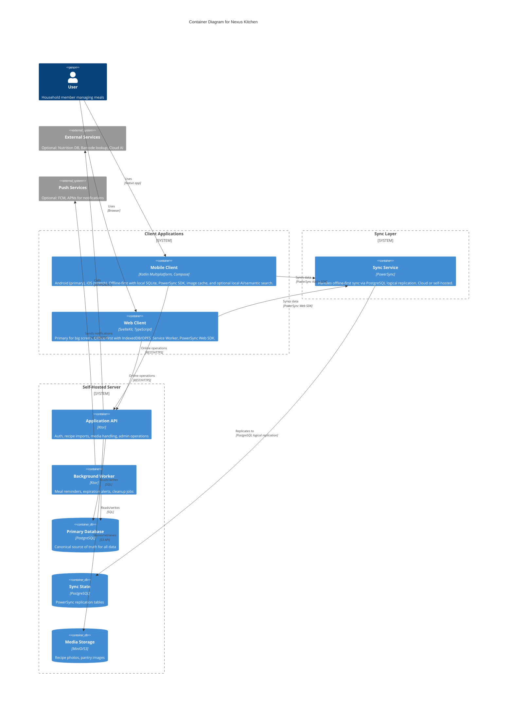
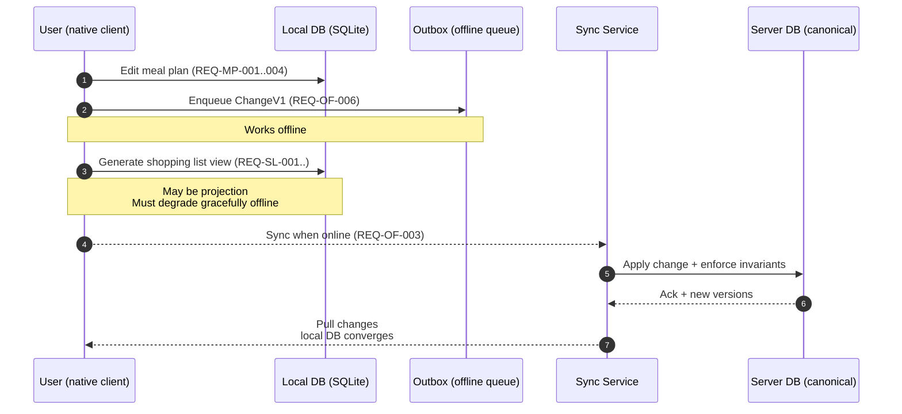
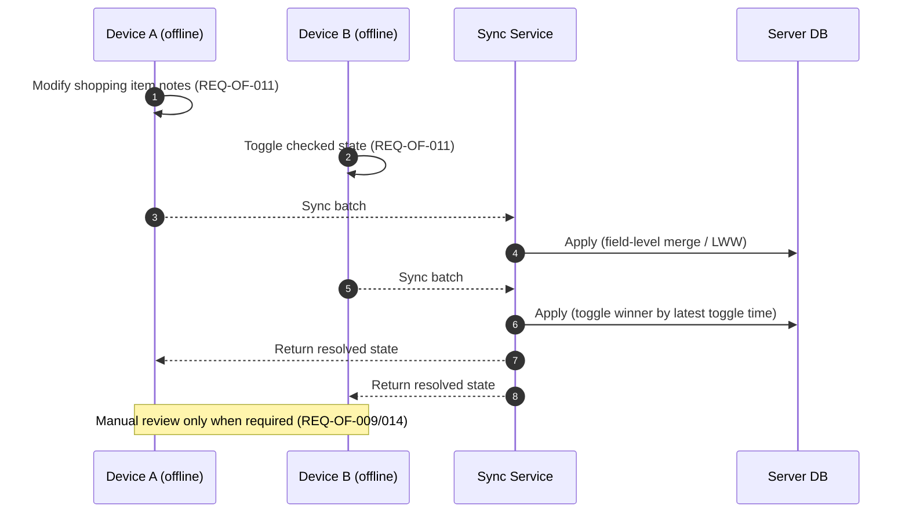
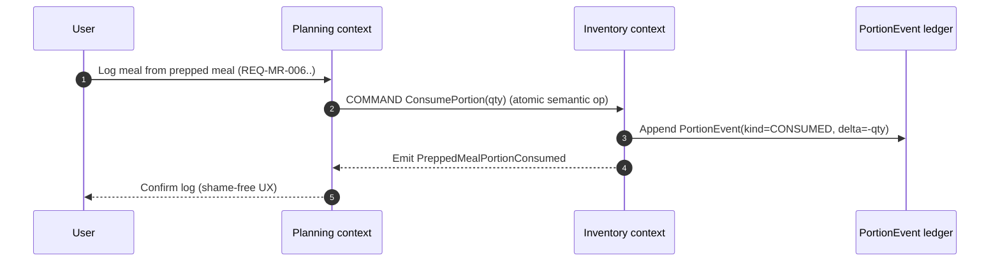

# Nexus Kitchen — Software Requirements Specification (SRS)

**Document Version:** 1.0.0  
**Date:** December 25, 2025  
**Purpose**: Software Requirements Specification for Nexus Kitchen,

> **Document precedence:**
> [**SRS**](./) is authoritative for _requirements and user-visible guarantees_ ("what").
> [**Domain Specification**](./domain-specification.md) is authoritative for _domain terminology, entity schemas/enums
> , invariants, and event semantics_ ("the model").
> [**Logical Architecture**](./logical-architecture.md) is authoritative for _bounded context/service decomposition,
> sync/change protocol, patchability rules, and operational data flows_ ("how it's built").
> If a conflict is found, update the **non-authoritative** document; avoid duplicating competing definitions.

---

## Table of Contents

1. [Executive Summary](#1-executive-summary)
2. [Stakeholder Requirements](#2-stakeholder-requirements)
3. [Functional Requirements](#3-functional-requirements)
4. [Non-Functional Requirements](#4-non-functional-requirements)
5. [Integration Requirements](#5-integration-requirements)
6. [User Experience Requirements](#6-user-experience-requirements)
7. [Constraints and Assumptions](#7-constraints-and-assumptions)
8. [Glossary](#8-glossary)
9. [Appendix A: ADHD Feature Priority Matrix](#appendix-a-adhd-feature-priority-matrix)
10. [Appendix B: Success Metrics](#appendix-b-success-metrics)
11. [Appendix C: Requirement Clusters and Traceability](#appendix-c-requirement-clusters-and-traceability-for-planning--testing)
12. [Appendix D: Conceptual Data Model](#appendix-d-conceptual-data-model-informative)

---

## 1. Executive Summary

### 1.1 Purpose

This document defines the requirements for **Nexus Kitchen**, a self-hosted meal planning application designed to
address both general meal management needs and specific challenges faced by individuals with ADHD. The application
provides meal planning, nutrition tracking, recipe management, inventory management, and shopping list functionality,
guided by principles that reduce cognitive load and support executive function challenges.

### 1.2 Scope

The system includes:

- Meal planning and scheduling
- Meal reminders and low-friction meal logging
- Recipe management, import, scaling, and search (keyword + semantic)
- Pantry and grocery inventory management
- Shopping list generation and management
- Optional nutrition and variety tracking (shame-free by design)
- Multi-user household collaboration
- Offline-first native clients with self-hosted sync
- Optional/experimental web client (online-only)

### 1.3 Design Philosophy

The system is guided by a core principle:

> **Good enough nutrition maintained consistently beats perfect nutrition attempted sporadically.**

All features must work with ADHD brain patterns rather than forcing neurotypical productivity models.

### 1.4 Document Conventions

#### 1.4.1 Normative keywords

- **Shall** = mandatory requirement
- **Should** = recommended / best-effort requirement
- **May** = optional capability

#### 1.4.2 Requirement IDs

Requirements use the format `REQ-<AREA>-<NNN>` (e.g., `REQ-MR-006`). IDs are stable and should not be reused for
unrelated requirements.

#### 1.4.3 Platforms and client tiers

- **Primary clients:** Android (native) and Web
- **Stretch native client:** iOS
- **Note:** Desktop applications (Windows/Linux/macOS) are not in scope; the web client serves the "big screen" use case

#### 1.4.4 Feature toggles and conditional requirements

Some capabilities are **opt-in** or **disabled by default**. Conditional requirements use phrasing like:

- “**When \<feature\> is enabled…**”

#### 1.4.5 Connectivity states

Connectivity states apply to **all primary clients** (Android and Web):

- **Fully Offline:** Works without network connectivity.
- **Offline with Cache:** Works offline _if_ relevant data is already cached locally; otherwise degrades gracefully.
- **Requires Sync:** Offline edits are allowed but require sync to reflect across devices.
- **Requires Online:** Requires connectivity at the time of use.

**Platform notes:**

- **Web:** Offline-first via IndexedDB/OPFS and Service Workers. Some browser-specific limitations apply (e.g.,
  no background sync when browser is closed).
- **Android:** Full offline-first with background sync via WorkManager.

#### 1.4.6 Scales and tracking semantics

- **Energy Level (1–5):** user-reported current capacity (1 = very low, 5 = high).
  - **Energy selection** may be used for filtering without being persisted.
  - **Energy history logging** (persisting energy entries over time) is an opt-in tracking feature.
- **Effort Level (1–5):** recipe preparation effort (1 = minimal/no-cook, 5 = complex).

- **Domain model mapping:**
  - `Recipe.effortLevel` stores **Effort Level** (recipe demand).
  - `MealLog.energyLevel` (optional) and `EnergyLog.energyLevel` store **Energy Level** (user capacity) when energy
    logging is enabled.

#### 1.4.7 “Experimental” definition

“Experimental” features are permitted to be incomplete, may change without migration guarantees, and are not
required to meet the same reliability or parity expectations as primary clients.

#### 1.4.8 Data model responsibility split

This SRS is a **requirements contract** (“what the system must do”). The canonical **data model** (entity fields,
constraints, invariants, and evolution) lives in the **Domain Specification**.

To avoid duplication drift:

- The SRS includes only a thin, stable **Conceptual Data Model** snapshot for interpretability (Appendix D).
- The Domain Specification is the **source of truth** for structure, invariants, and sync/search projection details.

Some “data-shaped” statements remain requirements because they are user-visible or operational guarantees
(e.g., exportability, deterministic conflict handling, backup/restore scope). In those cases, the SRS states the
**guarantee**, and the Domain Specification defines the **representation**.

## 1.5 System Architecture Overview

This section describes the _intended_ high-level architecture so contributors can align implementation choices with the
requirements. It is descriptive, not prescriptive about specific libraries, except where the SRS explicitly constrains
technology choices.

### 1.5.1 High-level component diagram



> **Note:** Reverse proxy and TLS termination (e.g., Traefik, Caddy, nginx) are **user configuration concerns** handled
> at deployment time (see Technical Architecture §11.2). They are not shown in this diagram as they are not application
> components.

### 1.5.2 Sources of truth and local state

- **Server database** is the **canonical** source of truth for shared data (households, recipes, meal plans, shopping
  lists, inventory).
- **Native client local databases** are the **working set** for offline-first operation and may temporarily diverge
  from server state until synced.
- **Media/attachments** (recipe photos, pantry item photos) are stored server-side and cached on clients on a
  best-effort basis for offline viewing.

### 1.5.3 Key flows

- **Offline-first CRUD (native):** Users read/write to the local database; changes are queued and synced when online.
- **Web (online-only):** Users read/write via the Application API. If connectivity is lost, write operations are blocked
  (REQ-PF-002b / REQ-OF-WEB-002).
- **Features that require online services (examples):** URL import, external nutrition lookup, barcode lookup (when
  enabled), cloud AI provider calls.
- **Local AI and semantic search (native):** When configured, embeddings and AI features can run locally and be cached
  for offline use; the semantic index is maintained locally on each native client.

### 1.5.4 Semantic search indexing location

Semantic search (REQ-RC-017 / REQ-AI-010..014) is specified as **local-first**:

- each native client maintains its own embedding index based on locally available recipe data,
- index build and rebuild can be background tasks,
- the system should clearly show index status and gracefully fall back to keyword search.

---

### 1.5.5 Logical architecture alignment (informative)

This SRS defines **what** Nexus Kitchen must do. The companion **Logical Architecture** document defines a
technology-agnostic view of **how** the system can be structured to satisfy these requirements (bounded contexts,
logical services/modules, data flows, and the offline-first sync model).

**Logical bounded contexts / domain modules (expected):**

- **Identity:** users, households, roles, preferences, feature flags
- **Recipe:** recipes, ingredients, import/parsing, scaling, search
- **Inventory:** pantry items, prepped meals, expiration/defrost state
- **Planning:** meal plans, planned meals (date+slot), reminders, meal logs, meal prep sessions
- **Shopping:** shopping lists, store layouts/sections, list generation
- **Nutrition (optional):** nutrition data, goals, summaries
- **Energy (optional):** energy logs, patterns, predictions
- **Variety (optional):** food profiles, frequency/hyperfixation signals, chaining suggestions

**Supporting platform services (cross-cutting):**

- **Sync Service:** offline-first replication for native clients (initial plan: PowerSync; choice may evolve)
- **Notification Service:** reminders and household change notifications (local when offline; push when online)
- **Suggestion Orchestrator:** combines signals (inventory, energy, variety, favorites) to generate explainable suggestions
- **AI Gateway (optional):** provider abstraction for local and/or cloud AI capabilities (parsing, step breakdown, embeddings)

These boundaries are **logical**: an MVP may ship as a **modular monolith** while preserving these separations in code,
and later evolve toward independently deployable services.

## 2. Stakeholder Requirements

### 2.1 Target Users

**Primary users:**

- Individuals with ADHD who struggle with meal planning, remembering to eat, grocery management, and executive function
  around cooking
- Household members seeking collaborative meal management
- Privacy-conscious users who prefer self-hosted solutions

**Secondary users:**

- Community contributors extending the application
- System administrators deploying the application

### 2.2 Business Constraints

| Constraint       | Requirement                                             |
| ---------------- | ------------------------------------------------------- |
| Development team | Solo developer or small team                            |
| Mission          | Non-profit, open-source learning project                |
| Operational cost | Under $15/month for VPS operation, or $0 on home server |
| Licensing        | Copyleft license (derivatives remain open source)       |
| Deployment       | Self-hostable with minimal technical expertise          |

---

## 3. Functional Requirements

### 3.1 Meal Planning

#### 3.1.1 Calendar-Based Planning

- **REQ-MP-001:** The system shall allow users to create, view, and edit meal plans in a calendar view (daily, weekly, monthly).
- **REQ-MP-002:** The system shall allow users to assign meals to meal slots (breakfast, lunch, dinner, snacks).
- **REQ-MP-003:** The system shall support recurring meal schedules.
- **REQ-MP-004:** The system shall allow users to drag and drop meals between dates.
- **REQ-MP-005:** The system shall display cumulative nutritional information for planned meals (when nutrition tracking
  is enabled).

#### 3.1.2 Suggestions and Smart Defaults

- **REQ-MP-006:** When pantry-aware suggestions are enabled, the system shall suggest meals based on available pantry ingredients.
- **REQ-MP-007:** When pantry-aware suggestions are enabled, the system shall prioritize ingredients approaching
  expiration in meal suggestions.
- **REQ-MP-008:** The system shall allow users to provide explicit feedback on suggested meals (e.g., like/dislike,
  “too much effort,” “not appetizing”) and shall use that feedback to adjust future suggestions.
- **REQ-MP-009:** When energy-aware planning is enabled, the system shall factor in the user’s current Energy Level
  selection and/or predicted Energy Level (when available) when suggesting meals.
- **REQ-MP-010:** The system shall avoid suggesting meals containing user-specified disliked ingredients or allergens.
- **REQ-MP-011:** The system shall provide a brief explanation for each suggestion (e.g., “uses expiring yogurt,”
  “favorite,” “Effort ≤ 2 for low energy”) to improve user trust and controllability.

### 3.2 Recipe Management

#### 3.2.1 Recipe Storage

- **REQ-RC-001:** The system shall allow users to create recipes with at least: title, ingredients, instructions, and servings.
- **REQ-RC-002:** The system shall allow users to categorize recipes with tags (dietary, cuisine type, meal type, etc.).
- **REQ-RC-003:** The system shall allow users to rate and review recipes.
- **REQ-RC-004:** The system shall allow users to mark recipes as favorites.
- **REQ-RC-005:** The system shall support structured instructions (step-by-step format).
- **REQ-RC-018:** The system shall support optional recipe fields including: prep time, cook time, active time, total
  time, photos, and notes.
- **REQ-RC-019:** When optional recipe fields are unknown, the system shall allow them to be left blank without
  blocking save and shall display “Unknown” (or equivalent neutral phrasing) instead of forcing placeholder values.

#### 3.2.2 Recipe Import

- **REQ-RC-006:** The system shall allow users to import recipes from URLs (web scraping with structured data extraction
  when available).
- **REQ-RC-007:** The system shall allow users to import recipes from photos (OCR and parsing).
- **REQ-RC-008:** The system shall allow users to manually enter recipes.
- **REQ-RC-009:** When nutrition lookup is enabled, imported recipes shall have automatically calculated nutritional
  information where possible.

#### 3.2.3 Recipe Scaling and Conversion

- **REQ-RC-010:** The system shall allow users to scale recipes to different serving sizes.
- **REQ-RC-011:** The system shall adjust ingredient quantities proportionally when scaling.
- **REQ-RC-012:** The system shall support unit conversion for ingredients.

#### 3.2.4 Effort-Based Classification

- **REQ-RC-013:** Recipes shall be classified by **Effort Level** (1–5 scale from minimal/no-cook to complex).
- **REQ-RC-014:** Recipes shall track both total time and active hands-on time separately (when provided or inferred).
- **REQ-RC-015:** The system shall allow users to filter recipes by Effort Level.

#### 3.2.5 Recipe Search

- **REQ-RC-016:** The system shall allow users to search recipes by keyword across title, ingredients, tags, and notes,
  and filter results by cuisine, meal type, favorites, Effort Level, and time (active/total when available).
- **REQ-RC-017:** When semantic search is enabled, the system shall support embedding-based semantic search over recipes
  and shall gracefully fall back to keyword search when semantic indexing is unavailable or disabled.

### 3.3 Nutrition Tracking

#### 3.3.1 Nutritional Data

- **REQ-NT-001:** The system shall maintain nutritional information per ingredient (calories, macronutrients, micronutrients).
- **REQ-NT-002:** The system shall calculate total nutrition for recipes based on ingredients.
- **REQ-NT-003:** When external nutrition lookup is enabled, the system shall integrate with at least one free/open
  nutrition database.
- **REQ-NT-004:** The system shall allow users to manually override or add nutritional data for custom foods.

#### 3.3.2 Tracking and Goals

- **REQ-NT-005:** When nutrition tracking is enabled, the system shall allow users to set daily nutritional targets
  (calories, protein, carbs, fat, etc.).
- **REQ-NT-006:** The system shall allow users to log meals consumed (planned or ad-hoc).
- **REQ-NT-007:** When nutrition tracking is enabled, the system shall display progress toward daily/weekly nutritional
  goals.
- **REQ-NT-008:** When nutrition tracking is enabled, the system shall provide nutritional gap analysis with food
  suggestions to address deficiencies.

#### 3.3.3 Compassionate Tracking (ADHD-Specific)

- **REQ-NT-009:** Nutrition tracking shall be opt-in and clearly optional.
- **REQ-NT-010:** The system shall never use shaming language about nutrition choices.
- **REQ-NT-011:** The system shall present nutrition information as neutral data, not judgment.
- **REQ-NT-012:** The system shall celebrate consistency over perfection.

### 3.4 Pantry and Inventory Management

#### 3.4.1 Inventory Tracking

- **REQ-PM-001:** The system shall allow users to add pantry items with quantity, unit, and location (fridge, pantry, freezer).
- **REQ-PM-002:** The system shall allow users to track expiration dates for perishable items.
- **REQ-PM-003:** The system shall alert users to items approaching expiration.
- **REQ-PM-004:** When barcode lookup is enabled on a supported device, the system shall allow users to add items via
  barcode scanning.
- **REQ-PM-005:** When photo recognition is enabled, the system shall allow users to add items via photo with
  recognition assistance.
- **REQ-PM-006:** The system shall allow users to mark items as “running low” with configurable minimum quantities.

#### 3.4.2 Visual Inventory (ADHD-Specific)

- **REQ-PM-007:** The system shall allow users to attach photos to pantry items.
- **REQ-PM-008:** The system shall display a visual grid view of pantry contents (addressing “out of sight, out of mind”).
- **REQ-PM-009:** The system shall organize visual inventory by storage location.

#### 3.4.3 Automatic Inventory Updates

- **REQ-PM-010:** When users complete a recipe, the system shall offer to deduct used ingredients from inventory.
- **REQ-PM-011:** When users complete a shopping list, the system shall offer to add purchased items to inventory.

### 3.5 Shopping List Management

#### 3.5.1 List Creation

- **REQ-SL-001:** The system shall allow users to manually add items to shopping lists.
- **REQ-SL-002:** The system shall automatically generate shopping lists from meal plans based on required ingredients
  minus pantry inventory (when pantry tracking is enabled).
- **REQ-SL-003:** The system shall allow users to manage multiple shopping lists.
- **REQ-SL-004:** The system shall allow users to add items to a shopping list directly from recipes.

#### 3.5.2 Visual Shopping Lists (ADHD-Specific)

- **REQ-SL-005:** Shopping list items shall display product photos when available.
- **REQ-SL-006:** Shopping lists shall be organized by store section/aisle.
- **REQ-SL-007:** The system shall allow users to define custom store layouts and section ordering.
- **REQ-SL-008:** The system shall allow users to save store layouts for frequently visited stores.

#### 3.5.3 Shopping Experience

- **REQ-SL-009:** The system shall allow users to check off items while shopping.
- **REQ-SL-010:** Checked items shall move to a “completed” section rather than disappearing.
- **REQ-SL-011:** When barcode lookup is enabled on a supported device, the system shall allow users to add items via
  barcode scan while shopping.
- **REQ-SL-012:** The system shall support linking shopping items to online product sources.

#### 3.5.4 Online Ordering Integration

- **REQ-SL-013:** Users should be able to export shopping lists to common online grocery services.
- **REQ-SL-014:** The system should provide an extensible framework for integrating with delivery services.

### 3.6 Meal Reminders and Logging (ADHD-Specific)

#### 3.6.1 Reminders

- **REQ-MR-001:** The system shall allow users to set recurring meal reminders (e.g., “Time to eat lunch”).
- **REQ-MR-002:** Reminders shall support pre-alerts (e.g., 30 minutes before meal time for preparation).
- **REQ-MR-003:** The system shall allow users to configure reminder timing for each meal slot.
- **REQ-MR-004:** Reminders shall be **dismissible** without guilt-inducing language.
- **REQ-MR-005:** Missed reminders shall not generate shame-inducing notifications.

#### 3.6.2 Quick Logging

- **REQ-MR-006:** The system shall allow users to log meals with one tap (minimal friction).
- **REQ-MR-007:** When energy history logging is enabled, the system shall allow users to log Energy Level (1–5)
  alongside meals.
- **REQ-MR-008:** The system shall support quick-add from favorites or recent meals.
- **REQ-MR-009:** The system shall support logging “something” without specifying what (acknowledgment without detail).

#### 3.6.3 Visual Timeline

- **REQ-MR-010:** The system shall display a visual timeline of eating patterns.
- **REQ-MR-011:** The timeline shall show gaps without negative framing.
- **REQ-MR-012:** The system shall recognize and celebrate streaks without penalizing breaks.

### 3.7 Energy-Aware Features (ADHD-Specific)

#### 3.7.1 Energy Selection, Logging, and Prediction

- **REQ-EA-001:** The system shall allow users to set/report current Energy Level (1–5).
- **REQ-EA-010:** When energy history logging is disabled, the system shall not persist Energy Level entries beyond the
  current session.
- **REQ-EA-011:** When energy history logging is enabled, the system shall store energy entries with timestamps and
  (when provided) association to meal logs.
- **REQ-EA-002:** When energy pattern learning is enabled, the system shall learn typical energy patterns by time of day
  and day of week after at least **20** logged energy entries (default threshold).
- **REQ-EA-003:** When energy pattern learning is enabled and sufficient data exists, the system shall use historical
  patterns to predict Energy Level.
- **REQ-EA-012:** When energy pattern learning is enabled, the system shall persist the energy entries required for
  learning and prediction (i.e., energy history logging shall be enabled as part of energy pattern learning).
- **REQ-EA-008:** When energy pattern learning is enabled but insufficient data exists, the system shall indicate that
  predictions are unavailable and shall not display misleading predictions.
- **REQ-EA-009:** The system shall allow users to configure the minimum data threshold for predictions (default: 20).

#### 3.7.2 Energy-Based Filtering

- **REQ-EA-004:** When energy-aware planning is enabled, the system shall allow users to filter suggestions by current
  or predicted Energy Level.
- **REQ-EA-005:** When Energy Level is low, the system shall prioritize low-effort meals, premade options, and
  “assembled meals.”
- **REQ-EA-006:** When Energy Level is very low, the system shall surface no-cook options and minimal-step options.
- **REQ-EA-007:** The system shall not suggest high Effort Level meals when the user’s Energy Level is low, when
  energy-aware planning is enabled.

### 3.8 Food Variety and Rotation (ADHD-Specific)

#### 3.8.1 Hyperfixation Awareness

- **REQ-FV-001:** When variety tracking is enabled, the system shall track food frequency patterns non-judgmentally.
- **REQ-FV-002:** When variety tracking is enabled, the system shall identify potential food hyperfixation periods using
  a documented and user-configurable heuristic.
- **REQ-FV-003:** When variety tracking is enabled, hyperfixation tracking shall be informational only, never shaming.
- **REQ-FV-004:** The system shall respect hyperfixations as valid eating patterns.

#### 3.8.2 Gentle Variety Suggestions

- **REQ-FV-005:** When variety suggestions are enabled, the system shall offer “safe food rotation” suggestions
  (variations on current favorites).
- **REQ-FV-006:** When variety suggestions are enabled, the system shall support “food chaining” suggestions
  (introducing new foods similar to current favorites).
- **REQ-FV-007:** Variety suggestions shall be optional and never pushy.
- **REQ-FV-008:** The system shall suggest variations on familiar foods (different sauces, toppings, preparations) when
  enabled.

#### 3.8.3 Food Profiles

- **REQ-FV-009:** When food profiles are enabled, the system shall allow users to capture food characteristics
  (texture, temperature, flavor profile, complexity).
- **REQ-FV-010:** When food profiles are enabled, the system shall use food profiles to suggest similar new foods based
  on preferred characteristics.

### 3.9 Cooking Assistance (ADHD-Specific)

#### 3.9.1 Adaptive Recipe Instructions

- **REQ-CA-001:** The system shall allow users to view recipes in a step-by-step cooking mode.
- **REQ-CA-002:** The system shall allow users to request a more detailed breakdown of recipe steps (adjustable granularity).
- **REQ-CA-003:** When AI step breakdown is enabled, the system shall provide step breakdown assistance using AI when requested.
- **REQ-CA-004:** Instructions shall use imperative, action-focused language.

#### 3.9.2 Timer Management

- **REQ-CA-005:** The system shall allow users to set multiple named timers from within recipes.
- **REQ-CA-006:** The system shall automatically detect time references in recipe steps and offer to set timers (where supported).
- **REQ-CA-007:** Timers shall provide visual countdown with progress indicators.
- **REQ-CA-008:** Timers shall support audio and haptic notifications on supported devices.

#### 3.9.3 Progress Tracking

- **REQ-CA-009:** The system shall allow users to track progress through recipe steps with visual indicators.
- **REQ-CA-010:** The system shall allow users to check off completed steps.
- **REQ-CA-011:** The system shall allow users to check off gathered ingredients.

#### 3.9.4 Kitchen Display Mode

- **REQ-CA-012:** The application shall provide a kitchen display mode optimized for countertop use.
- **REQ-CA-013:** Kitchen mode shall use large touch targets suitable for messy hands.
- **REQ-CA-014:** Kitchen mode shall keep the screen awake during active cooking.
- **REQ-CA-015:** Kitchen mode should support hands-free progression (optional voice control as stretch goal).

### 3.10 Household and Sharing

#### 3.10.1 Household Management

- **REQ-HH-001:** The system shall allow users to create and join households.
- **REQ-HH-002:** The system shall support multiple household members with role-based permissions (admin, member, viewer).
- **REQ-HH-003:** The system shall allow users to invite others to households via email or link.
- **REQ-HH-012:** A user shall be a member of at most one household at a time. If a user joins a new household, they
  shall first leave (or be removed from) their current household.

#### 3.10.2 Shared Resources

- **REQ-HH-004:** Households shall share pantry inventory.
- **REQ-HH-005:** Households shall share shopping lists.
- **REQ-HH-006:** Households shall share meal plans.
- **REQ-HH-007:** The system shall allow users to designate recipes as household-shared or personal.
- **REQ-HH-008:** When household members are online, changes to shared resources shall sync to other members within
  **10 seconds**; when offline, changes shall be queued and synced upon reconnection, with conflicts handled per
  REQ-OF-007 through REQ-OF-009.

#### 3.10.3 Collaboration

- **REQ-HH-009:** Shopping list items shall support assignment to specific household members.
- **REQ-HH-010:** The system shall allow users to mark items as purchased with attribution.
- **REQ-HH-011:** The system shall provide notifications for shared list changes (configurable).

### 3.11 Meal Prep Support

#### 3.11.1 Meal Prep Session Planning

- **REQ-PP-001:** The system shall allow users to select one or more recipes to batch cook in a meal prep session.
- **REQ-PP-002:** The system shall allow users to specify the number of servings to prepare for each selected recipe.
- **REQ-PP-003:** The system shall suggest a meal prep day, defaulting to common prep days (e.g., weekends).
- **REQ-PP-004:** The system shall allow users to override the suggested prep day.
- **REQ-PP-005:** The system shall generate a meal plan distributing prepped meals across future days.
- **REQ-PP-006:** The default planning horizon shall be calculated as: (new prepped servings + existing prepped
  inventory) / user's meals per day.
- **REQ-PP-007:** The system shall allow users to configure the planning horizon manually.
- **REQ-PP-008:** The system shall support regenerating meal distribution (“replan”) with a single action.
- **REQ-PP-009:** The system shall allow users to manually adjust generated meal assignments.

#### 3.11.2 Prepped Meal Inventory

- **REQ-PP-010:** Prepped meals shall be tracked in inventory as individual portions/servings.
- **REQ-PP-011:** Each prepped meal portion shall track: recipe source, preparation date, storage location
  (fridge/freezer), and expiration date.
- **REQ-PP-012:** The system shall apply different default shelf lives based on storage location (fridge vs.
  freezer).
- **REQ-PP-013:** The system shall allow users to adjust shelf life estimates for individual items.
- **REQ-PP-014:** The system shall visually indicate prepped meals approaching expiration.
- **REQ-PP-015:** The system shall suggest “eat this first” based on expiration dates.
- **REQ-PP-016:** The system shall allow users to record moving frozen meals to the fridge for defrosting.
- **REQ-PP-017:** The system shall track defrost time and adjust “ready to eat” status accordingly.
- **REQ-PP-018:** The system shall allow users to consume/remove prepped meal portions from inventory.

#### 3.11.3 Meal Prep Integration with Shopping

- **REQ-PP-019:** When planning a meal prep session, the system shall calculate required ingredients across all selected
  recipes.
- **REQ-PP-020:** The system shall compare required ingredients against current pantry inventory.
- **REQ-PP-021:** The system shall generate a shopping list for missing ingredients.
- **REQ-PP-022:** The shopping list shall indicate which items are needed for which prep recipes.

#### 3.11.4 Meal Prep Integration with Meal Planning

- **REQ-PP-023:** Prepped meals in inventory shall be available as options when generating meal plans.
- **REQ-PP-024:** At the start of meal plan generation, the system shall prompt users for their preference: prioritize
  prepped meals, prioritize fresh cooking, or no preference.
- **REQ-PP-025:** The preference prompt shall include a visual preview of prepped inventory (with expiration indicators)
  without overwhelming the user.
- **REQ-PP-026:** The user's preference shall be a suggestion that can be adjusted, never forced.
- **REQ-PP-027:** When prepped meals are selected for a day, the system shall support automatically decrementing from
  prepped inventory upon meal logging (configurable/confirmable).

#### 3.11.5 Meal Prep Energy Integration (ADHD-Specific)

- **REQ-PP-028:** When energy-aware planning is enabled, high-energy days shall default to suggesting fresh cooking or
  new meal prep sessions.
- **REQ-PP-029:** When energy-aware planning is enabled, low-energy days shall default to suggesting prepped meals or
  simple options.
- **REQ-PP-030:** Energy-based defaults shall always be overridable by the user.
- **REQ-PP-031:** The system shall never force meal choices based on energy levels.

### 3.12 Feature Configuration

#### 3.12.1 Feature Categorization

- **REQ-CFG-001:** Passive enhancement features (energy-aware filtering, expiration-aware suggestions, prepped meal
  prioritization, smart defaults) shall be enabled by default and individually toggleable.
- **REQ-CFG-002:** Active tracking features (energy history logging, energy pattern learning, nutrition tracking,
  variety tracking, hyperfixation awareness, food chaining suggestions) shall be disabled by default and require
  explicit opt-in.
- **REQ-CFG-003:** Design philosophy elements (shame-free language, minimal taps, visual feedback, graceful exit ramps)
  shall be embedded in all features and not configurable.

#### 3.12.2 Onboarding

- **REQ-CFG-004:** Onboarding shall capture user preferences using relatable statements (e.g., “I sometimes forget to
  eat”) rather than clinical or diagnostic labels.
- **REQ-CFG-005:** Onboarding selections shall set initial feature defaults, with all settings individually overridable
  in Settings.
- **REQ-CFG-006:** The system shall never surface “ADHD” terminology or other clinical labels in user-facing UI.
- **REQ-CFG-009:** The system shall provide separate controls for: (a) enabling energy-aware filtering, (b) enabling
  energy history logging, and (c) enabling energy pattern learning/predictions.

#### 3.12.3 Data Preservation

- **REQ-CFG-007:** Disabling an active tracking feature shall not delete historical data collected while the feature was
  enabled.
- **REQ-CFG-008:** The system shall allow users to explicitly delete tracking data for any feature independently of
  disabling the feature.

---

## 4. Non-Functional Requirements

### 4.1 Platform Support

#### 4.1.1 Client Platforms

- **REQ-PF-001:** The application shall run natively on Android devices. _(Primary client)_
- **REQ-PF-002:** The application shall provide a web client that runs in modern web browsers
  (Chrome, Firefox, Safari, Edge). _(Primary client)_
- **REQ-PF-002a:** The web client shall support offline-first operation via IndexedDB/OPFS and Service Workers.
- **REQ-PF-002b:** The web client shall clearly indicate sync status and handle offline/online transitions gracefully.
- **REQ-PF-003:** (Stretch Goal) The application should run natively on iOS devices.

#### 4.1.2 Responsive Design

- **REQ-PF-004:** The application shall adapt layout for phone screen sizes.
- **REQ-PF-005:** The application shall provide optimized layouts for tablets (7", 10", 12"+).
- **REQ-PF-006:** Tablet layouts shall support side-by-side views (e.g., ingredients and instructions together).

#### 4.1.3 Web UX (Primary)

- **REQ-PF-008:** On web, the application shall support keyboard input and standard system copy/paste for text fields.
- **REQ-PF-009:** On web, the application should provide keyboard shortcuts for common actions (e.g., add item,
  search, mark complete) where practical.
- **REQ-PF-010:** On web, the application shall support responsive layouts for various screen sizes.
- **REQ-PF-011:** On web, the application should support browser tabs for multi-window workflows (e.g., viewing
  a recipe while editing a meal plan).

### 4.2 Offline Capability

#### 4.2.1 Offline-First Architecture (All Primary Clients)

- **REQ-OF-001:** Core functionality shall be available without network connectivity on **all primary clients** (Android
  and Web; iOS if implemented).
- **REQ-OF-002:** All primary clients shall store user data locally on client devices.
- **REQ-OF-003:** All primary clients shall sync data when connectivity is restored.
- **REQ-OF-004:** Web clients shall use IndexedDB/OPFS for local storage and Service Workers for offline access.

#### 4.2.2 Offline Feature Matrix (All Primary Clients)

The system shall define which features work in each connectivity state on primary clients:

| Feature Category                     | Fully Offline | Offline with Cache | Requires Sync | Requires Online |
| ------------------------------------ | :-----------: | :----------------: | :-----------: | :-------------: |
| View recipes                         |       🗸       |                    |               |                 |
| View meal plans                      |       🗸       |                    |               |                 |
| View shopping lists                  |       🗸       |                    |               |                 |
| Log meals                            |       🗸       |                    |               |                 |
| Set timers                           |       🗸       |                    |               |                 |
| Edit data                            |       🗸       |                    |               |                 |
| Keyword recipe search (REQ-RC-016)   |       🗸       |                    |               |                 |
| Semantic recipe search (REQ-RC-017)  |               |         🗸          |               |                 |
| View recipe images                   |               |         🗸          |               |                 |
| Nutrition lookup (external)          |               |         🗸          |               |                 |
| Sync changes                         |               |                    |       🗸       |                 |
| Import from URL                      |               |                    |               |        🗸        |
| AI features (local model configured) |               |         🗸          |               |                 |
| AI features (cloud provider)         |               |                    |               |        🗸        |
| Online ordering                      |               |                    |               |        🗸        |

- **REQ-OF-004:** The application shall clearly indicate current connectivity status.
- **REQ-OF-005:** The application shall gracefully degrade when features require connectivity.
- **REQ-OF-006:** Native clients shall queue changes made offline for later sync.

#### 4.2.3 Online-Only Scope (Web Client)

- **REQ-OF-WEB-001:** (Experimental) If the web client is provided, offline-first operation is out of scope.
- **REQ-OF-WEB-002:** (Experimental) If the web client is provided, it shall prevent write operations when connectivity
  is unavailable and shall present a clear explanation.

#### 4.2.4 Conflict Resolution (Native Clients)

Offline-first sync implies that multiple devices can edit the same logical data while disconnected. Conflict handling
must be **deterministic**, **minimize user interruption**, and avoid surprising data loss.

- **REQ-OF-007:** The system shall handle conflicts when the same data is modified on multiple devices.
- **REQ-OF-008:** The system shall use a deterministic conflict resolution strategy.
- **REQ-OF-009:** Users shall be notified of conflicts that require manual resolution.

The following requirements define the default conflict policy for the most conflict-prone objects:

- **REQ-OF-010:** Conflict resolution shall occur at the smallest practical unit (e.g., per shopping list item, per
  pantry item, per meal-slot assignment) and shall not overwrite unrelated changes.
- **REQ-OF-011:** For shopping lists, the system shall merge concurrent edits at the **item** level. Completion state
  (checked/unchecked) shall be determined by the most recent completion toggle event. Independent field edits
  (e.g., note text) shall be resolved deterministically (e.g., last-write-wins per field).
- **REQ-OF-012:** For pantry inventory quantities, the system should represent common quantity updates as
  **additive adjustments** (e.g., “+1”, “-2”) so concurrent offline changes can be merged without losing updates;
  when an absolute quantity edit conflicts, the system shall resolve deterministically and should preserve the
  prior value in history for transparency.
- **REQ-OF-013:** For meal plan conflicts where different meals are assigned to the same date+slot concurrently, the
  system shall deterministically pick a winner for the slot and shall preserve the losing assignment as an
  “unscheduled” item (with timestamp) so it can be recovered without re-entry.
- **REQ-OF-014:** Conflict notifications shall be **grouped** (not spammy), use neutral language, and provide a single
  “Review conflicts” entry point when manual resolution is needed.
- **REQ-OF-015:** The system should record conflict-resolution metadata (e.g., timestamps and chosen winner) for
  debugging and support purposes.

### 4.3 Performance

#### 4.3.1 Baseline hardware targets (for performance requirements)

Performance requirements in this section (startup time, transitions, search latency) are measured against the following
**baseline** configurations.

**Primary clients (baseline):**

- **Android (baseline):** 4 CPU cores, 4 GB RAM, flash storage (not spinning disk), Android 10+.
- **Web (baseline):** Modern browser (Chrome 100+, Firefox 100+, Safari 15+, Edge 100+), 4 GB RAM available to browser.

**Primary clients (recommended for “semantic search always-on”):**

- **Android:** 6–8 CPU cores, 6+ GB RAM.
- **Web:** 8+ GB RAM available to browser, hardware acceleration enabled.

**Self-hosted infrastructure (baseline for 1 household / hobby scale):**

- **CPU:** 2 vCPU
- **RAM:** 4 GB
- **Storage:** 30 GB SSD (Postgres + object/media store), plus backup target storage
- **Network:** stable uplink; HTTPS termination supported by reverse proxy

**Self-hosted infrastructure (recommended for multi-household or heavy media):**

- **CPU:** 4 vCPU
- **RAM:** 8–16 GB
- **Storage:** 100+ GB SSD (or SSD + separate bulk volume for media)

> Notes:
>
> - These targets are intentionally conservative and align with the project’s low-ops, self-hosting constraints
>   (C-002 / C-003).
> - Local semantic search performance depends heavily on model size and device thermals; semantic search is optional
>   and must degrade gracefully.

- **REQ-PR-001:** Application startup time shall be under 3 seconds on supported baseline hardware (see §4.3.1).
- **REQ-PR-002:** Screen transitions shall complete in under 300ms under normal conditions.
- **REQ-PR-003:** Keyword recipe search (REQ-RC-016) shall return results in under 500ms for local data.
- **REQ-PR-003a:** When semantic search is enabled and the local index is ready, semantic recipe search (REQ-RC-017)
  should return results in under 750ms for local data.
- **REQ-PR-004:** The application shall remain responsive while syncing in the background.
- **REQ-PR-005:** The local database shall efficiently handle 10,000+ recipes.

### 4.4 Security

#### 4.4.1 Authentication

- **REQ-SC-001:** The system shall support secure user authentication.
- **REQ-SC-002:** Passwords shall be stored using secure, modern hashing algorithms.
- **REQ-SC-003:** The system shall support session management with secure token handling.
- **REQ-SC-004:** The system should support external authentication providers (stretch goal).

#### 4.4.2 Data Protection

- **REQ-SC-005:** All data in transit shall be encrypted.
- **REQ-SC-006:** User data shall be isolated between accounts/households.
- **REQ-SC-007:** API endpoints shall validate authorization for all requests.
- **REQ-SC-008:** The backend and any web-facing components shall protect against common web vulnerabilities (XSS, CSRF,
  injection).

### 4.5 Privacy

- **REQ-PV-001:** The system shall be fully self-hostable, giving users complete data ownership.
- **REQ-PV-002:** AI features shall support privacy-preserving local model execution.
- **REQ-PV-003:** The system shall not require external cloud services for core functionality.
- **REQ-PV-004:** The system shall allow users to export all their data in standard formats.
- **REQ-PV-005:** The system shall allow users to delete their account and all associated data.

### 4.6 Accessibility

- **REQ-AC-001:** The application shall support system accessibility settings (font scaling, high contrast) where
  platform capabilities allow.
- **REQ-AC-002:** Interactive elements shall meet minimum touch target sizes (44pt minimum).
- **REQ-AC-003:** Color shall not be the sole indicator of state or meaning.
- **REQ-AC-004:** The application shall support screen readers where platform capabilities allow.
- **REQ-AC-005:** Kitchen display mode shall use extra-large touch targets (66–96pt).

### 4.7 Maintainability

#### 4.7.1 Modularity

- **REQ-MT-001:** The database layer shall be modular, allowing different database backends.
- **REQ-MT-002:** The authentication layer shall be modular, allowing different auth providers.
- **REQ-MT-003:** The AI integration layer shall be modular, allowing different AI providers.
- **REQ-MT-004:** Integrations shall be implementable as plugins without modifying core code.

#### 4.7.2 Testing

- **REQ-MT-005:** The codebase shall include unit tests for business logic.
- **REQ-MT-006:** The codebase shall include integration tests for API endpoints.
- **REQ-MT-007:** The codebase shall include end-to-end tests for critical user flows.
- **REQ-MT-008:** Test coverage shall be tracked and maintained above minimum thresholds (see §4.7.2.1).

##### 4.7.2.1 Quality gates (minimum thresholds)

Coverage is a _floor_, not a guarantee. Nexus Kitchen uses coverage thresholds to prevent silent test erosion, and
relies on **review + property/invariant tests + end-to-end flows** for real confidence.

Minimum thresholds (CI must fail when violated):

| Layer / module                                   | Minimum coverage (line) | Notes                                                            |
| ------------------------------------------------ | ----------------------: | ---------------------------------------------------------------- |
| Shared domain + use cases (`shared/…`)           |                     80% | Highest ROI; contains most invariants and merge/queue logic.     |
| Backend service layer (Ktor handlers + services) |                     70% | Pair with route-level integration tests for every endpoint.      |
| Persistence adapters / repositories              |                     60% | Prefer integration tests with a real Postgres container.         |
| UI layer (Compose screens)                       |                     40% | Focus on golden flows, state reducers, and accessibility checks. |

Additional quality gates:

- **Every invariant** in the Domain Specification that can be unit-tested should have at least one corresponding
  unit/property test.
- **Every public API endpoint** must have an integration test that covers: auth, household scoping, and one unhappy-path.
- **Critical offline flows** (queue → sync → conflict) must have end-to-end coverage (REQ-MT-007) for: meal logging,
  pantry adjustments, and shopping list check-off.

#### 4.7.3 Documentation

- **REQ-MT-009:** API endpoints shall be documented.
- **REQ-MT-010:** Deployment procedures shall be documented.
- **REQ-MT-011:** Plugin/extension development shall be documented.
- **REQ-MT-012:** User guides shall be provided.

#### 4.7.4 Cross-Platform Maintainability (Kotlin Multiplatform)

- **REQ-MT-013:** Primary native clients shall share business logic and data models using **Kotlin Multiplatform**
  common modules.
- **REQ-MT-014:** Primary native clients shall implement a shared UI using **Compose Multiplatform**, allowing
  platform-specific adaptations where needed.
- **REQ-MT-015:** The project shall maintain a shared design system/component library to maximize UI consistency across
  native clients.

### 4.8 Deployment

- **REQ-DP-001:** The system shall be deployable via container orchestration.
- **REQ-DP-002:** The deployment shall include all required services (database, backend, reverse proxy).
- **REQ-DP-003:** The deployment shall support automatic HTTPS certificate provisioning.
- **REQ-DP-004:** The deployment shall be configurable via environment variables.
- **REQ-DP-005:** Deployment documentation shall enable users with basic technical knowledge to self-host.
- **REQ-DP-006:** The system shall provide health check endpoints for monitoring.

### 4.9 Data Portability, Backup, and Restore

Exports (REQ-PV-004) are primarily for **user portability**. Backups are primarily for **disaster recovery** and
**administration** of a self-hosted deployment.

#### 4.9.1 Backup scope (server)

- **REQ-BK-001:** The system shall support creating a backup of server-side persistent state, including the primary
  database and all user-uploaded media/attachments.
- **REQ-BK-002:** Backups shall include all data required to restore a working system, including users, households,
  recipes, meal plans, shopping lists, pantry/inventory, reminders configuration, and relevant settings (excluding
  secrets such as external API keys where re-entry is safer).
- **REQ-BK-003:** The backup artifact format shall be documented and shall be portable (e.g., a single `.tar.gz` file
  containing a database dump plus media files), without requiring proprietary tooling.

#### 4.9.2 Restore behavior

- **REQ-BK-004:** The system shall support restoring from a backup into a fresh deployment such that the restored
  instance is functionally equivalent to the original at the time of backup.
- **REQ-BK-005:** After restore, native clients shall be able to re-authenticate and re-sync without manual per-record
  repair (conflicts may still occur if clients contain divergent offline changes).

#### 4.9.3 Automation and integrity (recommended)

- **REQ-BK-006:** The deployment documentation should include a recommended automated backup approach (e.g., scheduled
  job/cron) and retention guidance.
- **REQ-BK-007:** Backup and restore tooling should provide integrity verification (e.g., checksums) and clear failure
  modes (“backup incomplete”, “media missing”) rather than silent partial restores.

---

## 5. Integration Requirements

### 5.1 External Data Sources

#### 5.1.1 Nutrition Databases

- **REQ-IN-001:** When external nutrition lookup is enabled, the system shall integrate with at least one free/open
  nutrition database.
- **REQ-IN-002:** When external nutrition lookup is enabled, nutrition lookups shall include fallback behavior when the
  primary source is unavailable.
- **REQ-IN-003:** The system shall allow users to cache nutrition data locally.
- **REQ-IN-006:** The system shall allow manual food/nutrition entry and local-only operation without configuring
  external nutrition services.

#### 5.1.2 Barcode Databases

- **REQ-IN-004:** When barcode lookup is enabled, the system shall integrate with barcode lookup services for product identification.
- **REQ-IN-005:** When barcode lookup is enabled, barcode lookups shall return product name, brand, and basic information.
- **REQ-IN-007:** The system shall allow manual pantry item entry without barcode lookup.

### 5.2 AI Integration

#### 5.2.1 AI Capabilities

- **REQ-AI-001:** When enabled, the system shall support AI-assisted recipe import/parsing from photos and URLs.
- **REQ-AI-002:** When enabled, the system shall support AI-assisted meal suggestions.
- **REQ-AI-003:** When enabled, the system shall support AI-assisted recipe step breakdown (adjustable granularity).
- **REQ-AI-004:** When enabled, the system shall support AI-assisted food recognition from photos.
- **REQ-AI-005:** When enabled, the system should support AI-assisted nutritional analysis and advice.

#### 5.2.2 AI Provider Flexibility

- **REQ-AI-006:** The AI integration shall support local model execution (privacy-first).
- **REQ-AI-007:** The AI integration shall support multiple cloud AI providers.
- **REQ-AI-008:** The AI integration shall gracefully degrade when AI services are unavailable.
- **REQ-AI-009:** The system shall allow users to configure their preferred AI provider and to disable AI features entirely.

#### 5.2.3 Embeddings and Semantic Search

- **REQ-AI-010:** When semantic search is enabled, the system shall generate embeddings for recipes using at least
  title, ingredients, instructions, tags, and notes.
- **REQ-AI-011:** When semantic search is enabled, the system shall maintain a local vector index for fast similarity search.
- **REQ-AI-012:** The system shall keep the embedding index updated when recipes are created or edited.
- **REQ-AI-013:** The system shall provide a way to rebuild the embedding index.
- **REQ-AI-014:** The system shall expose embedding index status (e.g., ready, building, error) in a user-understandable
  way.

#### 5.2.4 Supported Models

- **REQ-AI-017:** The project shall document supported local embedding models for semantic search (at minimum one
  default), including expected device constraints (CPU/RAM) and approximate download size.
- **REQ-AI-018:** The system shall allow users to select the embedding model used for semantic search, and shall allow
  disabling semantic search.

### 5.3 Calendar Integration (Stretch Goal)

- **REQ-CL-001:** (Stretch Goal) Users should be able to export meal plans to external calendar applications.
- **REQ-CL-002:** (Stretch Goal) Users should be able to sync meal reminders with system calendars.

---

## 6. User Experience Requirements

### 6.1 Design Principles (ADHD-Informed)

#### 6.1.1 Cognitive Load Reduction

- **REQ-UX-001:** Each screen shall have a single primary action.
- **REQ-UX-002:** The system shall minimize required decision points.
- **REQ-UX-003:** Common tasks shall require no more than 3 taps/clicks where feasible.
- **REQ-UX-004:** Forms shall use smart defaults whenever possible.
- **REQ-UX-005:** The system shall remember user preferences and past choices where appropriate.

#### 6.1.2 Shame-Free Design

- **REQ-UX-006:** The system shall never use negative language about user behavior.
- **REQ-UX-007:** Gaps in logging shall be presented neutrally, not as failures.
- **REQ-UX-008:** Progress shall be celebrated without creating pressure.
- **REQ-UX-009:** All features shall have graceful “exit ramps” (easy to dismiss, skip, or defer).
- **REQ-UX-010:** Notifications shall never be guilt-inducing.

#### 6.1.3 External Scaffolding

- **REQ-UX-011:** The system shall provide persistent visual reminders and cues.
- **REQ-UX-012:** Important information shall remain visible (not hidden in menus).
- **REQ-UX-013:** The system shall provide clear visual status indicators.
- **REQ-UX-014:** The system shall support the user's memory through visual timelines and history.

#### 6.1.4 Immediate Feedback

- **REQ-UX-015:** User actions shall produce immediate visual feedback.
- **REQ-UX-016:** Loading states shall be clearly indicated.
- **REQ-UX-017:** Success and error states shall be clearly communicated.
- **REQ-UX-018:** The system should use haptic feedback for confirmations on supported devices.

### 6.2 Visual Design

- **REQ-VD-001:** The interface shall use clean, uncluttered layouts.
- **REQ-VD-002:** Visual hierarchy shall clearly indicate primary vs. secondary actions.
- **REQ-VD-003:** The system shall support light and dark color modes.
- **REQ-VD-004:** Icons shall be accompanied by text labels for clarity.
- **REQ-VD-005:** The system shall use consistent visual language throughout.

### 6.3 Error Handling

- **REQ-EH-001:** Error messages shall be human-readable (no technical jargon).
- **REQ-EH-002:** Error messages shall suggest corrective actions when possible.
- **REQ-EH-003:** The system shall not lose user input on errors.
- **REQ-EH-004:** Network errors shall be handled gracefully with retry options.

---

## 7. Constraints and Assumptions

### 7.1 Constraints

- **C-001:** Development resources are limited (solo developer or small team).
- **C-002:** Operational costs must remain under $15/month for VPS hosting or $0 for home server.
- **C-003:** The system must be self-hostable without requiring commercial cloud services.
- **C-004:** The license must be copyleft open source.
- **C-005:** Primary native clients will prioritize cross-platform maintainability over perfect per-platform polish.
- **C-006:** Mobile clients (Android, iOS stretch) will be implemented using **Kotlin Multiplatform** and **Compose Multiplatform**;
  the web client will use **SvelteKit**.
- **C-007:** The sync approach will be offline-first for all primary clients (Android and Web).

### 7.2 Assumptions

- **A-001:** Users have basic technical ability for Docker-based deployments (or documentation sufficient to guide them).
- **A-002:** Users have reliable internet access for initial setup and multi-device sync (though primary clients
  can be offline).
- **A-003:** Devices have sufficient storage for local data caching (minimum 500MB for mobile, adequate browser storage for web).
- **A-004:** Users enabling local AI features have hardware capable of running inference models.
- **A-005:** The experimental web client will be used primarily for “quick access” and does not guarantee offline
  operation.

### 7.3 Dependencies

- **D-001:** If external nutrition lookup is enabled, free/open nutrition databases remain available.
- **D-002:** If barcode lookup is enabled, barcode lookup services remain available with acceptable rate limits.
- **D-003:** Local AI models of sufficient quality remain freely available.
- **D-004:** The selected sync library/provider remains available and maintainable for the project (initial plan:
  PowerSync; choice may evolve).

---

## 8. Glossary

| Term                   | Definition                                                                                               |
| ---------------------- | -------------------------------------------------------------------------------------------------------- |
| Energy Level           | User-reported scale (1–5) indicating current cognitive/physical capacity for tasks                       |
| Energy history logging | Persisting energy entries over time for learning/prediction; opt-in tracking                             |
| Effort Level           | Recipe preparation effort rating (1–5), independent of the user’s current Energy Level                   |
| Food Chaining          | Technique that introduces new foods by starting with accepted foods and making small, systematic changes |
| Food Hyperfixation     | Pattern where a person eats the same food(s) repeatedly for an extended period                           |
| Household              | Group of users who share resources (pantry, meal plans, shopping lists)                                  |
| Kitchen Display Mode   | UI mode optimized for cooking, with large text and touch targets                                         |
| Meal Prep Session      | Planned batch cooking event where users prepare servings for future consumption                          |
| Planning Horizon       | Number of days into the future that a meal plan covers                                                   |
| Prepped Meal           | Portion of a previously prepared recipe stored for future consumption                                    |
| Safe Food              | Foods a person can reliably eat regardless of sensory or energy state                                    |
| Shame-Free Design      | Presenting information neutrally without judgment or guilt-inducing language                             |
| Experimental           | Best-effort capability that may be incomplete and may change without migration guarantees                |

---

## Appendix A: ADHD Feature Priority Matrix

### Priority 1 — MVP (Must Have)

1. Meal Reminders
2. One-Tap Meal Logging
3. Energy-Based Meal Filtering

### Priority 2 — High Impact

1. Meal Prep Session Planning
2. Prepped Meal Inventory
3. Visual Shopping Lists
4. Store Section Organization
5. Household Sharing

### Priority 3 — Enhanced Experience

1. AI Recipe Step Breakdown
2. Multi-Timer Management
3. Kitchen Display Mode
4. Favorite Meals
5. Defrost Tracking

### Priority 4 — Advanced Features

1. Food Variety Rotation
2. Food Chaining Suggestions
3. Hyperfixation Tracking
4. Compassionate Nutrition Insights

---

## Appendix B: Success Metrics

### Engagement Metrics

- Daily active users who log at least one meal
- Percentage of users who set up meal reminders
- Shopping list completion rate (items checked off)
- Household feature adoption rate
- Meal prep session frequency (sessions per user per month)
- Prepped meal utilization rate (prepped meals consumed vs expired/discarded)

### Quality Metrics

- User-reported satisfaction with energy-based filtering accuracy
- Time to complete common tasks (recipe search, meal logging, shopping list creation)
- Offline functionality reliability (successful offline sessions on native clients)
- Meal prep planning horizon accuracy (did suggested days match user needs)

### Design Validation Metrics

- Zero shame-inducing messaging complaints
- Positive feedback on variety suggestions (>60% helpful rating)
- Low uninstall rate after first week of use

---

## Appendix C: Requirement Clusters and Traceability (for Planning & Testing)

This appendix groups requirements by the priority matrix for release planning and acceptance testing.

### C.1 Priority 1 Clusters

| Cluster                | Requirement IDs (non-exhaustive)             |
| ---------------------- | -------------------------------------------- |
| Meal Reminders         | REQ-MR-001..005, REQ-UX-010, REQ-EH-004      |
| One-Tap Meal Logging   | REQ-MR-006..009, REQ-MR-010..012, REQ-UX-003 |
| Energy-Based Filtering | REQ-EA-001..012, REQ-RC-013..015, REQ-MP-009 |

### C.2 Priority 2 Clusters

| Cluster                | Requirement IDs (non-exhaustive)             |
| ---------------------- | -------------------------------------------- |
| Meal Prep Planning     | REQ-PP-001..009, REQ-PP-019..027             |
| Prepped Meal Inventory | REQ-PP-010..018, REQ-PP-014..017             |
| Visual Shopping Lists  | REQ-SL-001..012, REQ-SL-005..010             |
| Store Organization     | REQ-SL-006..008                              |
| Household Sharing      | REQ-HH-001..012, REQ-OF-003, REQ-OF-006..009 |

### C.3 Priority 3 Clusters

| Cluster           | Requirement IDs (non-exhaustive)             |
| ----------------- | -------------------------------------------- |
| AI Step Breakdown | REQ-CA-001..004, REQ-AI-003, REQ-AI-006..009 |
| Multi-Timer       | REQ-CA-005..008                              |
| Kitchen Mode      | REQ-CA-012..015, REQ-AC-005                  |
| Favorites         | REQ-RC-004, REQ-MR-008                       |
| Defrost Tracking  | REQ-PP-016..017                              |

### C.4 Priority 4 Clusters

| Cluster                 | Requirement IDs (non-exhaustive) |
| ----------------------- | -------------------------------- |
| Variety Rotation        | REQ-FV-001..008                  |
| Food Chaining           | REQ-FV-006, REQ-FV-009..010      |
| Hyperfixation Tracking  | REQ-FV-001..004                  |
| Compassionate Nutrition | REQ-NT-009..012, REQ-UX-006..009 |

---

## Appendix D: Conceptual Data Model (Informative)

This appendix is a **high-level snapshot** of the core data concepts and relationships in Nexus Kitchen.
It is intended to help readers interpret requirements (especially sync/conflict/backup requirements) without
duplicating the full schema.

**Canonical definitions:** The authoritative entity definitions (fields, types, constraints, invariants, projections)
live in the **Domain Specification**.

### D.1 Core entities and relationships (conceptual)

At a conceptual level, the system is organized around these objects:

- **Household → Members**
  - A household contains one or more members with roles (admin/member/viewer).
- **Recipes**
  - Users create recipes; a recipe may be personal or shared with a household.
  - Recipes contain ingredients and steps; ingredients may reference master ingredient records.
- **Planning**
  - Meal plans contain meal-slot assignments (planned meals) for specific dates.
  - Recurring schedules are represented as reusable rules/templates.
  - Meal logs record what was actually eaten (from plan, from recipe, from prepped meals, or quick logs).
  - Reminders are user-specific and recur by day/time/slot.
- **Inventory**
  - Pantry items track on-hand quantities and expiration.
  - Prepped meals track portions, storage location, and expiration (and optional defrost state).
- **Shopping**
  - Shopping lists contain items; items can be linked back to ingredients and/or recipes that require them.
  - Store layouts organize shopping items into sections/aisles.
- **Energy / Nutrition / Variety (optional, opt-in features)**
  - Energy logs (and derived patterns) support energy-aware suggestions.
  - Nutrition goals and daily summaries support progress and gap analysis.
  - Food profiles / hyperfixation signals / chaining suggestions support gentle variety.

### D.2 Key identifiers and “units of conflict resolution”

Offline-first sync requires deterministic merges at the smallest practical unit (REQ-OF-010). Conceptually, the most
conflict-prone “merge units” are:

- **ShoppingListItem** (item-level merges; completion toggles vs field edits)
- **PantryItem** (quantity adjustments should be representable as additive deltas)
- **PlannedMeal assignment** (effectively the meal in a specific date+slot; preserve “losing” concurrent edits as
  recoverable unscheduled items)
- **MealScheduleRule** (recurring template rules)
- **MealReminder** (schedule/time settings)
- **MealLog** (append-style record; deletions are represented as explicit deletes/tombstones rather than silent disappearance)

### D.3 Data ownership boundaries

Conceptually, most entities are either:

- **Household-shared** (visible to all members): shared pantry inventory, shared shopping lists, shared meal plans, and
  household-shared recipes.
- **User-owned** (visible only to the user unless explicitly shared): personal recipes, recipe favorites/ratings,
  reminders, meal logs, energy logs, nutrition goals, and variety tracking artifacts.

Implementations typically represent this with an optional `householdId` on shareable entities and enforce access via
household membership.

### D.4 Backup scope (high level)

Server backups (REQ-BK-001..003) must include all canonical persistent state needed to restore a working system, including:

- users and households/household members (membership records)
- recipes (personal + shared) and associated media
- meal plans, recurring schedule rules, and meal logs
- pantry items, prepped meals, and related inventory state
- shopping lists, store layouts/sections
- opt-in tracking data (energy logs/patterns, nutrition goals/summaries, variety artifacts) when present
- uploaded media/attachments (recipe photos, pantry photos, etc.)

**Not required:** client-local projections such as semantic/vector search indexes and AI caches, which are rebuildable
from server data.

### D.5 Cross-link pattern (recommended)

To keep the SRS readable without turning it into a schema document, data-heavy requirements may optionally include a
lightweight trace note:

- `Touches: Recipe, PantryItem, ShoppingListItem`

These are plain entity names (matching the Domain Specification) and do not introduce new IDs.

---

## Appendix E: Diagrams (Informative)

These diagrams are **illustrative aids** to help readers reason about the requirements. They do not introduce new
authoritative semantics.

- **Model semantics** (entities, enums, invariants, domain events) remain authoritative in the **Domain Specification**.
- **Sync/change protocol, patchability rules, and operational flows** remain authoritative in the **Logical Architecture**.

### E.1 System context (users, clients, and self-hosted server)

```mermaid
flowchart LR
  subgraph Clients["Clients"]
    A[Android (offline-first)]
    W[Web (offline-first)]
    I[iOS (stretch, offline-first)]
  end

  subgraph Server["Self-hosted deployment"]
    RP[Reverse proxy / TLS]
    API[Application API]
    SYNC[Sync Service]
    DB[(Postgres - canonical)]
    OBJ[(Media / object storage)]
  end

  A <--> SYNC
  W <--> SYNC
  I <--> SYNC

  RP --> API
  API --> DB
  API --> OBJ
  SYNC --> DB
```

### E.2 Core “happy path” journey: plan → shop → cook → log



### E.3 Offline conflict pattern (deterministic + recoverable)



### E.4 Prepped meal portion ledger: consume / discard / adjust



---

| Version | Date       | Author          | Description                                                                                                          |
| ------- | ---------- | --------------- | -------------------------------------------------------------------------------------------------------------------- |
| v1.0.0  | 2026-12-25 | Robert Hamilton | Initial Document. Checklist: schema/event field changes reflected in Domain Spec + Architecture appendices/examples. |

---

_End of Requirements Document_
