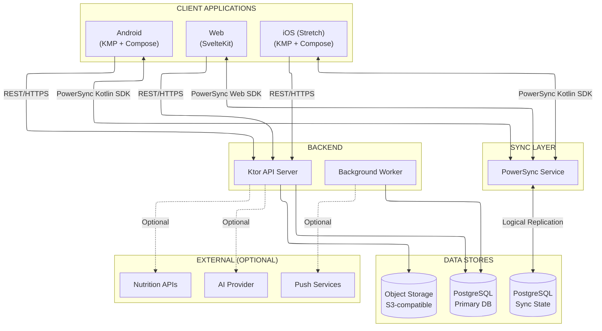
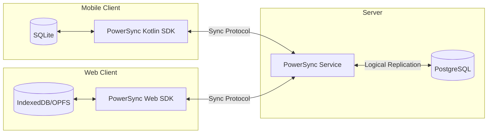

# Nexus Kitchen — Technical Architecture

**Document Version:** 3.1.0  
**Date:** December 26, 2025  
**Purpose:** High-level implementation architecture for the Svelte (Web) + otlin Multiplatform (Mobile) + Ktor +
PostgreSQL stack

---

## 0. Document Scope

This document describes **architectural decisions and system structure**. It does not contain implementation code —
those details belong in the codebase and developer documentation.

### 0.1 What This Document Covers

- Technology choices and rationale
- System topology and component relationships
- Module boundaries and layering
- Data flow patterns
- API and sync contracts (shapes, not implementations)
- Deployment topology
- Operational concerns (observability, security posture)

### 0.2 What This Document Does Not Cover

- Code examples or snippets
- Library-specific configuration syntax
- Step-by-step setup instructions
- UI component implementations

### 0.3 Canonical Sources

| Concern                    | Canonical Source                                              |
| -------------------------- | ------------------------------------------------------------- |
| Kotlin dependency versions | `gradle/libs.versions.toml`                                   |
| Web dependency versions    | `apps/web/package.json`                                       |
| Server schema              | Flyway migrations in `server/src/main/resources/db/migration` |
| Sync rules                 | `powersync.yaml` in repo                                      |
| API contracts              | OpenAPI spec + server route tests                             |

---

## Table of Contents

1. [Technology Stack Summary](#1-technology-stack-summary)
2. [Platform Support Matrix](#2-platform-support-matrix)
3. [System Architecture Overview](#3-system-architecture-overview)
4. [Client Architecture](#4-client-architecture)
5. [Sync Architecture](#5-sync-architecture)
6. [Backend Architecture](#6-backend-architecture)
7. [Database Design Principles](#7-database-design-principles)
8. [API Contracts](#8-api-contracts)
9. [AI Integration](#9-ai-integration)
10. [Observability](#10-observability)
11. [Deployment Topology](#11-deployment-topology)
12. [Security Posture](#12-security-posture)
13. [Stretch Goal: iOS Support](#13-stretch-goal-ios-support)
14. [Appendix A: Key Decisions Log](#appendix-a-key-decisions-log)

---

## 1. Technology Stack Summary

### 1.1 Stack Overview

| Layer                 | Technology            | Role                                     |
| --------------------- | --------------------- | ---------------------------------------- |
| **Web Client**        | SvelteKit             | Primary web UI, SSR optional             |
| **Web Sync**          | PowerSync Web SDK     | Offline-first local storage + sync       |
| **Mobile Client**     | Kotlin Multiplatform  | Shared business logic for Android/iOS    |
| **Mobile UI**         | Compose Multiplatform | Declarative UI for Android/iOS           |
| **Mobile Sync**       | PowerSync Kotlin SDK  | Offline-first local storage + sync       |
| **Backend Framework** | Ktor                  | REST API, auth, integrations             |
| **Database**          | PostgreSQL            | Canonical data store                     |
| **Sync Service**      | PowerSync Service     | Manages client sync, conflict resolution |
| **Object Storage**    | S3-compatible         | Recipe images, user uploads              |

### 1.2 Why This Stack

**Two-client strategy with shared sync:**

- **Web (SvelteKit):** Proven framework, excellent DX, handles "big screen" meal planning
- **Mobile (KMP + Compose):** Native experience, code sharing between Android and iOS
- **PowerSync for both:** Same sync rules, same backend, different client SDKs — minimal duplication

**Why not direct DB access from SvelteKit?**

- SvelteKit server-side _could_ use Drizzle/Prisma to talk to Postgres
- But this bypasses Ktor, duplicating auth, validation, and business rules
- PowerSync provides offline-first for web with no additional backend complexity

**Why Ktor?**

- Kotlin-native, shares language with mobile codebase
- Lightweight, coroutine-based
- Single backend for both clients

### 1.3 Trade-offs Accepted

| Trade-off            | Rationale                                                                  |
| -------------------- | -------------------------------------------------------------------------- |
| Two UI codebases     | Web (Svelte) and Mobile (Compose) — no practical way to share UI code      |
| Two languages        | TypeScript (web) + Kotlin (mobile/server); accepted for ecosystem benefits |
| No desktop app       | Browser handles "big screen" use case; reduces scope                       |
| PowerSync dependency | Major time savings vs building sync from scratch                           |

---

## 2. Platform Support Matrix

| Platform    | Priority | Status           | Technology                           |
| ----------- | -------: | ---------------- | ------------------------------------ |
| **Android** |  Primary | MVP              | KMP + Compose + PowerSync Kotlin SDK |
| **Web**     |  Primary | MVP              | SvelteKit + PowerSync Web SDK        |
| **iOS**     |  Stretch | Community-tested | KMP + Compose + PowerSync Kotlin SDK |

### 2.1 Feature Parity

| Feature            | Android | Web | iOS | Notes                          |
| ------------------ | :-----: | :-: | :-: | ------------------------------ |
| Core meal planning |   ✅    | ✅  | ✅  |                                |
| Offline-first sync |   ✅    | ✅  | ✅  | Web uses IndexedDB/OPFS        |
| Push notifications |   ✅    | ⚠️  | ✅  | Web: browser limitations       |
| Barcode scanning   |   ✅    | ⚠️  | ✅  | Web: camera API                |
| Background sync    |   ✅    | ❌  | ⚠️  | Web: no background when closed |
| Multi-window       |   ❌    | ✅  | ❌  | Browser tabs                   |

---

## 3. System Architecture Overview

### 3.1 Component Topology



### 3.2 Data Flow Patterns

**Offline-first CRUD (both clients):**

1. User writes to local database (SQLite on mobile, IndexedDB on web)
2. Change queued in local outbox
3. PowerSync syncs when online
4. Conflicts resolved per entity strategy

**Online-only operations (via Ktor API):**

- Authentication and token refresh
- Recipe URL import and parsing
- External nutrition/barcode lookup
- Image uploads
- AI features (when using cloud provider)

---

## 4. Client Architecture

### 4.1 Web Client (SvelteKit)

```text
apps/web/
├── src/
│   ├── lib/
│   │   ├── components/     # Reusable UI components
│   │   ├── stores/         # Svelte stores (reactive state)
│   │   ├── sync/           # PowerSync setup and queries
│   │   └── api/            # REST client for Ktor
│   └── routes/             # SvelteKit file-based routing
├── static/
└── package.json
```

**Key patterns:**

- PowerSync Web SDK provides reactive queries over IndexedDB
- Svelte stores wrap PowerSync watches for UI reactivity
- Service Worker enables offline asset caching
- REST calls to Ktor for auth and online-only features

### 4.2 Mobile Client (KMP + Compose)

```text
apps/mobile/
├── shared/                 # KMP shared code
│   └── src/
│       ├── commonMain/     # Domain, data, sync, DI
│       ├── androidMain/    # Android-specific (notifications, camera)
│       └── iosMain/        # iOS-specific
├── androidApp/             # Android entry point
└── iosApp/                 # iOS entry point (stretch)
```

**Layering:**

- **UI Layer:** Compose screens, navigation (Voyager)
- **Presentation:** ScreenModels with StateFlow
- **Domain:** Use cases, business logic
- **Data:** Repositories, PowerSync queries, REST client

**Key patterns:**

- PowerSync Kotlin SDK provides reactive queries over SQLite
- Koin for dependency injection
- Voyager for multiplatform navigation
- Platform-specific implementations via expect/actual

---

## 5. Sync Architecture

### 5.1 PowerSync Role

PowerSync manages:

- Client-side local database (SQLite on mobile, IndexedDB on web)
- Change tracking and outbox
- Server sync via PowerSync Service
- Conflict detection

The application defines:

- Sync rules (what data syncs to which users)
- Conflict resolution strategies per entity
- Custom merge logic where needed

### 5.2 Sync Topology



### 5.3 Bucket Strategy

Data is partitioned into sync buckets:

| Bucket           | Contents                               | Scope              |
| ---------------- | -------------------------------------- | ------------------ |
| `user_data`      | Preferences, reminders, personal logs  | Per-user           |
| `household_data` | Recipes, pantry, plans, shopping lists | Per-household      |
| `master_data`    | Common ingredients, tags               | Global (read-only) |

### 5.4 Conflict Resolution by Entity

| Entity              | Strategy         | Rationale                           |
| ------------------- | ---------------- | ----------------------------------- |
| User Preferences    | Last-write-wins  | Personal, single user               |
| Recipes             | Last-write-wins  | Conflicts rare                      |
| Pantry Items        | Merge quantities | Multiple users may update same item |
| Prepped Meals       | Server-wins      | Portions are critical               |
| Shopping List Items | Merge            | Union of checked states             |
| Meal Logs           | Append-only      | No conflicts                        |

---

## 6. Backend Architecture

### 6.1 Ktor Application Structure

```text
server/
├── src/main/kotlin/
│   ├── Application.kt          # Entry point
│   ├── plugins/                # Ktor plugins (auth, serialization, etc.)
│   ├── routes/                 # API route definitions
│   ├── services/               # Business logic
│   ├── repositories/           # Data access
│   └── models/                 # DTOs, request/response types
└── src/main/resources/
    └── db/migration/           # Flyway migrations
```

### 6.2 API Responsibilities

The Ktor API handles operations that **cannot** or **should not** happen client-side:

| Category         | Examples                                         |
| ---------------- | ------------------------------------------------ |
| **Auth**         | Login, register, token refresh, password reset   |
| **Sync uploads** | PowerSync write-back handlers                    |
| **Imports**      | Recipe URL parsing, structured data extraction   |
| **Lookups**      | Nutrition data, barcode/UPC resolution           |
| **Media**        | Image upload, optimization, signed URLs          |
| **AI (cloud)**   | Recipe parsing, suggestions (when cloud-enabled) |
| **Admin**        | Household management, data export                |

### 6.3 Background Worker

A separate worker process handles scheduled tasks:

- Meal reminder notifications
- Expiration alerts
- Cleanup jobs (orphaned media, expired tokens)

The worker shares code with the API but runs independently.

---

## 7. Database Design Principles

### 7.1 Schema Conventions

| Rule                        | Rationale                                         |
| --------------------------- | ------------------------------------------------- |
| `id TEXT PRIMARY KEY`       | UUIDs for sync compatibility; no auto-increment   |
| Timestamps as `BIGINT`      | UTC epoch milliseconds; cross-platform consistent |
| JSONB for nested data       | Preferences, nutrition info, flexible fields      |
| Soft deletes (`deleted_at`) | Sync requires tombstones                          |
| No secrets in synced tables | Password hashes, tokens stay server-only          |

### 7.2 Schema Migration Strategy

**Expand → Migrate → Contract:**

1. **Expand:** Add new column as nullable or with default
2. **Migrate:** Backfill data, deploy code that writes to new column
3. **Contract:** Remove old column after all clients updated

This keeps older clients working during rollout.

---

## 8. API Contracts

### 8.1 Contract Sharing

To keep web and mobile clients aligned with the API:

1. Ktor generates OpenAPI spec from route definitions
2. Web client generates TypeScript types from OpenAPI
3. Mobile client uses shared Kotlin DTOs (same codebase as server)

### 8.2 Auth Contract

| Endpoint             | Method | Purpose              |
| -------------------- | ------ | -------------------- |
| `/api/auth/register` | POST   | Create account       |
| `/api/auth/login`    | POST   | Obtain tokens        |
| `/api/auth/refresh`  | POST   | Refresh access token |
| `/api/auth/me`       | GET    | Current user profile |

Tokens: Short-lived access token (~15 min) + longer-lived refresh token (~7 days)

### 8.3 Sync Contract

PowerSync handles the sync protocol. The API provides:

| Endpoint                       | Purpose                               |
| ------------------------------ | ------------------------------------- |
| `/api/sync/{table}/{id}`       | PUT/PATCH/DELETE for write-back       |
| `/api/sync/merge/{table}/{id}` | Custom merge logic (e.g., quantities) |

---

## 9. AI Integration

### 9.1 Provider Abstraction

AI features are behind a common interface, allowing:

- Local provider (Ollama) for privacy
- Cloud providers (OpenAI, Anthropic, etc.) for capability
- Graceful degradation when unavailable

### 9.2 AI Capabilities

| Capability         | Use Case                              | Fallback                      |
| ------------------ | ------------------------------------- | ----------------------------- |
| Recipe URL parsing | Extract structured data from webpage  | JSON-LD/schema.org extraction |
| Recipe image OCR   | Parse recipe from photo               | Manual entry                  |
| Step breakdown     | Expand complex steps for ADHD support | Show original steps           |
| Meal suggestions   | Personalized recommendations          | Rule-based suggestions        |

### 9.3 Privacy Rules

- Never send credentials, tokens, or emails to AI providers
- Redact PII by default
- Cloud AI requires explicit user opt-in
- Treat AI output as untrusted input; validate before persisting

---

## 10. Observability

### 10.1 Logging

- Structured JSON format
- Request ID correlation
- Log levels: DEBUG, INFO, WARN, ERROR
- **Never log:** passwords, tokens, full request bodies with PII

### 10.2 Metrics

Expose metrics endpoint (Prometheus format recommended):

| Metric Category  | Examples                             |
| ---------------- | ------------------------------------ |
| Request metrics  | Count, latency, status by route      |
| Sync metrics     | Write counts by table, conflict rate |
| Job metrics      | Execution count, duration, failures  |
| Resource metrics | DB pool size, connection wait time   |

### 10.3 Health Checks

| Endpoint            | Purpose                                |
| ------------------- | -------------------------------------- |
| `/api/health/live`  | Process is running                     |
| `/api/health/ready` | Dependencies available (DB, PowerSync) |

---

## 11. Deployment Topology

### 11.1 Components

| Component         | Instances | Stateful | Notes                       |
| ----------------- | --------- | -------- | --------------------------- |
| Ktor API          | 1+        | No       | Horizontally scalable       |
| Background Worker | 1         | No       | Single instance recommended |
| PowerSync Service | 1         | No       | Cloud or self-hosted        |
| PostgreSQL        | 1         | Yes      | Primary data store          |
| Object Storage    | 1         | Yes      | S3-compatible               |
| Reverse Proxy     | 1         | No       | User's choice (see below)   |

### 11.2 Reverse Proxy (User Configuration)

The deployment requires TLS termination and routing. This is a **user configuration concern** — the application does
not prescribe a specific reverse proxy.

Common choices: Traefik, Caddy, nginx, HAProxy

Requirements for any choice:

- TLS termination (Let's Encrypt or user-provided certs)
- Route `/api/*` to Ktor
- Route sync endpoints to PowerSync Service
- Serve web client static assets (or use CDN)

### 11.3 Deployment Modes

**Development:**

- Docker Compose with all services
- Local volumes for Postgres and object storage
- No TLS (localhost only)

**Production (self-hosted):**

- Docker Compose or Kubernetes
- Managed or containerized Postgres
- S3-compatible object storage
- TLS via reverse proxy
- Secrets via environment variables or secret manager

**Production (hybrid):**

- PowerSync Cloud instead of self-hosted
- Managed Postgres (Supabase, Neon, RDS, etc.)
- Cloud object storage (S3, R2, etc.)

---

## 12. Security Posture

### 12.1 Authentication

- Password hashing: Argon2id (preferred) or bcrypt
- JWT tokens for API access
- Refresh token rotation
- Rate limiting on auth endpoints

### 12.2 Authorization

- Row-level: Users access own data + household data based on membership
- Role-based: Household roles (ADMIN, MEMBER, VIEWER)
- Sync rules are **not** a security boundary — server validates all writes

### 12.3 Data Protection

| Layer      | Protection                                          |
| ---------- | --------------------------------------------------- |
| In transit | TLS 1.2+ required                                   |
| At rest    | Postgres encryption (if enabled), encrypted backups |
| Client     | Platform keychain for tokens (mobile)               |

### 12.4 Privacy

- No telemetry without explicit opt-in
- All user data exportable
- Full account deletion supported
- Self-hosted = user controls all data

---

## 13. Stretch Goal: iOS Support

### 13.1 Technical Status

The stack fully supports iOS:

- KMP compiles to iOS (arm64, simulator)
- Compose Multiplatform has iOS support
- PowerSync Kotlin SDK supports iOS

### 13.2 Current Blockers

- **No test hardware:** Developer lacks macOS/iOS devices
- **Apple Developer Program:** $99/year required for distribution

### 13.3 Community Contribution Path

1. GitHub Actions produces iOS build artifacts
2. Releases marked as "community-tested"
3. Contributors with Apple hardware can test and report issues

---

## Appendix A: Key Decisions Log

| Decision               | Choice                | Rationale                                                  |
| ---------------------- | --------------------- | ---------------------------------------------------------- |
| Web framework          | SvelteKit             | Proven, excellent DX, offline-first with PowerSync Web SDK |
| Mobile framework       | KMP + Compose         | Android-first, iOS code sharing                            |
| Desktop apps           | Not in scope          | Browser handles "big screen" use case                      |
| Backend framework      | Ktor                  | Kotlin-native, shares language with mobile                 |
| Sync engine            | PowerSync (both SDKs) | Same rules for both clients; proven offline-first          |
| Reverse proxy          | User's choice         | Not application concern; document requirements only        |
| Schema source of truth | Postgres (Flyway)     | Single canonical schema                                    |
| API contract sharing   | OpenAPI → TypeScript  | Generate web types from server spec                        |
| Navigation (mobile)    | Voyager               | Simple multiplatform screen lifecycle                      |

---

_End of Technical Architecture Document_
